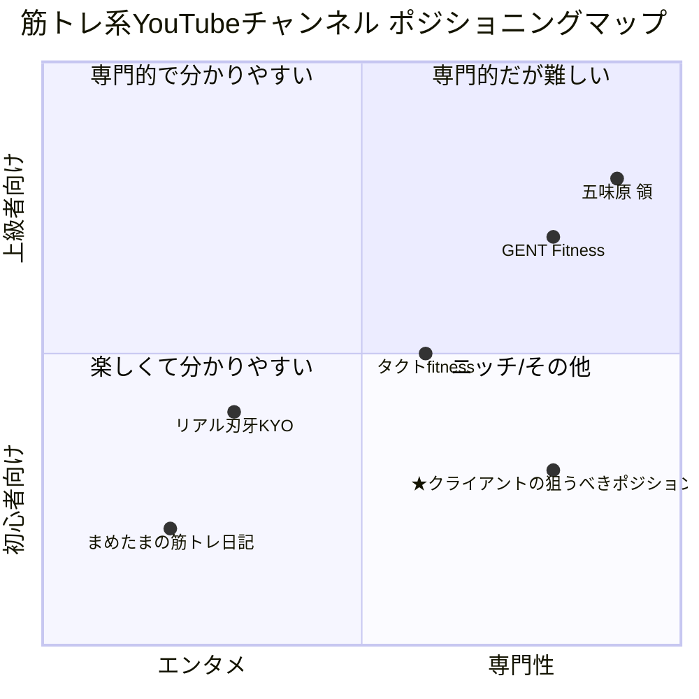

# **YouTubeチャンネルコンセプト策定のためのタスクリスト**
---

# **【フェーズ1】 提供価値と視聴者ニーズの明確化（大論点1の達成）**

このフェーズでは、チャンネルの根幹となる「誰に、何を、なぜ提供するのか」を定義します。

## 1. 自己分析と強みの言語化（サブ論点1-1）

### タスク1-1: 保有資格・実績・経験・成功体験（確認できた範囲）

* **人物／肩書き（活動拠点）**：パーソナルトレーナー。活動拠点は東京都中央区・人形町周辺（BMCパーソナルジム運営）。Xのプロフィールでも「BMCパーソナルジム運営」を明記。([BMCパーソナルジム][1])
* **受賞・競技実績**：

  * 「SUMMER STYLE AWARD 新人類 美容部門 優勝」の掲載（月刊 MEN’s PHYSIQUE 選手紹介ページ）。([月刊MEN's PHYSIQUE][2])
  * 「フィジークという競技で全国7位」の実績記載（Hotpepper Beauty スタッフページ）。([ホットペッパービューティー][3])
* **メディア／レビューでの紹介**：UFitレビューにて「資格取得×大会優勝経験のトレーナー」「YouTube/Instagram/Xで発信」「BMC紹介」。([uFit][4])
* **施術/指導年数**：施術歴7年（BMCサイト・トレーナー紹介）。([BMCパーソナルジム][5])
* **提供サービス**：対面パーソナルトレーニング、食事指導、ポージング指導、オンライン指導（BMCサイト／IGプロフィール・投稿）。([BMCパーソナルジム][6])
* **オンライン指導の訴求**：Canva LPに「オンラインコーチング（全国対応）」の記載。([natyuraru123.my.canva.site][7])

> ※**保有資格の具体名**は公式サイトの該当欄が未入力で未確認（「資格が入ります」のダミー表記）。引き続き要確認。([BMCパーソナルジム][5])

### タスク1-2: 発信哲学（推定・抽出）

* **結果重視×短期間での成果／続けやすさ**：BMCサイトに「結果重視」「週1〜2回でも効果」「続けやすい×効果が出る」を明記。([BMCパーソナルジム][6])
* **個別最適化／1対1で伴走**：完全個室・マンツーマン、生活リズムや目的の丁寧なヒアリング。([BMCパーソナルジム][6])
* **科学的根拠の重視**：UFit記事に「機能解剖学・運動生理学・バイオメカニクスを組み合わせた科学的根拠に基づく指導」と紹介。([uFit][8])
* **ナチュラル哲学**：「lifetime natural（ドーピング無しのナチュラル志向）」をIGやXの自己紹介で発信。([Instagram][9])

### タスク1-3: キャラクター設定（客観的に見える像）

* **「親しみやすい専門家」**：大会実績や技術発信をしつつ、初心者〜選手まで幅広くサポートする伴走型。([BMCパーソナルジム][6])
* **「厳しいが結果にコミットするコーチ」**：結果重視・短期間での成果・正しいフォームの徹底（「誤ったやり方は逆効果」含む）。([BMCパーソナルジム][5])
* **「ナチュラル競技者／発信者」**：競技志向と発信活動（YouTube/IG/X）を両立。([uFit][4])

---

## 2. ターゲットの解像度（サブ論点1-2）

### タスク2-1: 視聴者の悩み（SNS・導線から収集／分類）

※YouTube/Instagramのコメント本文取得は制限があり、今回は**公式サイト・外部レビュー・プロフィール記載**から代表的ペインを抽出しています（実地コメント収集は別途サンプリングが必要）。

* **ボディメイクが続かない／短期間で成果を出したい**（継続設計と「短期でも効果」訴求）。([BMCパーソナルジム][6])
* **正しいやり方が分からない／やっても変わらない**（誤ったトレーニングで逆効果になる不安）。([BMCパーソナルジム][5])
* **人目が気になる／個室で集中したい**（完全個室の価値）。([BMCパーソナルジム][6])
* **仕事で忙しい／通いやすさ重視**（駅チカ・9:00〜22:00）。([BMCパーソナルジム][1])
* **大会に出たいが道筋が不明**（ポージング／選手育成の支援）。([BMCパーソナルジム][10])
* **女性特有の部位悩み（脚・お腹）**の解決ニーズ。([BMCパーソナルジム][5])

### タスク2-2: 本質的ペイン（深掘り）

* **情報過多→正解が選べない**：方法論が乱立し、自己流で成果が出ず挫折。
* **習慣化の失敗**：忙しさ×人目×準備の手間→継続障壁（個室・手ぶらOK・LINE伴走で解消）。([BMCパーソナルジム][6])
* **「結果までの道筋の不透明さ」**：大会出場や減量・増量サイクル、時期設計が分からない（コーチングで可視化）。([BMCパーソナルジム][10])

### タスク2-3: 理想の状態（ゲイン）

* **自信の回復とボディラインの可視的変化**（ビフォーアフター事例の訴求）。([BMCパーソナルジム][11])
* **最短距離の合理的プロセス**（週1〜2回×正しいフォーム×食事指導）。([BMCパーソナルジム][6])
* **大会出場〜入賞の実現**（選手育成・ポージング・食事Period化）。([BMCパーソナルジム][10])
* **通いやすい生活導線（駅近×長時間営業×個室）**。([BMCパーソナルジム][1])

---

## 3. チャンネルコンセプトの策定（サブ論点1-3）

### タスク3-1: 強み×本質的ペインのマッチング要約

* **強み**：ナチュラル競技者としての実績／結果重視の1対1設計／個室×通いやすさ／食事×フォーム×ポージングの**統合指導**。([BMCパーソナルジム][6])
* **解決する本質的ペイン**：**方法迷子**・**継続困難**・**成果までの道筋不明**。
* **ズラし**：大会志向〜一般層まで「**ナチュラルで勝てる身体**」のエビデンス/実務知を「短期で手応え→中長期で定着」に落とす編集。

### タスク3-2: コンセプト案（複数）

> 形式：「**[ターゲット]** の **[本質的ペイン]** を、**[独自の強み/哲学]** を通じて解決し、**[理想の状態]** へ導くチャンネル」

1. **「人形町の忙しい社会人」**の**“正しいやり方が分からない＆続かない”**を、**完全個室×結果重視プログラム（週1–2回／フォーム×食事の統合指導）**で解決し、**短期間で見た目の手応え→習慣化**へ導くチャンネル。([BMCパーソナルジム][6])
2. **「大会を目指す初心者〜中級者」**の**“ロードマップ不透明”**を、**ナチュラル競技者のコーチング（ポージング／期分け栄養／減量増量）**で解決し、**初出場〜入賞**へ導くチャンネル。([BMCパーソナルジム][10])
3. **「女性の部位悩み（脚・お腹）」**の**“自己流で逆効果”**を、**機能解剖×正しいフォーム矯正**で解決し、**メリハリ体型の実現**へ導くチャンネル。([BMCパーソナルジム][5])

---

## 参考リンク（主要ファクトの根拠）

* BMC公式サイト（特徴・住所・営業時間・実績表示・Instagram埋め込み等）：([BMCパーソナルジム][6])
* Hotpepper Beauty（代表トレーナー、全国7位記載）：([ホットペッパービューティー][12])
* UFitレビュー（科学的指導・メダル実績の紹介・同一人物の紐付け）：([uFit][4])
* 月刊 MEN’s PHYSIQUE（受賞歴の掲載）：([月刊MEN's PHYSIQUE][2])
* Xプロフィール（BMC運営・ナチュラルプロ志向）：([X (formerly Twitter)][13])
* Canva LP（オンラインコーチング記載）：([natyuraru123.my.canva.site][7])

---

## 未確認・追加取得をおすすめする項目

* **保有資格の正式名称・発行団体・取得年**（公式サイトの記載未整備）。([BMCパーソナルジム][5])
* **直近12か月のSNSコメントの定量サンプリング**（視聴者ペインの正規化に必要：動画トップ20本×各上位コメント／IG直近50投稿×上位コメントなど）。
* **YouTubeチャンネルの「概要」や外部リンクの最新化**（購買導線／予約導線の最適化点検）。

必要なら、この続きを**コメント収集の定量ルール**や**CSVスキーマ**（投稿URL／投稿日／いいね数／コメント文／カテゴリ付与）まで作って一気に抽出・タグ付けします。

[1]: https://body-make-club.com/access/ "アクセス | BMCパーソナルジム"
[2]: https://gekkanmensphysique.com/lists-of-competitor/saitoshota/?utm_source=chatgpt.com "齋藤晶太（フィジーカー） - 月刊 MEN's PHYSIQUE"
[3]: https://beauty.hotpepper.jp/kr/slnH000743268/staff/W001173088/?utm_source=chatgpt.com "齋藤 晶太｜BMC"
[4]: https://ufit.co.jp/blogs/gym/bmc-personaltraining?srsltid=AfmBOopNXjTLAjBmIXHyEszIBV6RZsW96LQXA0ygtQFe9OgXVdahH7qE&utm_source=chatgpt.com "BMCパーソナルジム人形町店の口コミ体験レビュー！料金・ ..."
[5]: https://body-make-club.com/staff/ "トレーナー紹介 | BMCパーソナルジム"
[6]: https://body-make-club.com/about/ "BMCパーソナルジムについて | BMCパーソナルジム"
[7]: https://natyuraru123.my.canva.site/?utm_source=chatgpt.com "ナチュラルなタンパク質"
[8]: https://ufit.co.jp/blogs/gym/bmc-personaltraining?srsltid=AfmBOoravhL8tRaP2cqE085qX2CwD088hXETH08h_1UBKQu6yGx4PZx2&utm_source=chatgpt.com "BMCパーソナルジム人形町店の口コミ体験レビュー！料金・ ..."
[9]: https://www.instagram.com/s261746/?hl=en&utm_source=chatgpt.com "ナチュラルなタンパク質(natural protein) (@s261746)"
[10]: https://body-make-club.com/?utm_source=chatgpt.com "BMCパーソナルジム | 人形町駅から徒歩すぐの駅近パーソナル ..."
[11]: https://body-make-club.com/ "BMCパーソナルジム | 人形町駅から徒歩すぐの駅近パーソナルジム"
[12]: https://beauty.hotpepper.jp/kr/slnH000743268/?utm_source=chatgpt.com "BMC"
[13]: https://x.com/clzjsgsgjcfkff?utm_source=chatgpt.com "ナチュラルなタンパク質 (@clZjSGsgjcFkff) / ..."

---

# **【フェーズ2】 競合分析と独自の立ち位置の確立（大論点2の達成）**

市場全体を俯瞰し、自チャンネルが勝負すべき「独自のポジション」を明確にします。

## **4. 競合リサーチ（サブ論点2-1）**

### **タスク4-1: 競合チャンネルのリストアップ**

`competitors_contents.md`に基づき、直接競合となる筋トレ系YouTubeチャンネルを以下にリストアップします。

  * タクトfitness (Takuto Fitness)
  * GENT Fitness
  * 五味原 領 (Ryo Gomihara)
  * リアル刃牙KYO (中川恭兵)
  * まめたまの筋トレ日記

### **タスク4-2: 競合分析シートの作成**

各競合チャンネルの分析結果を以下にまとめます。

| チャンネル名 | コンセプト・特徴 | 強み | 弱み（＝参入機会） | 人気コンテンツの傾向 | 推定視聴者層 |
| :--- | :--- | :--- | :--- | :--- | :--- |
| **タクトfitness** | 自宅トレーニング中心のメニューや分割法を丁寧に解説。 | ・自宅で実践できるノウハウが豊富 ・各部位のトレーニング方法を具体的に解説する専門性 | ・パーソナルトレーナーとしての実体験や顧客との対話に基づくコンテンツが少ない | ・「〇〇の方法」「〇〇メニュー」といったノウハウ・解説系 | ・ジムに通えない/行かないホームトレーニー ・筋トレ初心者～中級者 |
| **GENT Fitness** | 元フィジーク日本チャンピオンによる初心者から上級者まで楽しめるトレーニング情報。 | ・大会出場者ならではの高い専門性と信頼性 ・正しいフォーム解説の質が高い | ・上級者向けの内容が多く、初心者にはハードルが高い可能性がある ・エンタメ性は比較的低い | ・大会のVlog ・特定の種目を深掘りする専門的なフォーム解説 | ・フィジーク/ボディビル大会出場を目指す選手 ・トレーニング中級者～上級者 |
| **五味原 領** | ボディビルダー・パーソナルトレーナーとしての独自の減量法やトレーニング哲学を発信。 | ・「魚の脂質0kcal理論」など、独自の理論に基づいた深い洞察 ・食事や栄養に関する専門性が非常に高い | ・特定の理論に特化しており、万人に受け入れられるとは限らない ・実技よりも理論中心のコンテンツが多い | ・「〇〇の真実」「〇〇すべき理由」といった理論・哲学系 | ・減量や食事管理に悩むトレーニー ・ボディビルに興味がある中級者～上級者 |
| **リアル刃牙KYO** | "リアル刃牙"のキャラクターを活かしたVlogや自宅トレーニングを発信。 | ・インフルエンサーとしてのキャラクター性、エンタメ性が高い ・Vlog形式で視聴者の共感や憧れを醸成 | ・専門的な解説や理論的背景が他のチャンネルに比べて少ない傾向 ・パーソナル指導のリアルな現場感は薄い | ・大会出場時のVlog ・有名人をテーマにした企画系 | ・インフルエンサーのファン層 ・筋トレやダイエットに興味を持ち始めた若年層 |
| **まめたまの筋トレ日記** | コンビで楽しく取り組める、短時間・自重中心のトレーニング。 | ・圧倒的な分かりやすさと手軽さ ・視聴者が「これならできそう」と感じるコンテンツ設計 | ・専門性や理論的な深掘りは少ない ・高重量を扱うような本格的なトレーニング情報は少ない | ・「〇分でできる」「〇〇を落とす」といった短時間・課題解決型トレーニング | ・運動習慣のないダイエット初心者 ・自宅で手軽に運動したい層 |

## **5. 市場機会の発見（サブ論点2-2）**

### **タスク5-1: 自社の強みと市場機会の照合**

**クライアント（斉藤氏）の強み**は、「パーソナルジムを経営する**現役の指導者**」である点です。これは、一方的な情報発信者とは異なり、日々顧客のリアルな課題に接し、解決に導いているという信頼性の証です。

競合分析の結果、以下の\*\*市場機会（空白地帯）\*\*が明らかになりました。

1.  **理論と実践の橋渡し:** 専門的な理論を解説するチャンネル（GENT Fitness, 五味原 領）と、手軽な実践メニューを紹介するチャンネル（まめたま、タクトfitness）は存在するが、**「なぜこのフォームなのか」「なぜこの食事が有効なのか」という理論的背景と、初心者が実践可能な具体的なアクションを繋ぎ合わせるコンテンツ**は少ない。
2.  **個別具体的な課題解決:** 多くのチャンネルが「背中トレ」「腹筋」といった一般的なテーマを扱う一方で、「O脚を改善しながらヒップアップしたい」「デスクワークによる肩こりを解消するトレーニング」といった、**パーソナルジムの顧客が実際に抱えるような、より個別で具体的な悩みに応えるコンテンツ**は手薄である。
3.  **オンラインからオフラインへの接続:** YouTubeチャンネルは存在するものの、その発信者が運営する**実際のパーソナルジムでの指導風景や、顧客の変化（ビフォーアフター）などを通じて、視聴者が「自分もこのジムに行ってみたい」と感じさせるようなコンテンツ**は確立されていない。

これらの市場機会は、クライアントの「現役パーソナルトレーナー」という強みと完全に合致しており、競合との明確な差別化を図れるポイントです。

## **6. ポジショニングの決定（サブ論点2-3）**

### **タスク6-1: ポジショニングマップの作成**

市場を「**専門性⇔エンタメ**」と「**初心者向け⇔上級者向け**」の2軸で整理し、競合チャンネルを配置します。

  * **右上（専門性 × 上級者向け）:** GENT Fitness, 五味原 領
  * **右下（専門性 × 初心者向け）:** **※空白地帯**
  * **左上（エンタメ × 上級者向け）:** （該当する有力チャンネルは少ない）
  * **左下（エンタメ × 初心者向け）:** まめたまの筋トレ日記, リアル刃牙KYO
  * **中間:** タクトfitness

<!-- end list -->

## **7: 独自のポジションの確立**
### **【改訂版】確立すべき独自のポジション**

基本となるポジション「専門性 × 初心者向け」は維持しつつ、クライアントの個性を加えた、よりユニークなポジションを定義します。

**「日本一明るい現役トレーナーが、ジムで顧客に語りかけるように、専門知識を『身近な雑談レベル』まで噛み砕いてくれるチャンネル」**

このポジションは、競合との差別化をさらに強化します。

* **専門家（GENT Fitness, 五味原 領）との差別化:** 視聴者が「講義を受ける」のではなく、「明るい先輩や友人に相談している」感覚で、楽しみながら自然と知識が身につく体験を提供します。
* **エンタメ/手軽さ系（まめたま, リアル刃牙KYO）との差別化:** 明るさや楽しさといった共通点を持ちつつも、その背景にはクライアントの「現役指導者としての実績」や「科学的根拠に基づく指導」という裏付けがあり、情報の信頼性で大きく差別化します。

---

### **提案1：「筋トレの『なんで？』が楽しくわかる！あなたの隣の頼れるトレーナー」**

このコンセプトの核心は**「知的好奇心の充足」と「親近感」**です。視聴者は、クライアントとの対話を楽しむような感覚で、専門知識を自然と吸収していきます。

**【具体的なコンテンツ案】**

1.  **シリーズ企画：「今さら聞けない筋トレの『なんで？』」**
    * 視聴者が抱きがちな素朴な疑問を、クライアントが隣で話すように明るく解説します。
    * **動画タイトル例：**
        * 「なんでプロテインは『すぐ』飲めって言われるの？30分遅れたら筋肉は消えるの？」
        * 「なんでベンチプレスは肩甲骨を寄せるの？胸より腕が疲れちゃう問題を解決します！」
        * 「なんでお酒を飲むと筋肉に悪いの？飲み会が多いサラリーマンの最適解を教えます！」

2.  **シリーズ企画：「それ、意味ないかも？巷の筋トレ都市伝説をプロが斬る！」**
    * 世の中のフィットネス情報に惑わされる視聴者を「頼れる専門家」として救出する企画です。
    * **動画タイトル例：**
        * 「腹筋ローラーだけじゃお腹は割れない？最短で結果を出すための『本当の』使い方」
        * 「『とりあえずランニング』は非効率？プロが教える、脂肪が燃える運動の順番」

---

### **提案2：「堅苦しい話は抜き！でも効果はホンモノ。笑顔で変わる、結果コミットチャンネル」**

このコンセプトの核心は**「ベネフィットの可視化」と「エンターテインメント性」**です。小難しい理屈よりも、「これをやればこうなれる！」という夢や希望を、クライアントの明るいキャラクターに乗せて届けます。

**【具体的なコンテンツ案】**

1.  **看板企画：「【衝撃ビフォーアフター】お客さんのリアル密着ドキュメント」**
    * クライアントの強みである「結果重視」の指導 を、実際の顧客の変化を通じて証明します。
    * **動画タイトル例：**
        * 「【実録】たった週1回でここまで変わる！3ヶ月で-10kgに成功したAさんの全記録」
        * 「結婚式まであと2ヶ月！花嫁の二の腕痩せチャレンジに密着したら奇跡が起きた」

2.  **シリーズ企画：「難しい計算はポイ！コンビニ飯だけで筋肉はデカくなる！」**
    * 情報過多で悩む視聴者のペイン を「考えさせない」というアプローチで解決します。
    * **動画タイトル例：**
        * 「増量期も減量期も、セブンイレブンだけで完璧。現役トレーナーのガチ買い物リストを公開」
        * 「『効かせる』って何だよ！難しいことゼロ、背中トレの『感覚』がわかるたった１つのコツ」

---

### **提案3：「日本一ハードルの低いパーソナルジムCH！プロが教えるのに、超フレンドリー」**

このコンセプトの核心は**「不安の解消」と「徹底的な初心者目線」**です。ジムや筋トレに対するあらゆる心理的・物理的ハードルを取り除くことに特化します。

**【具体的なコンテンツ案】**

1.  **シリーズ企画：「【世界一やさしい】初めてのジム、完全攻略ガイド」**
    * ジム未経験者が抱える「何から始めれば…」という不安 をゼロにすることを目指します。
    * **動画タイトル例：**
        * 「【初心者さんいらっしゃい！】ジム契約初日にやることリスト｜持ち物からマシンの座り方まで」
        * 「もう周りの目は気にならない。ジムで初心者が一番落ち着ける『神エリア』教えます」

2.  **お悩み相談企画：「ムキムキになりたくない女子、集まれ！お悩み相談室」**
    * 女性特有の悩み に特化し、「こんなこと聞いてもいいのかな？」という不安を解消します。
    * **動画タイトル例：**
        * 「脚を細くしたくて筋トレしてるのに、逆に太くなっちゃう『悲劇』の原因と解決策」
        * 「プロが教える、本当に『お腹が凹む』腹筋のやり方。その腰の動き、危険です！」

---

# **【フェーズ3】 具体的なコンテンツプランへの落とし込み（大論点3の達成）**

定義したコンセプトとポジショニングを、視聴者に届く「コンテンツ」と「運用体制」に具体化します。

**7. コンテンツ戦略の設計（サブ論点3-1）**
* **タスク7-1: コンテンツテーマの洗い出し**
    * コンセプトに基づき、視聴者のペインを直接的に解決する企画案を50個以上リストアップする。
* **タスク7-2: フォーマットの決定**
    * テーマごとに最適な動画フォーマット（解説、レシピ、Vlog、Q&Aなど）を検討する。
* **タスク7-3: 3H戦略への分類**
    * 企画案を、認知拡大の「Hero」、ファン化促進の「Hub」、検索流入獲得の「Help」コンテンツに分類し、投稿バランスを計画する。

**8. 世界観の構築とコミュニケーション（サブ論点3-2）**
* **タスク8-1: トーン＆マナーの定義**
    * 動画の編集スタイル、テロップのフォントや色、BGMの選定基準など、チャンネル全体の世界観を統一するルールを設ける。
* **タスク8-2: サムネイルフォーマットの作成**
    * 一貫性があり、クリックしたくなるサムネイルのテンプレートをデザインする。
* **タスク8-3: エンゲージメント方針の策定**
    * コメントへの返信ポリシーや、コミュニティ機能の活用方法など、視聴者との交流方針を具体的に定める。

**9. 運用サイクルの確立（サブ論点3-3）**
* **タスク9-1: 運用ルールの設定**
    * 投稿頻度、曜日、時間帯を決定する。
* **タスク9-2: 効果測定指標（KPI）の設定**
    * チャンネルの成長を測るための重要指標（例: 視聴維持率、エンゲージメント率、登録者転換率）を定義する。
* **タスク9-3: PDCAサイクルの設計**
    * 定期的にKPIを分析し、コンテンツの改善や新たな企画に繋げるためのミーティングやレビューのプロセスを確立する。