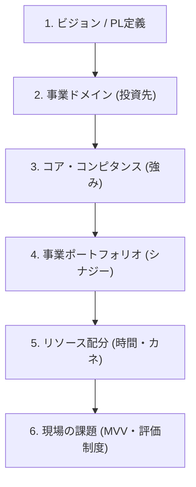
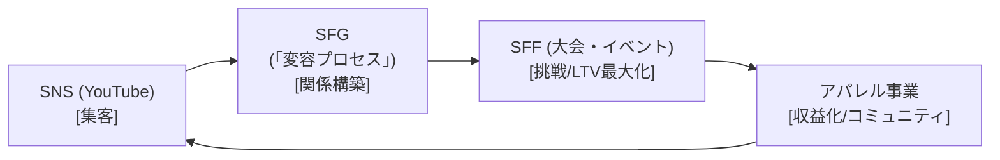

# 経営戦略ディスカッション
なーすけ様の「最上位の論点」を構造化し、
共に「解くべき課題」の全体像を掴む

---

## 本日の共通前提

*   **NDAの確認**: 事前に締結済みのNDAに基づき、機密情報を取り扱います。
*   **ご持参資料**: 議論を深めるため、直近四半期のPL/BS（概算で可）をご準備ください。
*   **本日のスタンス**: "評価の場"ではなく、共に思考を深める"壁打ちの場"です。自由な発想で議論しましょう。

---

## 本日の目的とゴール

**ミーティングの目的**
なーすけ様から頂いた最上位の論点（PL視点のビジョン、リソース配分）を、私（コンサルタント）がどう構造化したかをご提示し、最も重要な論点について「共同作業（壁打ち）」を行います。

**本日のゴール**
1.  解くべき課題の**「全体像（課題マップ）」**について、目線を合わせます。
2.  最重要論点について**「Test Drive（お試し議論）」**を行い、思考を深めます。
3.  この議論をどう「実行」に移すか、今後の進め方を協議します。

---

## なーすけ様の「最上位の論点」の再確認

なーすけ様ご自身による高度な現状分析が全ての出発点です。

**最上位の論点**
1.  **会社PL視点での今後のビジョン**
2.  **SFG事業と他事業へのリソース配分**

**私の役割**
この高度なCEOアジェンダを「構造化」し、「意思決定」を加速させる
**『思考のパートナー』**です。

---

## 【全体像】経営・戦略レイヤーの「課題マップ」

本日の目的は、[1]この全体像の目線合わせ、[2]最重要論点のTest Drive、[3]今後の進め方の合意です。

1.  **ビジョン / PL定義**
2.  **事業ドメイン (投資先)**
3.  **コア・コンピタンス (強み)**
4.  **事業ポートフォリオ (シナジー)**
5.  **リソース配分 (時間・カネ)**
6.  **現場の課題 (MVV・評価制度)**

---

<!--
_class: invert
-->

### **Step 1: ビジョン / PL定義**
会社の「北極星」は何か？

---

#### **Step 1: ビジョン / PL定義**
会社の「北極星」は何か？

*   目的: 会社の進むべき方向を示す、明確な「旗印」を立てること。
*   内容:
    *   定性: 我々が目指す「理想の状態」は何か？ (例: フィットネス業界に新しい基準を確立する)
    *   定量: その理想を、会社のPL（損益計算書）上でどう表現するか？ (例: 売上規模、利益率)
*   なぜ必要か？:
    *   組織全体の意思決定の「ブレ」をなくし、全ての活動を一つのゴールに向かわせるためです。経営者から現場まで、全員が同じ「旗印」を見て判断できるようになります。

---

<!--
_class: invert
-->

### **Step 2: 事業ドメイン**
我々の「主戦場」はどこか？

---

#### **Step 2: 事業ドメイン (投資先)**
我々の「主戦場」はどこか？

・ 目的: 限られたリソース（ヒト・モノ・カネ）を集中させる「戦場」を定義すること。
・ 内容:
    ・ 我々は「ジム業」なのか、「コーチング業」なのか、それとも「コミュニティ事業」なのか？
    ・ これは「看板」を変える話ではなく、「リソースの"投資先"」 を決める話です。
・ なぜ必要か？:
    ・ 「何でも屋」にならず、特定の領域でNo.1になるためです。投資先を絞ることで、リソースの効果を最大化します。(例: 「コーチング業」なら、投資先は機材ではなく「トレーナーの研修」になる)

---

<!--
_class: invert
-->

### **Step 3: コア・コンピタンス**
我々の「真の武器」は何か？

---

#### **Step 3: コア・コンピタンス (強み)**
我々の「真の武器」は何か？

目的: 競合が絶対に真似できない、持続的な競争優位性の「源泉」を特定すること。
内容:
顧客に圧倒的な価値を提供し、かつ他社が模倣困難な「核となる能力」を1つに絞り込みます。
(例: 「最新機材」は真似できるが、「独自の育成システムで育ったトレーナーが作る文化」は真似できない)
なぜ必要か？:
「それ"だけ"は絶対に負けない」という一点を定め、全リソースを集中して磨き続けることで、誰にも追いつけない強固なポジションを築くためです。

---

<!--
_class: invert
-->

### Step 4: 事業ポートフォリオ
「勝利の方程式」はあるか？

---

#### Step 4: 事業ポートフォリオ (シナジー)
「勝利の方程式」はあるか？

目的: 複数の事業が「足し算」ではなく「掛け算」の効果を生む、事業間の「関係性」を設計すること。
内容:
各事業（SNS, SFG, SFF, アパレル）が、会社全体の目標達成のために「どのような役割を担うか」を定義します。
(例: SNSで集客し、SFGでファンにし、SFFで熱狂させ、アパレルで収益を得る)
なぜ必要か？:
事業単体の成果ではなく、事業間の相互作用（シナジー）を最大化することで、会社全体としての成長を加速させる「エコシステム」を構築するためです。

---

<!--
_class: invert
-->

### Step 5: リソース配分
「何に集中」し「何をやめる」か？

---

#### Step 5: リソース配分 (時間・カネ)
「何に集中」し「何をやめる」か？

目的: 戦略を「実行」に移すため、有限なリソース（特に経営者の時間）の使い道を具体的に決定すること。
内容:
定めた「勝利の方程式」の中で、最も流れが滞っている箇所（ボトルネック）はどこか？
そのボトルネックを解消するため、経営者の時間や資金を「どこに、どれだけ」投下するかを決定します。
なぜ必要か？:
戦略を「絵に描いた餅」で終わらせないためです。「やらないこと」を決め、最も重要な一点にリソースを集中させることが、成果に繋がります。

---

<!--
_class: invert
-->

### Step 6: 現場への接続
戦略を「組織のDNA」にする

---

#### Step 6: 現場の課題 (MVV・評価制度)
戦略を「組織のDNA」にする

目的: 経営陣が決定した戦略を、現場の日常業務レベルまで浸透させ、組織全体で実行できるようにすること。
内容:
新しい戦略（例: 「コーチング」重視）に合わせて、現場の行動指針（MVV）や評価制度（現行: セッション本数）を見直します。
(例: 評価指標を「セッション本数」から「顧客継続率」へ変更する)
なぜ必要か？:
経営の意思と現場の行動が一致して初めて、戦略は実行力を持ちます。組織の「OS」をアップデートし、全社員が同じ方向を向いて走れるようにするためです。

---

## 本日の "Test Drive" （共同作業）

この課題マップの中で、最も重要な「2つの分岐点」についてディスカッションを行います。

1.  Test Drive 1 (ミクロ)
    SFGの「本質的な価値（強み）」は何か？

2.  Test Drive 2 (マクロ)
    事業全体の「勝利の方程式」と「ボトルネック」は何か？

---

### **Test Drive 1 (ミクロ)**
その「ギャップ」は"課題"ではなく"機会"ではないか？

---

## (TD1) 仮説：その「ギャップ」は"機会"ではないか？

**論点A ("課題"と捉える見方)**
* マーケティング（見た目）と実態（関係性）がズレており、非効率。

**私の仮説 ("機会"と捉える見方 = 論点B)**
* この「ギャップ」こそが、SFGが提供する「意図せざる"変容プロセス"」そのものではないか？
* この「変容プロセス」こそが"プロダクト"であり、他社が模倣困難な「コア・コンピタンス」の源泉ではないか？

---

## (TD1) 根拠：なぜ「変容プロセス」が強みと言えるのか？

*   **《SFG理念》** 人にしか提供できない“深い対話と共感”がサービスの核。
*   **《トレーナー所感》** お客様の入会動機は「見た目」、しかし継続理由は「関係性」。
*   **《ペルソナ》** 「見た目」で入会し、「関係性」を通じて「内面の変化（自己肯定感）」を得る変容の余地がある。

---

## (TD1) 問い：もし「変容プロセス」が強みなら？

**問い1:** この仮説（ギャップ＝変容プロセス）は、なーすけ様の実感値と合致しますか？

**問い2:** もしこれが強みなら、「事業ドメイン」は「①ジム業」ではなく**「②コーチング/メンタリング業」**にリソースを集中投下すべきではないか？

**問い3:** その場合、PL（投資先）は「機材」ではなく、「トレーナーの採用・育成（ヒアリング力）」に変わるのではないか？

---

### **Test Drive 2 (マクロ)**
御社の「勝利の方程式」と
その"ボトルネック"はどこか？

---

## (TD2) 仮説：御社の「勝利の方程式」とは？

TD1の結果を踏まえると、SFGの役割は「キャッシュカウ（利益源）」ではなく、顧客の循環（エコシステム）を回す**「フラッグシップ（ビジョンの象徴）」**である、という仮説です。

* **[集客]** SNS (YouTube)
* **[関係構築]** SFG ("変容プロセス")
* **[挑戦/LTV最大化]** SFF (大会・イベント)
* **[収益化/コミュニティ]** アパレル事業

---

## (TD2) 可視化：顧客の循環（エコシステム）

この「顧客の循環」という仮説は、実感値と合致しますか？

---

## (TD2) 問い：この「方程式」の"ボトルネック"は？

**最重要の問い:**
この「勝利の方程式」の中で、今、経営者として最も**『流れが滞っている（＝ボトルネック）』**と感じる箇所はどこですか？

*   （例：SNSからSFGへの流入が弱い？）
*   （例：SFGからSFFへの挑戦者が少ない？）
*   （例：SFFからアパレルへの繋がりが薄い？）

---

<!--
_class: invert
-->

### これらの問いに、お一人で向き合うことの"重さ"

---

## CEOの「戦略思考」を阻む3つの壁

優れた経営者であるほど、全ての論点をご自身で深く思考されようとします。
しかし、そのプロセスには構造的な難しさが伴います。

1.  **論点の複雑性**
    *   ビジョン、ドメイン、強み、シナジー…これらは独立しておらず、複雑に絡み合っています。一つの変更が全体に影響を及ぼすため、常に"全体最適"の視点が求められます。

2.  **時間の有限性**
    *   日々のオペレーション、チームマネジメント、緊急対応…CEOの時間は常に断片化されます。まとまった「戦略だけを考える時間」を確保すること自体が、極めて困難です。

3.  **意思決定の孤独**
    *   会社の未来を決める重圧は、最終的にCEO一人の肩にかかります。客観的な視点や健全な"壁打ち相手"がなければ、思考の偏りや見落としが生まれるリスクがあります。

---

## 【ご提案】今後の進め方

---

## 配分判断の"型"（ご提案）

今後のリソース配分の議論を加速させるため、共通の「判断の型」を導入しませんか？

| 評価軸       | 重み付け | 事業A | 事業B | 事業C |
| :----------- | :------: | :---: | :---: | :---: |
| **戦略性**     |   40%    |   5   |   3   |   4   |
| **収益性**     |   30%    |   3   |   5   |   4   |
| **シナジー**   |   20%    |   4   |   4   |   5   |
| **コスト**     |   10%    |   2   |   4   |   3   |
| **合計スコア** |  **100%**  | **4.1** | **3.9** | **4.1** |

---

## Phase 1の具体的なアウトプット

本日特定したボトルネックを解消し、勝利の方程式を完成させるために、以下の成果物を定義します。

*   **Vision Statement v1.0**: 会社が目指す北極星
*   **Domain Definition**: 注力する事業領域の決定
*   **Core Competence Statement**:「変容プロセス」の言語化
*   **Resource Allocation v1.0**: 4軸評価に基づく配分表
*   **Next Step for HR**: 評価制度の見直し方針

---

## ご提案する進め方（案）

本日特定した"ボトルネック"の解消と"勝利の方程式"の完成を、**「プロジェクト」**として正式にご支援させていただけないでしょうか？

*   **Phase 1: 戦略の確定**（例: 3ヶ月）
    *   上記の全アウトプットを「決定」します。
    *   会議体: 週1回の定例MTG
    *   意思決定ゲート: 各アウトプットのv1.0承認
*   **Phase 2: 現場への接続**
    *   決定した戦略に基づき、現場課題（MVV、評価制度）に着手します。

---

## Next Step & Q&A

もしこの進め方にご興味を持っていただけるようでしたら、次回、具体的なご提案をさせてください。

1.  **NDA締結**（本日 or 明日）
2.  **PL/BSのご共有**（可能な範囲で）
3.  **Phase 1 のスコープ（支援範囲）とお見積り** のご提案

次回キックオフの日程を協議させていただけますでしょうか？