## 🗺️ ヒアリングの全体像（俯瞰図）

ヒアリングは、**「①現状の課題」** を特定し、**「②具体的な解決策（A/B案）」** を提示して反応を見る、という大きな流れで行います。

```mermaid
flowchart LR
    subgraph row1[" "]
        direction LR
        A[1. 導入・趣旨説明<br/>（目的の共有）] --> B(2. 現状の組織課題<br/>（Painの特定）)
        B --> C{課題の層は？<br/>（管理職 / 一般社員）}
        C --> D(3. 既存の施策と限界<br/>（Gapの発見）)
    end
    subgraph row2[" "]
        direction LR
        E(4. SHAPE FITの新アプローチ提示<br/>（自己理解→挑戦）) --> F(5. 具体的な研修A/B案の提示<br/>（管理職 vs 一般社員）)
        F --> G(6. 導入障壁・期待値の確認<br/>（現実性の検証）)
        G --> H[7. クロージング]
    end
    D --> E
```

-----

## 🎙️ 企業ヒアリング用 トークスクリプト（たたき台）

**【！】はじめに：この資料の目的と使い方**

これは、なーすけ様のヒアリング（アクションNo.1） をサポートするための「たたき台（案）」です。
厳密なスクリプトではないため、この通りに話す必要はありません。

一番重要なのは、なーすけさんご自身がイメージする **「SHAPE FITだからこそ提供できる研修プログラム」** を念頭に置き、それが **「本当に企業のニーズ（課題解決）に合致するのか？」** を確認する場にしていただくことです。

ぜひ、この資料を「押さえるべき論点の地図」として活用し、当日はなーすけさんご自身の言葉で、自由に深掘りしてみてください。

-----

### 1. 導入と趣旨説明

  * **目的（Why）:**
      * アイスブレイクと、ヒアリングの趣旨（＝新しい企業研修のアイデア検証）を率直に伝える。
  * **ゴール（What）:**
      * 相手に「率直なフィードバックが欲しい」というスタンスを理解してもらい、本音を引き出す準備をする。
  * **トーク例:**
      * 「本日はありがとうございます。今、SHAPE FITとして新しく『企業向けの人材・組織変革プログラム』を構想していまして。ぜひ〇〇様の率直なご意見を伺いたいです。」
      * 「私たちが実現したいのは、『働く人が自分の強みを生かして貢献できる仕組み』 なんですが、そのニーズについてぜひお聞かせください。」

### 2. 現状の組織課題（課題の特定）

  * **目的（Why）:**
      * 相手の「痛み」や「リアルな課題感」を把握する。
  * **ゴール（What）:**
      * 彼らが今、何に最も困っているか（例：離職、育成、エンゲージメント）を特定する。
      * **特にどの層（管理職 or 一般社員）に課題が集中しているか**を理解する。
  * **トーク例:**
      * 「今、貴社で『組織』や『人』に関して、一番課題に感じていることは何ですか？」
      * 「その課題は、特に**『管理職層』** と**『一般社員層』**、どちらで強く感じますか？」

### 3. 既存の取り組みと限界（ギャップの発見）

  * **目的（Why）:**
      * 既存の研修や施策で「満たされていないニーズ」を特定する。
  * **ゴール（What）:**
      * 「研修が"点"で終わってしまう」「行動変容につながらない」といった、既存ソリューションの「限界」や「不満」を引き出す。（＝SHAPE FITが入り込む余地を探る）
  * **トーク例:**
      * 「その課題に対して、これまで何か対策（研修など）はされてきましたか？」
      * 「正直なところ、それらの手応えや『物足りなさ』はありますか？」

### 4. SHAPE FITの価値観の提示（ニーズの仮説検証）

  * **目的（Why）:**
      * SHAPE FITが提唱する「CJM（変容モデル）」 の核となる価値観（自己理解→挑戦）が、ビジネスの現場で響くかを確認する。
  * **ゴール（What）:**
      * 従来の「スキル研修」ではなく、「マインドセット（在り方、自己理解）」から入るアプローチへのニーズの有無を確認する。
  * **トーク例:**
      * 「私たちは、多くの組織課題の根本に、従業員の『自己理解の不足』 や『（失敗を恐れて）挑戦できない』マインドがあるのでは、と考えています。」
      * 「従来のスキル研修とは少し違い、『自分軸』や『在り方』を見直すようなアプローチについて、どう思われますか？」

### 5. 具体的な研修アイデアの提示（A/Bテスト）

  * **目的（Why）:**
      * 漠然としたニーズではなく、具体的なプログラム案（A/B）への「リアルな反応」を見ることで、ニーズの解像度を上げる。
  * **ゴール（What）:**
      * **A案（管理職向け）** と **B案（一般社員向け）**、どちらが「刺さる」か、その理由を把握する。
      * 導入の現実的な障壁（コスト、時間、効果測定など）を引き出す。
  * **トーク例:**
      * 「そこで今、この『自己理解と挑戦』 を軸にした2つのプログラム案を考えています。」
      * **A案： 管理職向け「“変容起点”リーダーシップ・プログラム」**
          * （概要：まず管理職自身が『自己理解と挑戦』を体験し、部下の挑戦を引き出せるリーダーになる）
      * **B案： 一般社員向け「“自分軸”キャリア・アクセラレーション・プログラム」**
          * （概要：社員一人ひとりが『自分軸』を見つけ、社内で『小さな挑戦』を生み出し、組織貢献と自己実現を両立させる）
      * 「率直に、貴社の課題には**A案とB案、どちらがより『刺さる』** と感じますか？」
      * 「（もしA案なら）やはり管理職から変えるべき、と？ （もしB案なら）ボトムアップの方が効果的と？」
      * 「もし導入するとしたら、どんな懸念（コストや時間、効果が測りにくい等）がありますか？」

### 6. クロージング

  * **目的（Why）:**
      * 感謝を伝え、次のステップ（もしあれば）につなげる。
  * **ゴール（What）:**
      * 良い関係性を維持し、フィードバックへの感謝を伝える。
  * **トーク例:**
      * 「本日は、非常に参考になるご意見、ありがとうございました。」
      * 「いただいた内容を元に、プログラムを磨き上げて、もしプロトタイプができたら、またご意見伺ってもよろしいでしょうか？」

