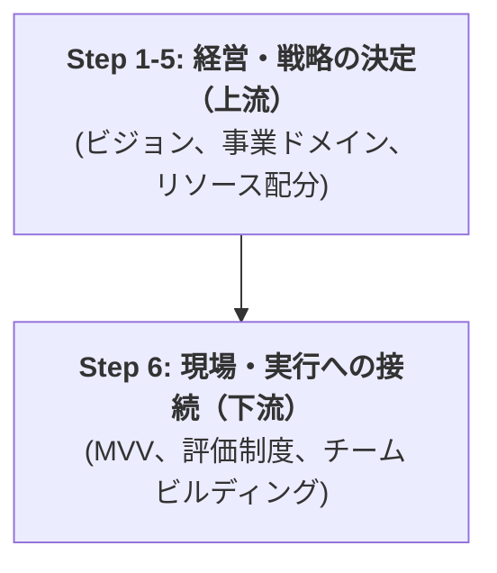

-----

marp: true
theme: default
class:

  - invert

-----

# 本プロジェクトの目的と進め方

チームメンバーの皆様へ
（2025.10.26）

-----

## 1\. なぜ今「戦略（ビジョン）」から議論するのか？

現在、皆様が現場で感じる課題（例：MVV、評価制度、マネタイズ）と、なーすけ様（CEO）が持つ経営課題（PL視点のビジョン、リソース配分）は、複雑に絡み合っています。

**現場の課題（実行）は、会社全体の方針（戦略）によって最適解が変わります**。

そこで本プロジェクトでは、まず**「経営・戦略レイヤー（上流）」**を明確に決定し、その方針に基づき**「現場・実行レイヤー（下流）」**の最適解を導き出します。

**目的:** 会社の「北極星（ビジョン）」と「勝利の方程式（戦略）」を決定し、全員が同じ方向を向いて走れる状態を作ること。

-----

## 2\. プロジェクトの進め方と皆様へのお願い

本プロジェクトは、**約2.5ヶ月** の短期集中型で実施します。
「週1回のワークショップ」を通じて、皆で議論し、なーすけ様に「意思決定」を重ねていただきます。

### 役割分担

  * **私（コンサルタント）**

      * 皆様の**「思考のパートナー」**です。
      * 議論を加速させるための「論点」や「思考の型」を提供し、議論をファシリテートします。

  * **なーすけ様（CEO）**

      * 会社の未来に関する**最終的な「意思決定」**を行います。

  * **チームメンバーの皆様（★最重要）**

      * 戦略を「絵に描いた餅」にしないための、**「現場のリアルな視点」**をご提供ください。
      * 特に **Phase 2（MVV策定・評価制度の見直し）** では、皆様が主役となって議論を推進いただくことを期待しています。