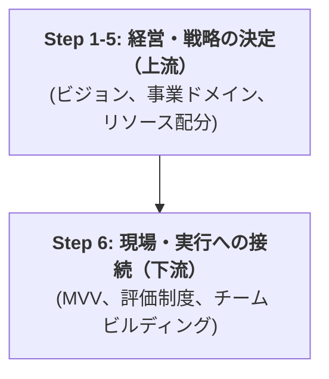
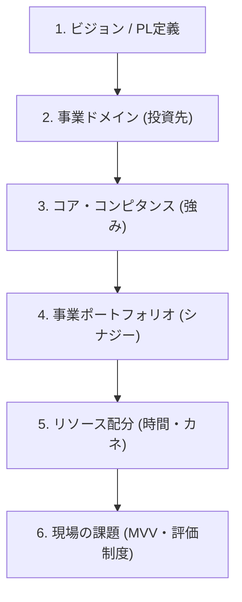

-----

marp: true
theme: default
class:

  - lead
  - invert

-----

# 経営戦略・実行接続プロジェクト

## 正式ご提案資料

なーすけ様 (SHAPE FIT GYM様)
2025年10月26日
鈴木（なーすけさん\_1025）

-----

## 本日のアジェンダ

1.  **前回ミーティングの振り返り**
2.  **本プロジェクトの目的と進め方（チームメンバーの皆様へ）**
3.  **解決すべき「課題マップ」の全体像（再掲）**
4.  **プロジェクトの全体像とマイルストーン**
5.  **ご支援スコープ（納品物）と役割分担**
6.  **概算お見積り**
7.  **Next Step & Q\&A**

-----

## 1\. 前回ミーティング（10/25）の振り返り

本日のご提案は、前回のミーティングでの以下の合意に基づいています。

1.  **解決すべき「課題マップ」の合意**
      * 経営・戦略レイヤーの「課題マップ」（ビジョン定義、事業ドメイン、リソース配分など6ステップ）に沿ってプロジェクトを進める方針に合意しました。
2.  **今後の進め方（プロジェクト形式）の合意**
      * 上記6ステップを「決定」するため、当方（鈴木）が「意思決定の軸」や「論点」を提供し、ワークショップ形式でご支援する進め方に合意しました。
3.  **ご契約（正式プロジェクト化）の合意**
      * 本日のご提案内容に基づき、正式な「課題解決の実行」フェーズ（ご契約）へ移行することを協議します。

-----

## 2\. 本プロジェクトの目的と進め方

チームメンバーの皆様へ

-----

### なぜ今「戦略（ビジョン）」から議論するのか？

現在、皆様が現場で感じる課題（例：MVV、評価制度、マネタイズ）と、なーすけ様（CEO）が持つ経営課題（PL視点のビジョン、リソース配分）は、複雑に絡み合っています。

**現場の課題（実行）は、会社全体の方針（戦略）によって最適解が変わります**。

そこで本プロジェクトでは、まず **「経営・戦略レイヤー（上流）」**を明確に決定し、その方針に基づき 　**「現場・実行レイヤー（下流）」**の最適解を導き出します。

**目的:** 会社の「北極星（ビジョン）」と「勝利の方程式（戦略）」を決定し、全員が同じ方向を向いて走れる状態を作ること。

-----

### プロジェクトの進め方と皆様へのお願い

本プロジェクトは、**約2.5ヶ月** の短期集中型で実施します。
「週1回のワークショップ」を通じて、皆で議論し、なーすけ様に「意思決定」を重ねていただきます。

#### 役割分担

  * **私（コンサルタント）**

      * 皆様の**「思考のパートナー」**です。
      * 議論を加速させるための「論点」や「思考の型」を提供し、議論をファシリテートします。

  * **なーすけ様（CEO）**

      * 会社の未来に関する**最終的な「意思決定」**を行います。

  * **チームメンバーの皆様（★最重要）**

      * 戦略を「絵に描いた餅」にしないための、**「現場のリアルな視点」**をご提供ください。
      * 特に **Phase 2（MVV策定・評価制度の見直し）** では、皆様が主役となって議論を推進いただくことを期待しています。

-----

## 3\. 【再掲】経営・戦略レイヤーの「課題マップ」

本プロジェクトは、この「課題マップ」を上から順に「決定」していくプロセスです。

-----

## 4\. プロジェクトの全体像とマイルストーン

-----

### プロジェクトの2つのフェーズ（計 2.5ヶ月）

**Phase 1: 経営・戦略の「決定」**

  * **期間:** 1.0 ヶ月 (W1 - W4)
  * **ゴール:** 会社の「北極星」と「勝利の方程式」を定義する。（課題マップ 1〜5）

**Phase 2: 現場・実行への「接続」**

  * **期間:** 1.5 ヶ月 (W5 - W10)
  * **ゴール:** 決定した戦略を、現場の「行動指針（MVV）」と「評価制度（KPI）」に翻訳する。（課題マップ 6）

-----

### 詳細マイルストーン (Phase 1: 経営・戦略の「決定」)

**期間: 1.0 ヶ月 (W1 - W4)**
*週1回の定例WSにて「意思決定」をテンポよく行います。*

| 週 | 主なWSテーマ (議論) | ゴール (意思決定 / 納品物) |
| :--- | :--- | :--- |
| **W1** | プロジェクト・キックオフ ビジョン定義 (Part 1) | ・チームメンバーとの目線合わせ ・ビジョン案の洗い出し |
| **W2** | ビジョン定義 (Part 2) 事業ドメイン定義 | ・`Vision Statement v1.0`（決定） ・`Domain Definition v1.0`（決定） |
| **W3** | コア・コンピタンス特定 | ・`Core Competence Statement v1.0`（決定） |
| **W4** | ポートフォリオ設計とリソース配分 **(※PL/BS ご共有前提)** | ・`事業ポートフォリオ定義書 v1.0`（決定） ・`Resource Allocation v1.0`（決定） |

-----

### 詳細マイルストーン (Phase 2: 現場・実行への「接続」)

**期間: 1.5 ヶ月 (W5 - W10)**

| 週 | 主なWSテーマ (議論) | ゴール (意思決定 / 納品物) |
| :--- | :--- | :--- |
| **W5** | Phase 1 戦略の振り返り 現場課題（HR）の方向性定義 | ・`Next Step for HR v1.0`（決定） |
| **W6** | 新戦略に基づく MVV（行動指針） 策定 WS (Part 1) | ・MVV のドラフト（たたき台）作成 |
| **W7** | MVV（行動指針）策定 WS (Part 2) | ・`MVV（行動指針） v1.0（案）`（決定） |
| **W8** | 戦略連動型 評価制度（KPI） 策定 WS (Part 1) | ・新 KPI の論点整理とドラフト作成 |
| **W9** | 評価制度（KPI）策定 WS (Part 2) | ・`戦略連動型 評価制度（KPI） v1.0（案）`（決定） |
| **W10** | プロジェクト最終報告会 | ・全成果物のレビュー ・ネクストステップの合意 |

-----

### スケジュール成功の前提条件

**プロジェクト成功のためのご協力のお願い**

1.  **時間の確保:**
    週 1 回（2h 程度）の定例 WS を最優先で確保いただきます。
2.  **意思決定:**
    各 WS での「意思決定」を、なーすけ様に確実に行っていただきます。
3.  **情報共有:**
    議論に必要な資料（特に W4 までに必要な **PL/BS**）を速やかにご共有いただきます。
4.  **連携:**
    WS 間のチャット等での迅速なコミュニケーションにご協力いただきます。

-----

## 5\. ご支援スコープと役割分担

-----

### Phase 1: 経営・戦略の「決定」支援スコープ

| 課題マップ | 主な支援内容（How） | 納品物（What） |
| :--- | :--- | :--- |
| **Step 1: ビジョン定義** | ・既存ミッション、ビジョン案の分析・整理 ・「ビジョン評価マトリクス」 を用いたWS実施 ・「理想の状態（定性）」と「PL（定量）」の言語化支援 | ・`Vision Statement v1.0` |
| **Step 2: 事業ドメイン定義** | ・「ドメイン別 トレードオフ・マトリクス」 の提供 ・（例：「ジム業」vs「コーチング業」）の影響可視化 ・主戦場（リソースの投資先）の決定支援 | ・`Domain Definition v1.0` |
| **Step 3: コア・コンピタンス** | ・「VRI評価シート」 を用いた強みの客観的評価 ・競合が模倣困難な「真の強み」の言語化支援 | ・`Core Competence Statement v1.0` |
| **Step 4: 事業ポートフォリオ** | ・「勝利の方程式（エコシステム）」 の仮説提示 ・各事業が担う役割（フラッグシップ等）の定義支援 | ・`事業ポートフォリオ定義書 v1.0` |
| **Step 5: リソース配分** | ・PL/BS（契約後ご共有）に基づく財務分析 ・「CEOタイム・アロケーション」シート を用いた時間配分最適化 ・「やらないこと」の決定支援 | ・`Resource Allocation v1.0` |

-----

### Phase 2: 現場・実行への「接続」支援スコープ

| 課題マップ | 主な支援内容（How） | 納品物（What） |
| :--- | :--- | :--- |
| **Step 6: 現場への接続** | ・Phase 1戦略と現行制度とのギャップ分析 ・新戦略に連動したMVV（行動指針）の見直しWSの設計・ファシリテート ・新戦略に基づく「評価制度（KPI）」の論点整理と改定方針の策定支援 | ・`Next Step for HR v1.0` ・`MVV（行動指針） v1.0（案）` ・`戦略連動型 評価制度（KPI） v1.0（案）` |

-----

### 役割分担（RACI）と前提条件

本プロジェクトを成功に導くため、お互いの役割を以下のように定義します。

#### ■ 当方（コンサルタント）の役割

  * なーすけ様の「思考のパートナー」 として、客観的な視点と健全な「壁打ち」相手となります。
  * 意思決定を加速させるための「論点」や「フレームワーク（思考の型）」を提供し、議論（ワークショップ）をファシリテートします。
  * ミーティングでの決定事項を文書化し、プロジェクト全体の進捗を管理（PMO）します。

#### ■ クライアント（なーすけ様・チーム）の役割

  * 提供された論点とフレームワークに基づき、会社の未来に関する**最終的な「意思決定」**を（なーすけ様に）行っていただきます。
  * 議論に必要な社内資料（既存ミッション・ビジョン資料、PL/BS等）を速やかにご共有いただきます。
  * 定例ミーティング（週1回想定）の時間を確保し、主体的にご参加いただきます。
  * チームメンバーの皆様は、戦略実行のための「現場のリアルな視点」を提供いただきます。

#### ■ スコープ外（対象外）業務

  * （例）決定した戦略の「実行」そのものの代行（トレーナーの採用面接、評価制度の運用実務、SFFイベントの運営代行など）
  * （例）システム開発、ウェブサイト改修、法務・税務に関する専門的助言・実務
  * （例）各納品物のデザイン・クリエイティブ制作

-----

## 6\. 概算お見積り

-----

### 概算お見積り（内訳）

| 見積金額（税抜） | 見積有効期限 | コンサルタント単価（参考） |
| :--- | :--- | :--- |
| **¥1,680,000** | 2025/11/25 | ¥15,000/時 |

**お支払い条件:** 各フェーズ開始前に 50%、フェーズ完了後に 50%を当月末締め翌月末払い

| No. | フェーズ | 主な支援内容 | 想定工数 (h) | 金額（税抜） | 備考 |
| :--- | :--- | :--- | :--- | :--- | :--- |
| 1 | **Phase 1: 経営・戦略の「決定」** | Vision, Domain, Competence, Portfolio, Resource Allocation の策定支援 | 40.0h | ¥600,000 | 1.0ヶ月 (4週) 目安 |
| 2 | **Phase 2: 現場・実行への「接続」** | Next Step for HR, MVV(案), 評価制度(案) の策定支援 | 72.0h | ¥1,080,000 | 1.5ヶ月 (6週) 目安 |
| | | | **総工数(目安)** | **112.0h** | |
| | | | **合計（税抜）** | **¥1,680,000** | |

-----

### お見積りの前提条件

1.  ご支援スコープは本資料に記載の範囲（スコープ内業務）とします。
2.  スコープ外業務（例: 実行代行、システム開発、法務助言等）は本見積に含まれません。
3.  週1回2時間程度の定例ワークショップ（オンライン）の実施を前提とします。
4.  上記工数には、WS準備・分析、およびPM・コミュニケーション工数が含まれます。
5.  本見積は概算であり、正式契約時に支援スコープと合わせて最終決定とします。

-----

## 7\. Next Step & Q\&A

-----

## Next Step

本日ご提示した内容（スコープ、マイルストーン、お見積り）について、ご不明点やご懸念事項があれば、ぜひご質問ください。

内容にご合意いただけるようでしたら、以下のステップに進ませていただきます。

1.  **ご契約（発注書）の締結**
2.  **キックオフミーティング（W1）の日程調整**
3.  **NDA締結**
4.  **PL/BSおよび既存資料のご共有**

ご清聴ありがとうございました。