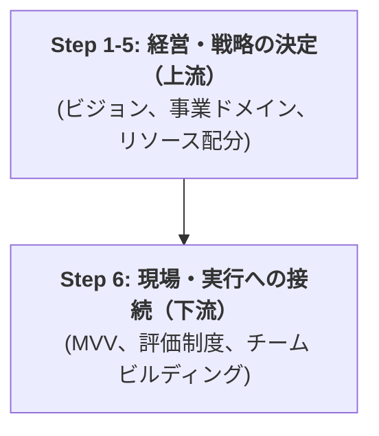

## タスク 3-1 遂行のためのMECEな論点

1.  **Why（目的・背景の共有）**

      * **経営課題の提示:** なーすけ様が定義された「最上位の論点」（PL視点のビジョン、リソース配分）とは何かを共有する。
      * **課題構造の提示:** なぜ「現場課題（MVV・評価制度など）」の議論の前に、「経営戦略（ビジョン・ドメインなど）」を決定する必要があるのか？（＝戦略が現場の行動の"前提"になるため）。
      * **プロジェクトのゴール:** このプロジェクトを通じて「何を決定するのか」（＝会社の北極星と勝利の方程式の確定）を明示する。

2.  **What（プロジェクトの全体像）**

      * **全体スコープ:** プロジェクトが「Phase 1: 戦略の決定」と「Phase 2: 現場への接続」の2段階で構成されることを示す。
      * **進め方:** 週1回のワークショップ形式で、皆で議論しながら「意思決定」を進めていくプロセスであることを説明する。
      * **全体期間:** 約2.5ヶ月の短期集中プロジェクトであるというマイルストーンの概要を伝える。

3.  **Who（役割分担と期待値）**

      * **コンサルタント（私）の役割:** 私は「実行を代行する人」ではなく、皆様の思考を整理し、意思決定を支援する「思考のパートナー」「ファシリテーター」であると定義する。
      * **CEO（なーすけ様）の役割:** 最終的な「意思決定」を行う責任者であることを再確認する。
      * **チームメンバー（皆様）への期待:** このプロジェクトの成功に不可欠な「現場のリアルな視点」でのインプットや、特にPhase 2（MVV策定など）における主体的な参画を期待している、と明確に伝える。

-----

## 【成果物】チームメンバー向け説明スライド（3枚）

上記の論点を踏まえ、タスク 1-3 で作成する「正式プロジェクトご提案資料」の冒頭に挿入するスライド（3枚）を作成します。

-----

marp: true
theme: default
class:

  - invert

-----

# 本プロジェクトの目的と進め方

チームメンバーの皆様へ
（2025.10.26）

-----

## 1\. なぜ今「戦略（ビジョン）」から議論するのか？

現在、皆様が現場で感じる課題（例：MVV、評価制度、マネタイズ）と、なーすけ様（CEO）が持つ経営課題（PL視点のビジョン、リソース配分）は、複雑に絡み合っています。

**現場の課題（実行）は、会社全体の方針（戦略）によって最適解が変わります**。

そこで本プロジェクトでは、まず**「経営・戦略レイヤー（上流）」**を明確に決定し、その方針に基づき**「現場・実行レイヤー（下流）」**の最適解を導き出します。

**目的:** 会社の「北極星（ビジョン）」と「勝利の方程式（戦略）」を決定し、全員が同じ方向を向いて走れる状態を作ること。

-----

## 2\. プロジェクトの進め方と皆様へのお願い

本プロジェクトは、**約2.5ヶ月** の短期集中型で実施します。
「週1回のワークショップ」を通じて、皆で議論し、なーすけ様に「意思決定」を重ねていただきます。

### 役割分担

  * **私（コンサルタント）**

      * 皆様の**「思考のパートナー」**です。
      * 議論を加速させるための「論点」や「思考の型」を提供し、議論をファシリテートします。

  * **なーすけ様（CEO）**

      * 会社の未来に関する**最終的な「意思決定」**を行います。

  * **チームメンバーの皆様（★最重要）**

      * 戦略を「絵に描いた餅」にしないための、**「現場のリアルな視点」**をご提供ください。
      * 特に **Phase 2（MVV策定・評価制度の見直し）** では、皆様が主役となって議論を推進いただくことを期待しています。