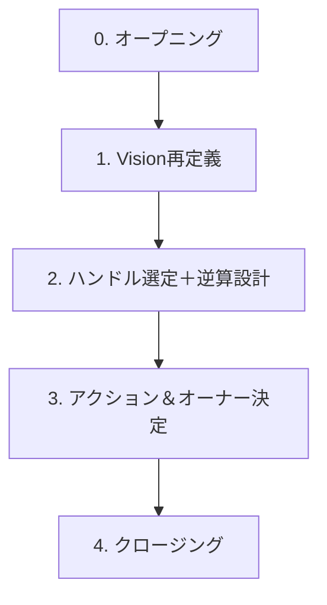

# 📘 Shape Fit Vision × Strategy 共創セッション

## 当日アジェンダ（完全版）

---

## 🅰︎ フェーズ0：オープニング（5min）

| 項目       | 内容                                                          |
| -------- | ----------------------------------------------------------- |
| **目的**   | 今日の目的・進行・期待値を揃え、「共創型の場」であることを明確化する                          |
| **ゴール**  | 参加者が安心して意見を出せる状態をつくる                                        |
| **ポイント** | - 「営業」ではなく「経営設計の共創」であることを冒頭で明言 - ファシリテーションよりも“翻訳＋構造化”を意識 |

**質問例：**

1. 「本日のゴールとして、“戦略の優先順位”と“次の一歩”を決める、でよいでしょうか？」
   　→ *（意図）：経営者が考えている“今日の成果物”を確認し、期待値ズレを防ぐ。*
2. 「現状、皆さんが一番議論したいのは“Vision側”か“戦略実行側”か、どちらが近いですか？」
   　→ *（意図）：“抽象⇄具体”どちらに重きを置いて話すべきかを掴む。*

---

## 🅱︎ フェーズ1：Vision再定義と構造整理（20〜25min）

| 項目       | 内容                                                            |
| -------- | ------------------------------------------------------------- |
| **目的**   | VISION・MISSION・VALUE・Shapenessを「構造」として統一理解する                  |
| **ゴール**  | - “10年後の世界”の共通イメージを言語化 - 「シェイプネスとは何か」を全員が同じ軸で説明できる状態       |
| **ポイント** | - 原文（クライアント言語）＋翻訳（構造化表現）で理解のズレをなくす - 価値観・循環構造・社会的波及を1枚で繋げる |

**質問例：**

1. 「“自分らしく生きられる社会”という言葉を、もう一段深く“構造”で表すとどうなりますか？」
   　→ *（意図）：「理想の社会像」→「社会構造」への翻訳を促す。*
2. 「シェイプネスが教育・企業・文化に根づく、とは“何が変わった状態”を指していますか？」
   　→ *（意図）：「成果の定義」を明確にし、後続のKPI設計に接続する。*
3. 「CJMの中で、最も現場で実感できる変化はどのフェーズですか？」
   　→ *（意図）：“感情実感”から始めて、変容ポイントを可視化する。*

---

## 🅲 フェーズ2：重点ハンドル選定＋逆算設計（35〜45min）

| 項目       | 内容                                                      |
| -------- | ------------------------------------------------------- |
| **目的**   | ビジョン達成のために、4レイヤー（企業/教育/地域/カルチャー）の中から“今最も効果が高いハンドル”を決定する |
| **ゴール**  | - 3ヶ月間で集中すべきTOP1ハンドルを合意 - 「そのハンドルを動かすと何が変わるか」を全員が理解  |
| **ポイント** | - 抽象的な夢ではなく「意思決定」まで進める - 財務・実行難易度・波及効果の3軸で整理する       |

**質問例：**

1. 「4つの領域の中で、“いま一番波及効果が高い”と感じるのはどこですか？」
   　→ *（意図）：“個人の勘”から定性的優先度を抽出する。*
2. 「その領域で、3ヶ月で“数字や行動”として確認できる変化はありますか？」
   　→ *（意図）：“実感ベースのKPI”を探す。*
3. 「逆に、まだ触らない方がいい領域（リソース的に早すぎる）はありますか？」
   　→ *（意図）：“やらないこと”の合意を取る。*
4. 「今回のTOP1ハンドルを、短く“何をやるための戦略か”と表現すると？」
   　→ *（意図）：“戦略名”をチーム内で統一し、後で共有可能にする。*

---

## 🅳 フェーズ3：アクション＆オーナー決定（20〜25min）

| 項目       | 内容                                                  |
| -------- | --------------------------------------------------- |
| **目的**   | “動く状態”を設計し、次回MTGに繋がる確実な進捗線を引く                       |
| **ゴール**  | - 「誰が」「いつまでに」「何をするか」決まっている状態 - DoD（完了定義）を全員が理解   |
| **ポイント** | - 議論で終わらせない - **KPI逆算 → タスク化 → Owner設定**の流れを意識する |

**質問例：**

1. 「このハンドルを動かすために“まず3週間以内にやれること”は何ですか？」
   　→ *（意図）：“最小実行単位”を引き出して勢いを作る。*
2. 「各担当者の中で、“自分がリードしたい部分”はどこですか？」
   　→ *（意図）：“自発的Owner”を可視化する。*
3. 「このアクションが“完了した”と判断する基準（DoD）は何ですか？」
   　→ *（意図）：“終わりの定義”を先に決め、実行管理を容易にする。*

---

## 🅴 フェーズ4：クロージング（5min）

| 項目       | 内容                                                                 |
| -------- | ------------------------------------------------------------------ |
| **目的**   | 今日の決定事項・保留事項・次回準備を確認し、“継続線”を明確にする                                  |
| **ゴール**  | - 合意内容を全員で再確認 - 次回MTGのテーマを仮決定 - クライアントの「得るもの」を明確化            |
| **ポイント** | - 1分で“今日の価値”をまとめる（ex:「今日は方向性が固まった」など） - “宿題を残した方が次回が決まる”意識で設計する |

**質問例：**

1. 「本日の議論を通して、“整理された”と感じた部分はどこですか？」
   　→ *（意図）：“価値実感”を口に出してもらい、次回の布石を作る。*
2. 「次に進むために、こちらで準備しておいた方がよい分析や資料はありますか？」
   　→ *（意図）：“次回発注の余白”を自然に作る。*

---

## 🧩 全体構成図

---

## 🧠 ファシリテーション意図まとめ

| 軸     | 意図                        |
| ----- | ------------------------- |
| 抽象→具体 | ビジョンの“構造化”から“実行”まで滑らかに繋げる |
| 思考→行動 | 「考えた」で終わらず、「動ける状態」で閉じる    |
| 共感→信頼 | クライアントの言葉を尊重しつつ、翻訳力で信頼を獲得 |
