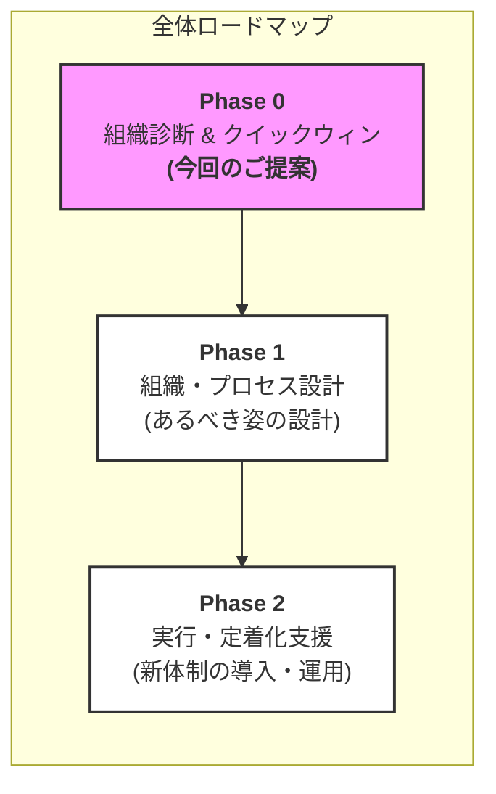
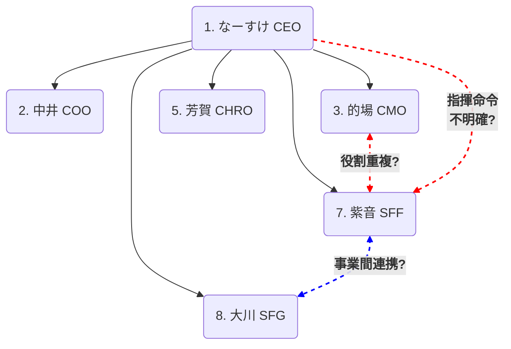

# 事業成長を加速する組織基盤の構築
## 〜「エコシステム型経営」を実現する仕組みづくり〜

**シェイプフィット社 御中**
**2025年11月9日**
**鈴木**

---

### エグゼクティブサマリー

**御社の「リソースの無駄」は、"症状"に過ぎません**

* **真の課題:**
    事業の急拡大とエコシステム化（内部×外部パートナー）に、**組織の「OS」（＝ルール・仕組み）**が追いついていないことです。
* **3つの論点:**
    課題は「①ガバンス」「②役割(R&R)」「③外部連携」の3点に集約されます。
* **ご提案:**
    まず**4週間の「組織診断 & クイックウィン」**で課題の全貌を可視化し、最も無駄を生む業務の**「RACI（役割分担表）」**を作成します。
* **本提案のスコープ:**
    今回の組織診断に加え、[他プロジェクト（例：YouTube戦略）]も包含した**「包括アドバイザリー契約」**をご提案します。

---

### 1. 課題認識のすり合わせ

**「なぜ、リソースの無駄が起きているのか？」**

* **クライアントの顕在課題 (Symptom)**
    * 「人材を適切に動かせていない」
    * 「リソースの無駄が発生している」
    * **ご要望:** 組織図を明確にし、人を適切に配置したい。

* **私たちが特定した真の課題 (Root Cause)**
    * 御社は「本社機能」「SFG」「SFF」「外部パートナー」が連携する**高度な「エコシステム型経営」**をされています。
    * しかし、その連携と管理の「仕組み（OS）」が未整備なため、**役割の重複、業務の隙間、意思決定の遅延**が「リソースの無駄」として表出しています。

---

### 2. 課題の構造：「内部」と「外部」の混在

ご提示いただいたステークホルダーマップ（右図）が、課題の核心を示しています。

**「内部（管理対象）」**と**「外部（協働対象）」**を、
**同じ「組織図」で管理しようとすると、必ず混乱が起きます。**
→ 外部・内部アプローチや、動かし方など

* **内部組織 (Organization)**
    * 例：なーすけ(CEO), 中井(COO), 的場(CMO), 紫音(SFF) 等
    * 管理方法：指揮命令、評価、配置
* **外部エコシステム (Ecosystem)**
    * 例：ﾌﾚｱﾈｽ社(CTO), ﾄﾚｰﾅｰ(SFG), ｽﾎﾟﾝｻｰ, FCｵｰﾅｰ
    * 管理方法：契約、協働、依頼、情報共有

---

### 3. プロジェクトの全体像と今回のご提案範囲

本課題の解決には、3つのフェーズが必要です。今回は「Phase 0」をご提案します。

  * **Phase 0 の目的:** 課題の構造化と真因の特定。最もクリティカルな問題の即時解決。
  * **Phase 1 の目的:** あるべき組織図、R\&R、会議体の設計。
  * **Phase 2 の目的:** 新体制の導入と、現場での運用支援（PMO）。

-----

### 4\. 【Phase 0】ご提案内容（4週間の進め方）

**「組織診断 & クイックウィン」プロジェクト**

  * **Week 1-2: Step 1. 現状把握 (As-Is)**
      * **内容:** 主要ステークホルダー（なーすけ氏、中井氏、紫音氏、大川氏、的場氏など）へのインタビュー
      * **論点:**
          * 「リソースの無駄」の具体例は？
          * 意思決定プロセス（誰が何を決め、誰が実行しているか）？
          * 連携上のボトルネックは？
  * **Week 3: Step 2. 課題の構造化・分析**
      * **内容:** 3つの主要論点（①ガバナンス、②R\&R、③エコシステム）に基づき、根本原因を特定。
      * **クイックウィン:** 「最も無駄を生み、即時解決可能な業務」を選定（例：SFFのイベント企画・運営プロセス）
  * **Week 4: Step 3. アウトプット作成とご報告**
      * **内容:** 診断結果と、Phase 1以降の推奨プランをご報告。
      * **クイックウィン:** 選定した業務の「RACIチャート（たたき台）」をご提示。

-----

### 5\. 成果物イメージ①：組織課題の構造マップ

「リソースの無駄」の真因を、3つの論点から構造化してご報告します。

| 論点 | 現状の課題 (As-Is) | あるべき姿 (To-Be) |
| :--- | :--- | :--- |
| **① ガバナンス** | ・本社とSFF/SFGの権限が曖昧 ・意思決定者が不明確 | ・事業部制など最適な組織構造 ・P/L責任と権限の明確化 |
| **② R\&R** | ・CMOとSFF紫音氏の役割が重複 ・業務の隙間（誰もやらない）が発生 | ・主要業務のプロセス可視化 ・**RACI**による役割分担の定義 |
| **③ ｴｺｼｽﾃﾑ** | ・外部CTOやFCオーナーへの  指示・連携が場当たり的 | ・外部パートナーとの定例会議 ・情報共有ルールの確立 |

-----

### 6\. 成果物イメージ②：組織図（たたき台）

「きれいな組織図」ではなく、\*\*「課題を可視化した組織図」\*\*を作成し、どこをどう変えるべきかをご提示します。

**【可視化される課題（例）】**

  * **\赤・点線:\</span\>** マーケティング機能（CMO）とSFF（紫音氏）の役割重複。CEOからSFFへの指揮命令系統の曖昧さ。
  * **\青・点線:\</span\>** SFGとSFFの事業間連携は定義されているか？

-----

### 7\. 成果物イメージ③：RACIチャート（クイックウィン）

**中井様の「人を適切に動かす」という課題への、最も即効性のある処方箋です。**

（例：SFFイベント企画・運営プロセス）
| 業務プロセス | CEO （なーすけ） | COO （中井） | CMO （的場） | SFF （紫音） | スポンサー |
| :--- | :---: | :---: | :---: | :---: | :---: |
| 1. イベント企画立案 | I | C | C | **A / R** | C |
| 2. 予算案作成・承認 | **A** | I | I | **R** | - |
| 3. スポンサー営業 | C | I | C | **R** | **A** |
| 4. マーケ施策実行 | I | I | **A / R** | C | I |
| 5. 当日運営 | I | I | I | **A / R** | C |

**R**=実行責任者 / **A**=説明責任者 / **C**=協業・相談先 / **I**=報告先

-----

### 8\. 推進体制

少数精鋭で、迅速に課題解決にあたります。

  * **シェイプフィット社**
      * プロジェクトオーナー：なーすけ 様 (CEO)
      * プロジェクトマネージャー：中井 様 (COO)
      * 主要カウンターパート：紫音 様 (SFF)
  * **ご支援体制**
      * プロジェクトマネージャー：鈴木
  * **コミュニケーション**
      * 週1回（30分）or 隔週の進捗確認ミーティング

-----

### 9\. お見積り

本プロジェクト（Phase 0）および、他プロジェクト支援を包含した「包括アドバイザリー契約」として、以下の通りご提案します。

  * **プラン名:** 包括アドバイザリー契約（初期フェーズ）
  * **契約期間:** 2025年11月xx日〜 2025年12月xx日 （4週間）
  * **本見積もりが包含する支援スコープ:**
    1.  **組織基盤強化支援 (Phase 0)**
          * 組織診断（主要メンバーへのインタビュー）
          * 課題構造マップの作成
          * クイックウィン（RACIチャート）の作成・提示
          * Phase 1以降の実行計画（案）の作成
    2. その他のプロジェクトは別途資料に記載
  * **備考:**
      * Phase 1（組織・プロセス設計）以降の実行支援については、本診断（Phase 0）の結果に基づき、最適なプランを別途お見積りいたします。

-----

### 10\. ネクストステップ

  * **本日**
      * 本提案内容に関するディスカッション
      * （スコープ、期間、お見積りの調整）
  * **〜X月X日 (金)**
      * ご契約
  * **X月X日 (月)**
      * プロジェクト・キックオフミーティング

ご清聴ありがとうございました。

