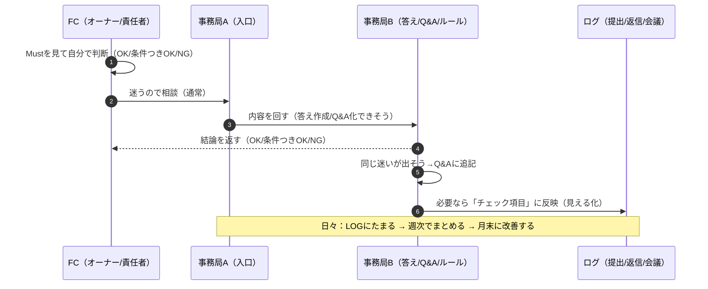

# ShapeFit ルール運用 全体像ペラ一

## 0) 本部の体制

### 本部の登場人物（最低限）

- **トップ（最終OK/NG）**：大事な例外・重要ルール変更だけ判断
- **決める会議（Mustを決める場）**：月末・重要事項を決める場
- **事務局A（入口）**：FCの連絡を受ける／会議を回す／全体連絡を出す
- **事務局B（中身）**：Q&A作る／例外を処理する／ルール文章（4資料）を直す／ログをまとめる
- **お客さん対応（CS）**：クレーム/返金など「顧客対応の方針」を決める
- **ルール確認（LEG）**：ルール上アウトか（トラブルになりそうか）確認する
- **お金確認（FIN）**：返金/精算/請求などお金の判断

### 連絡ルール（これだけ覚える）

- **FC → まず事務局A（入口）**
- 事務局Aが中で仕分けして、必要な人に回す
（相談→B / 例外→B / お客さん→CS など）

---

## 1) Mustを“運用にする”ときに起きること

毎日こう使います。

- **FC側**：
「迷ったらMustに照らす → それでも迷うなら事務局へ」
- **本部側**：
「Mustを守れているか“事実（ログ）”で見る → 必要なら声かけ・支援 → ルールを育てる」

つまり、運用の中心はこの3つです。

1. **判断の基準（Must）**
2. **見える化（ログを残す）**
3. **改善（声かけ・Q&A更新・ルール更新）**

---

## 2) “毎日”の運用イメージ

だいたいこの3つで回ります。

### A. 連絡・確認

- FCで何か判断が必要になった
→ **Mustに照らしてOK/NG/条件つき**を考える
→ 自信がなければ **事務局Aに連絡（入口）**

ここで大事なのは、**誰に聞くかが迷わない**こと。

- FC → 事務局A（入口）
- 事務局A → 必要なら事務局Bへ（答えを作る／Q&A化する）

### B. “提出/報告”があるMustは、日々のルーティンになる

たとえばMustに「提出物」「返信期限」「共有」が入ると、毎日こうなります。

- **やる側（FC）**：決まった時間までに提出
- **受ける側（本部）**：提出の有無をチェック（ログに入る）
- **ズレたとき**：その場で短く声かけ（重くしない）

※この“軽い声かけ”が運用のほとんどです。例外申請はまだ不要。

[5) 測り方（仕組み：迷わない・不公平にしない）](Shape%20Fit%E3%81%AE%E5%8B%9D%E3%81%A1%E6%96%B9%EF%BC%9A%E6%AD%A3%E8%A7%A3%E3%81%A7%E3%81%AF%E3%81%AA%E3%81%8F%E2%80%9C%E8%A8%80%E8%AA%9E%E5%8C%96%E2%80%9D%E3%82%92%E8%B5%B7%E3%81%93%E3%81%99%20v9%201%202d9163ffb49180929a39e331d58dfc8e.md) 

### C. “小さな詰まり”は、Q&Aに貯めて減らす

日々出る「これってどうだっけ？」は、

- その場で答えるだけで終わらせず
- **Q&Aに追記して、次から自己解決**できるようにする

---

## 3) “毎週”の運用イメージ

週次会議は、**Mustで迷いを減らし、揃える場**にします。

### 週次会議の型（おすすめ）

1. **Must状況（5分）**
    - 例：提出率、返信率、出席率など（ログで事実を見る）
2. **今週の詰まりTOP3（10分）**
    - 「迷った」「揉めた」「止まった」だけ持ち寄る
3. **決める（10分）**
    - その場で「OK/条件つきOK/NG」を決める（＝Q&Aの材料）
4. **共有（5分）**
    - 良かったやり方を1つ共有（自由領域を広げる）

会議後に本部側が必ずやるのはこれ：

- 事務局B：Q&A追記／必要なら4資料更新
- 事務局A：全体連絡（変更点だけ短く）

---

## 4) “月末”の運用イメージ

1ヶ月運用すると、必ずこうなります。

- 守りにくいMustが見える
- 例外が出やすいMustが見える
- そもそも文章が分かりにくい部分が見える

だから月末は、

- **ログ（事実）**
- **Q&Aの増分**
- **例外の数と中身**

を見て、「直す」「残す」「やめる」を決めます。

---

## 5) 日々運用の“実際の流れ”

「例外じゃない普通の相談」と「運用（チェック→声かけ→Q&A化）」が分かるように、日常版のフローです。

---

## 6) 例外が発生したときの運用パターン（ざっくり要約）

例外は「どうしてもMustから外したい」時にだけ使います。
（＝頻繁に使うものではなく、“特殊対応”）

### 例外の動き（短く言うと）

1. **FC → 事務局Aへ相談（入口は同じ）**
2. **事務局A → 事務局Bへ回す（例外として受付）**
3. 事務局Bが内容を見て、必要なら確認する
    - ルール的に危ない → **LEGへ確認**
    - お金が絡む → **FINへ確認**
    - 重大 → **トップへ最終判断**
4. **事務局B → FCへ結果を返す**（OK/NG/条件つきOK）
※条件つきOKの時は「条件」「期限」までセットで返す
5. もし他のFCにも影響するなら
    - **事務局Aが全体連絡**（必要な範囲だけ）

### 例外で必ず守ること（これだけ）

- **勝手に実行しない（結果が出てから）**
- **条件と期限を必ず付ける**
- **同じ例外が続くなら、Must/文章を直す（運用で育てる）**

---

## 7) 「Mustが運用として回っている状態」チェック（これが揃えば成功）

- FCが迷った時、**入口が一本（事務局A）** になっている
- 相談が**Q&Aに貯まり**、同じ質問が減っている
- Mustの守り状況が、感覚ではなく**ログで見える**
- 守れない人が出ても、いきなり罰ではなく
**短い声かけ → 支援 → 仕組み改善**で回っている
- 月末に、Mustや文章が**ちゃんと改善される**

---

## 8) 今後のマイルストーン（ざっくりの流れ）

### フェーズ0：準備（今すぐ〜）

- 目的：運用開始前に「迷わない入口」と「記録（ログ）」を用意する
- ゴール：FCが困った時に“誰に聞くか”が固定され、日々の記録が残せる状態

### フェーズ1：Must確定（1月）

- 目的：Must（最低ライン）を4つに絞って、全員の共通ルールにする
- ゴール：Mustが「文章」と「運用の型（ログ・会議）」に落ちている状態

### フェーズ2：トップ伴走運用（2月）

- 目的：トップ（なーすけ）が1on1で対峙し、改善と定着に寄り添う
- ゴール：オーナーとの信頼関係の中でMust運用が定着する

### フェーズ3：体制移行（3月）

- 目的：トップと新体制が並走し、徐々に事務局へハンズオン機能を引き継ぐ（グラデーション）
- ゴール：トップの手が離れても、仕組みと事務局で回る状態を作る

### フェーズ4：完全自走（4月〜）

- 目的：事務局主導で運用し、トップの手が離れた状態で回す
- ゴール：完全な仕組み化による自走

### フェーズ5：月末レビュー（改善して強くする）

- 目的：運用で見えたズレを直し、Must/文章/型を育てる
- ゴール：「直す・残す・やめる」が決まり、次月の運用が軽くなる

---

## 9) 直近のネクストアクション（本部側：簡潔版）

### まず今日〜48時間でやる（最優先）

- [x]  事務局A・Bの担当者を決める（入口と中身を分ける）
    - [ ]  事務局A；大川さん
    - [ ]  事務局B；鈴木
- [x]  FC向けに「連絡は事務局Aへ一本化」を周知する（窓口の固定）
- [x]  Must決定MTG（案出し回／承認回）の2回分の日程を仮押さえする
- [x]  相談・困りごとの提出先（フォーム or 固定投稿）を用意する

### 今週中にやる（運用の土台づくり）

- [ ]  1.1.ログ（最低限）を作る：返信／会議参加／提出物（まずは3つでOK）
- [ ]  1.2.Q&Aの更新ルールを決める（誰が、週何回、どこに追記するか）
- [ ]  1.3.「よくある迷い」の初期Q&Aを5〜10個だけ先に用意する（自己解決を増やす）
- [ ]  1.4.週次会議の型を固定する（Must状況→詰まりTOP3→決める→共有）

### 1月中旬までにやる（Mustを絞るための材料）

- [ ]  2.1.困りごとを集計して、Must候補を作る（規律／品質／誇りの3分類で整理）
- [ ]  2.2.Must候補ごとに「測り方（ログ）」と「例外が出る場面」を1行で書く
- [x]  2.3.案出しMTGで「暫定Must4つ」を決める（叩き台を確定）
- [x]  2.4.フェーズ3のタスクだし：鈴木担当

### 1月下旬までにやる（4資料完成に直結）

- [ ]  承認MTGでMustを最終確定する（OK/NG/条件つきの基準も合わせる）
- [ ]  Mustを4資料へ反映して「完成版v1」にする
- [ ]  配布（見る順番）を固定して全FCに展開する

---

## 10) 直近で一番大事なこと（1行まとめ）

- 「入口（事務局A）を一本化」→「ログを残す」→「Q&Aで迷いを減らす」→「Mustを4つに絞って確定」→「運用しながら毎月直す」