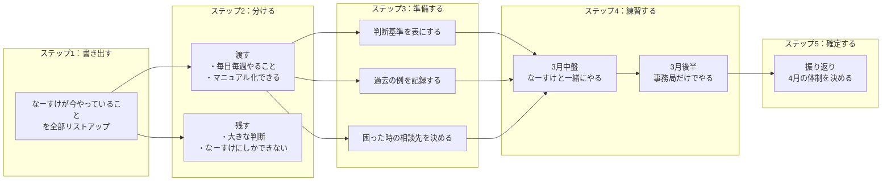
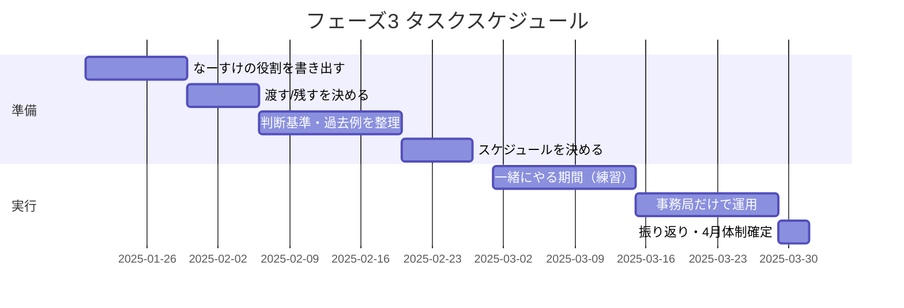

## フェーズ3 タスク出し/論点整理

---

## フェーズ3 詳細フロー（体制移行）

---

## タスク担当・期限フロー

## フェーズ3 タスク出し：論点整理

---

### そもそもフェーズ3で何をする？

**3月のゴール**
「なーすけさんがいなくても、事務局だけで日々の運用が回る状態を作る」

**やること**
なーすけさんが今やっていることを、事務局に少しずつ渡していく。

---

## 論点は3つだけ

---

### 論点1：なーすけさんは今、何をやっている？

まず「今なーすけさんがやっていること」を全部書き出す。

**書き出す項目**

| 分類 | 例 |
|------|-----|
| 決めること | 例外をOKにするかNGにするか、ルールを変えるか |
| 話すこと | FCオーナーとの1on1、週次会議でのコメント |
| 確認すること | ログを見る、Q&Aの内容を確認する |
| その他 | 上記に当てはまらないもの |

---

### 論点2：どれを事務局に渡す？どれを残す？

書き出したものを「渡す」「残す」に分ける。

**分け方の基準**

| 渡す | 残す |
|------|------|
| 毎日・毎週やること | 年に数回の大きな判断 |
| マニュアル化できること | なーすけさんにしかできないこと |
| 事務局でも判断できること | 最終責任を取る判断 |

**例**

| 項目 | 渡す/残す | 理由 |
|------|-----------|------|
| 例外申請の判断 | 渡す | 基準表を作れば事務局で判断できる |
| FCオーナーとの1on1 | 残す | 信頼関係の維持に必要 |
| 週次会議の進行 | 渡す | 事務局Aが進行すればOK |
| Mustの大きな変更 | 残す | 最終判断はなーすけさん |

---

### 論点3：渡すために何を準備する？

「渡す」と決めたものを、事務局が自分でできるようにする準備。

**準備すること**

| やること | 内容 |
|----------|------|
| 判断基準を書く | 「こういう時はOK」「こういう時はNG」を表にする |
| 過去の例を残す | 「前にこういうケースがあって、こう判断した」を記録 |
| 一緒にやる期間を決める | 最初は一緒にやって、慣れたら事務局だけでやる |
| 困った時の相談先を決める | 事務局で判断できない時、誰に聞くか |

---

## 3月のスケジュール（ざっくり）

| 時期 | やること |
|------|----------|
| 3月前半 | 「渡すもの」の準備を完了する |
| 3月中盤 | なーすけさんと事務局が一緒にやる（練習期間） |
| 3月後半 | 事務局だけでやってみる（なーすけさんは見守り） |
| 3月末 | うまくいったか確認、4月の体制を決める |

---

## タスクリスト（これだけやる）

| # | タスク | 担当 | 期限 |
|---|--------|------|------|
| 1 | なーすけさんが今やっていることを書き出す | 鈴木 | 1月下旬 |
| 2 | 「渡す/残す」を決める | なーすけ＋鈴木 | 2月上旬 |
| 3 | 渡すものの判断基準・過去例を整理する | 鈴木 | 2月中 |
| 4 | 一緒にやる期間のスケジュールを決める | 事務局A＋B | 2月下旬 |
| 5 | 3月の練習期間を実施 | 全員 | 3月 |
| 6 | 3月末に振り返り、4月体制を確定 | なーすけ＋事務局 | 3月末 |

---

## 一番大事なこと（1行）

**「なーすけさんが今やっていることを全部書き出す」が最初の一歩。**
