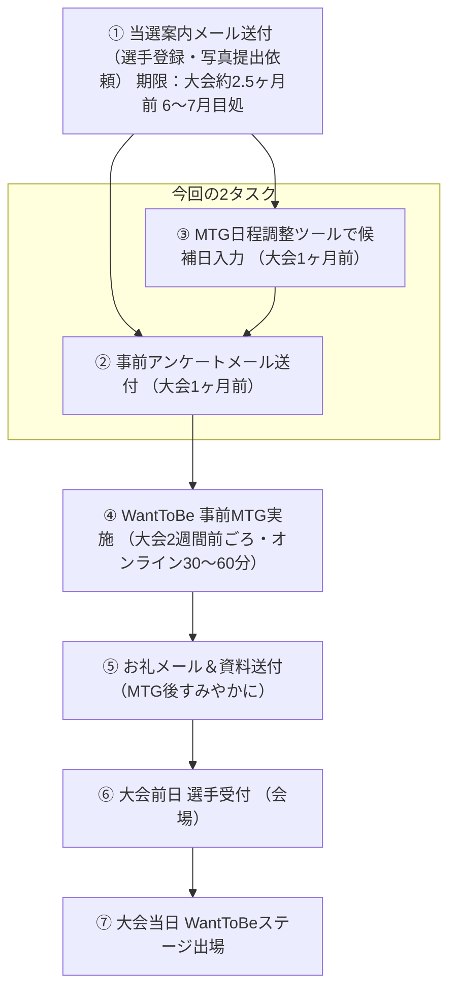

# WantToBe MTG〜大会当日 フロー＆タスク整理

---

## 全体フロー



> **補足：BとCの順序依存**
> タスクC（候補日入力）でURLが確定してからでないとタスクB（メール文章）にURLを差し込めないため、**C → B の順で着手**する。

---

## タスクA：MTG候補日入力

### 概要
日程調整ツール（aitemasu）に、WantToBe選手との事前MTG候補日を登録する。

### 論点と進め方（案）

| 論点 | 内容 | 確認事項 |
|------|------|----------|
| 開催期間 | 大会1ヶ月前〜2週間前の範囲で設定 | SFF2026関西（7月中）・関東（8月中）の大会日程から逆算して決定 |
| 1枠あたり所要時間 | 30〜60分（参考：2025年実績） | 2026年も同様でよいか |
| 用意する枠数 | WantToBe出場予定者数＋余裕分 | 何名エントリー想定か確認が必要 |
| 使用ツール | aitemasu（参考データURLより） | ツールのアカウント・権限確認 |
| 担当者 | MTGに出席する運営スタッフを確定 | なーすけさん（他にいれば確認） |

### 想定進め方
1. 大会日程から逆算して「候補日の範囲」を確定
2. aitemasuに枠を登録してURLを発行
3. 発行したURLをタスクBのメール文面に差し込む

---

## タスクB：事前アンケート＋MTG日程メール文章作成

### 概要
大会1ヶ月前に選手へ送付するメール（②）の文面を2026年版に更新・作成する。
内容は「事前アンケートへの回答依頼」＋「MTG日程の選択依頼」の2本立て。

### 論点と進め方（案）

| 論点 | 内容 | 確認事項 |
|------|------|----------|
| 送付タイミング | 大会1ヶ月前（2025年実績を踏襲） | 2026年も同じ運用でよいか |
| アンケートURL | Googleフォームの2026年版を新規作成 or 流用 | フォーム内容の見直しが必要か |
| アンケート回答期限 | 送付から約2週間後（MTG実施日より前） | 2026年の具体的な日付を確定 |
| MTG日程URL | タスクAで発行したaitemasuのURL | タスクA完了後に差し込み |
| 送付対象 | 当選確定済みのWantToBe選手全員 | 送付リストの管理方法を確認 |
| 文面の署名 | 運営担当スタッフ名 | 2026年の担当者名（しおんさん？）を確認 |
| 大会情報の更新 | 日程・会場・受付情報を2026年版に差し替え | 最新情報が確定しているかチェック |

### 想定進め方
1. 参考データ②の文面をベースに2026年情報へ書き換え
2. アンケートフォームURL・回答期限・MTG日程URLを差し込み
3. 送付前に担当者（なーすけさん or かおんさん）にレビューを依頼
4. 承認後、選手リストへ一斉送付

---

## 進め方サマリー（確認用）

```
[ Step 1 ]  タスクA：aitemasu候補日を登録してURL発行
                ↓
[ Step 2 ]  タスクB：②メール文面を作成しURLを差し込み
                ↓
[ Step 3 ]  レビュー・承認（運営内確認）
                ↓
[ Step 4 ]  選手へ一斉送付（大会1ヶ月前）
                ↓
[ Step 5 ]  MTG実施（大会2週間前ごろ）
                ↓
[ Step 6 ]  お礼メール＋資料送付
```

> **この進め方で問題ないか確認いただけますか？**
> 特に以下の点についてご確認をお願いします。
>
> - [ ]  候補日の開催範囲（何月何日〜何月何日で設定するか）
> - [ ]  WantToBe出場予定者の人数（枠数の設定に必要）
> - [ ]  アンケートフォームを新規作成するか2025年版を流用するか
> - [ ]  メール送付担当のスタッフ名
> - [ ]  レビュー・承認フロー（誰に確認を取るか）