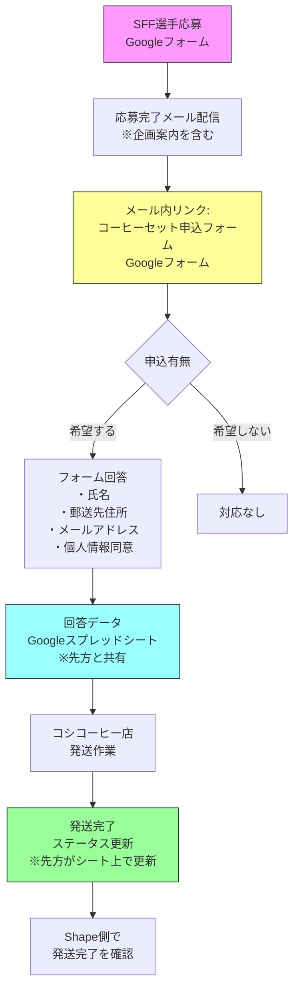
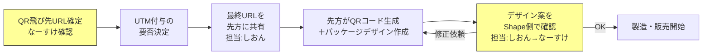
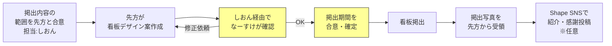

## 目次

---

## 1. 企画概要

### 背景

有限会社越（コシコーヒー店）はSFF2026のDIAMOND協賛企業として決定済み。2/12の打ち合わせにて、標準リターンに加え先方から3つの追加施策が提案された。いずれもShapeへのデメリットが少なく、**先方の「コーヒーを生活のルーティンに組み込んでほしい」という想いとShapeの「挑戦を続けるための環境づくり」**の世界観が合致するため、条件付きで全施策を受ける方針。

### 施策一覧

| # | 施策名 | 概要 | 方針 |
| --- | --- | --- | --- |
| ① | 応募者全員サポート企画 | 応募者全員に1週間分コーヒーセットを郵送 | **実施（オプトイン方式）** |
| ② | QRコード掲載 | ドリップパック裏面になーすけYouTubeへのQR | **実施（条件付き）** |
| ③ | 店舗看板露出 | 店舗外看板にSFF協賛・なーすけ露出 | **実施（デザイン事前確認が条件）** |

### コシコーヒー店の新商品構想

- **黒「アクティブ」**：朝用・カフェイン入り深煎り
- **白「リラックス」**：仕事後用・カフェイン少なめ
- 1日セット：黒2杯＋白1杯 ＝ 計3杯 × 1週間分で提供

---

## 2. 施策①：応募者全員サポート企画（コーヒー郵送）

### 2-1. 企画コンセプト

**企画名：「挑戦者への一杯 ― Shape Challenge Coffee」**

SFFへの応募自体が「挑戦」であり、その一歩を踏み出したこと自体に価値がある。結果に関わらず、挑戦を続けるための1週間分のコーヒーを、すべての応募者へ届ける。

**コンセプトの接続：**

- Shapeの世界観：「挑戦の火を灯し続ける」→ 応募という勇気ある一歩を全員で称える
- コシコーヒー店の想い：「コーヒーを生活のルーティンに」→ 朝のアクティブと夜のリラックスで挑戦のリズムを作る
- Valuesとの接続：「戻ってこれる（途切れを責めない）」→ 応募者全員の挑戦を肯定し、前に進む力を届ける

**応募完了通知のトーン設計：**

応募完了通知は「ありがとうございます」にとどまらず、「応募という挑戦を踏み出したあなたを称えます。挑戦のリズムを一緒につくりましょう」という文脈で設計する。コーヒーは\"慰め\"ではなく\"挑戦への乾杯\"として位置づける。

### 2-2. 対象・条件

| 項目 | 内容 |
| --- | --- |
| 対象者 | SFF2026に**応募した選手**のうち、希望者のみ |
| 提供物 | 黒「アクティブ」＋白「リラックス」1週間分セット |
| 個数上限 | なし（先方確認済み） |
| コスト負担 | 先方全額負担（確認済み） |
| 郵送対応 | コシコーヒー店が実施 |

### 2-3. 導線設計



### 2-4. Googleフォーム設計

**フォーム名：** Shape Fit Festival 2026 ― 挑戦者へのおくりもの コーヒーセットお届けフォーム

**項目設計：**

| # | 項目名 | 種別 | 必須 | 備考 |
| --- | --- | --- | --- | --- |
| 1 | メールアドレス | メール | ✅ | Gmail取得で2重応募防止。応募時と同一アドレスを入力してもらう |
| 2 | お名前（フルネーム） | テキスト | ✅ | 発送伝票用 |
| 3 | 郵便番号 | テキスト | ✅ | ハイフンあり |
| 4 | 都道府県 | プルダウン | ✅ |  |
| 5 | 市区町村・番地 | テキスト | ✅ |  |
| 6 | 建物名・部屋番号 | テキスト | — | 任意 |
| 7 | 電話番号 | テキスト | ✅ | 発送時の連絡用 |
| 8 | 個人情報の取り扱いへの同意 | チェックボックス | ✅ | 下記同意文言を表示 |

**個人情報同意文言（フォーム上に表示）：**

> ご入力いただいた個人情報（氏名・住所・電話番号・メールアドレス）は、SFF2026協賛企業である有限会社越（コシコーヒー店）によるコーヒーセットの発送目的のみに使用されます。情報は有限会社越に提供され、発送完了後に適切に管理されます。Shape Fitのプライバシーポリシーに基づき、本目的以外での利用は行いません。上記に同意いただける場合はチェックを入れてください。

**2重応募防止：**

- Googleフォームの「メールアドレスの収集」設定をONにし、「回答を1回に制限」を有効化
- これにより、Googleアカウント単位で1回のみ回答可能

### 2-5. スプレッドシート運用

**シート構成：**

| 列 | 項目 | 入力者 |
| --- | --- | --- |
| A | タイムスタンプ | 自動 |
| B | メールアドレス | 回答者 |
| C | お名前 | 回答者 |
| D | 郵便番号 | 回答者 |
| E | 都道府県 | 回答者 |
| F | 住所 | 回答者 |
| G | 建物名 | 回答者 |
| H | 電話番号 | 回答者 |
| I | 同意 | 回答者 |
| **J** | **発送ステータス** | **コシコーヒー店** |
| **K** | **発送日** | **コシコーヒー店** |
| **L** | **備考** | **両者** |

- 発送ステータスの選択肢：`未発送` / `発送済み` / `配達完了` / `不在・保管中` / `住所不明`
- 先方にはスプレッドシートの編集権限（J〜L列のみ運用ルール）を付与
- 応募者からの問い合わせ対応はShape側が行う

### 2-6. 応募完了メール文面（案）

**件名：** 【Shape Fit Festival 2026】ご応募ありがとうございます＆挑戦者へのご案内

**本文：**

> ○○様
>
> この度はShape Fit Festival 2026へのご応募、誠にありがとうございました。
>
> 応募という一歩を踏み出されたこと自体が、私たちが大切にしている「挑戦」そのものです。その挑戦に心から敬意を表します。
>
> ---
>
> **＼ 挑戦者のあなたへ、挑戦への一杯を ／**
>
> SFF2026協賛企業「コシコーヒー店」様より、挑戦を続けるあなたへ1週間分のコーヒーセットをお届けするサポート企画をご用意いただきました。
>
> 朝の「アクティブ」で1日のスイッチを入れ、夜の「リラックス」で自分を労う。挑戦のリズムを日常に取り入れてみませんか。
>
> **ご希望の方は、以下のフォームよりお届け先をご入力ください。**
> [フォームURL]
>
> ※ 締切：本メール送信日より2週間以内
> ※ お届けまでに2〜3週間ほどいただく場合がございます
>
> ---
>
> Shape Fit Festivalはあなたの挑戦をこれからも応援しています。
> 大会当日、会場でお会いできることを楽しみにしております。
>
> Shape Fit Festival 2026 運営事務局

### 2-7. 問い合わせ対応方針

| 想定問い合わせ | 対応方針 | 対応者 |
| --- | --- | --- |
| フォームが送信できない | フォームURLの再送・技術サポート | Shape |
| 届かない | スプレッドシートでステータス確認 → 先方に連絡 | Shape → コシコーヒー店 |
| 住所変更したい | シート上で修正し先方に連絡 | Shape |
| アレルギー・成分に関する質問 | コシコーヒー店へ取り次ぎ | Shape → コシコーヒー店 |
| 個人情報に関する問い合わせ | Shape側プライバシーポリシーに基づき回答 | Shape |

---

## 3. 施策②：ドリップパック裏面QRコード掲載

### 3-1. 概要

| 項目 | 内容 |
| --- | --- |
| 掲載場所 | ドリップパック裏面（成分表示と併記） |
| 販売チャネル | コシコーヒー店 自社EC・自社店舗・東急ハンズ（予定） |
| QRコード生成 | 先方が作成（※要確認） |
| 飛び先 | なーすけYouTubeチャンネルTOP |
| TOP協賛との競合 | 問題なし（確認済み） |

### 3-2. 決定事項・確認事項

| 論点 | ステータス | 内容 |
| --- | --- | --- |
| 掲載OK | ✅ 決定 | 条件付きでOK |
| QRコードの飛び先 | ⏳ 要確認 | YouTubeチャンネルTOPを推奨。UTMパラメータ付与はなーすけさんにヒアリングして決定 |
| QRコード生成の担当 | ⏳ 要確認 | 先方が作成の認識。次回打ち合わせで確認 |
| パッケージデザイン確認 | 📋 ルール設定 | QRコード周辺のデザイン・文言は掲載前にShape側で確認 |

### 3-3. UTMパラメータ（なーすけさん確認後に確定）

計測を行う場合の推奨設定：

```
https://www.youtube.com/@[チャンネルID]
  ?utm_source=koshi_coffee
  &utm_medium=drip_pack
  &utm_campaign=sff2026
```

### 3-4. 運用フロー



---

## 4. 施策③：店舗外看板へのなーすけ露出

### 4-1. 概要

| 項目 | 内容 |
| --- | --- |
| 掲出場所 | コシコーヒー店 店舗外看板 |
| 掲出内容 | SFF協賛の表記＋なーすけの露出（詳細はデザイン確認時に確定） |
| 先方スタンス | 「載せられますよ」（好意的提案） |

### 4-2. 条件・取り決め

| 項目 | 方針 |
| --- | --- |
| デザイン事前確認 | **必須**。先方がデザイン案を作成 → しおん経由でなーすけが確認・承認 |
| 掲出内容の範囲 | なーすけの写真・名前・「SFF協賛」の文言を想定。具体的な範囲はデザイン確認時に確定 |
| 肖像権・パブリシティ権 | なーすけ本人が確認・承認するフローとすることで、本人同意を担保 |
| 掲出期間 | 先方の希望を確認のうえ、合意の上で決定（SFF前後に限定 or 通年） |
| 掲出後の対応 | 掲出後に写真を共有いただき、Shape側のSNS等で紹介可能にする |

### 4-3. 運用フロー



---

## ■ A. 全体スケジュール

| 時期 | なーすけさんに関わること |
|------|------------------------|
| **今週** | 3施策の実施可否・方針を決定（本会議） |
| **3月末** | 応募完了メール文面・申込フォームの最終GO |
| **5月中旬** | QRパッケージデザイン＋店舗看板デザインの最終承認 |
| **応募受付開始〜** | 応募完了通知配信（施策①スタート） |

※ それ以外の実務（先方との調整・フォーム作成・素材回収等）はしおん＋鈴木で進めます。

---

## ■ B. なーすけさんへの意思決定項目

### 【全体方針】

1. **3施策すべて実施でOKか？**
   - ① 応募者全員コーヒー郵送 / ② ドリップパックQR / ③ 店舗看板なーすけ露出
   - いずれもShapeへのデメリットは小さく、先方全額負担。世界観も合致する前提で提案

2. **TOP協賛（ステディジャパン）との露出バランスは問題ないか？**
   - QRコードの飛び先がなーすけYouTubeであること、看板になーすけが載ることについて、TOPスポンサーから見て不公平感はないか

### 【施策① 応募者全員サポート企画】

3. **応募完了メール（または全員への結果通知メール）にコシコーヒー企画の案内を含めてよいか？**
   - 応募者全員に「協賛企業からのサポート」として案内を入れる形。希望者のみ申込む（オプトイン方式）

4. **応募者全員への通知トーン：「挑戦してくれてありがとう、挑戦のリズムを一緒につくりましょう」でよいか？**
   - コーヒーは\"慰め\"ではなく\"挑戦への乾杯\"という位置づけ

5. **応募者の個人情報（住所・氏名等）をコシコーヒー店と共有してよいか？**
   - フォーム上で個人情報同意を取得する設計

6. **問い合わせ対応の一次窓口はShape側でよいか？**

### 【施策② QRコード】

7. **QRの飛び先はYouTubeチャンネルTOPでよいか？（or 特定の動画・LP）**

8. **UTMパラメータを付与して計測するか？**

9. **パッケージデザインの最終確認者はなーすけでよいか？**

### 【施策③ 店舗看板】

10. **なーすけの写真・名前を店舗外看板に掲出することを承認するか？**

11. **掲出期間の希望は？**
    - A: SFF期間前後のみ / B: 通年OK / C: 先方希望を聞いてから判断

12. **掲出内容でNGなものはあるか？**
    - 想定：なーすけの写真・名前・「SFF2026協賛」の文言

---

## ■ C. しおんさん → コシコーヒー店（はまのさん宛）メッセージ案

なーすけ承認後に、Slackで先方に送るメッセージです。

---

> はまのさん
>
> お世話になっております。SFFのしおんです。
>
> 先日ご提案いただいた3つの施策について、社内で検討いたしました。
> いずれも実施の方向で進めさせていただければと思います！
>
> **① 応募者全員サポート企画（コーヒー郵送）** → OK
> **② ドリップパック裏面QRコード** → OK
> **③ 店舗看板へのSFF・なーすけ露出** → OK
>
> ざっくりとした流れとしては、
> - ①は**応募受付開始後、応募者全員へ**ご案内 → 希望者にコーヒーセットを郵送
> - ②はこちらからQRの飛び先URLをお送り → 貴社にてパッケージ制作 → デザイン確認後に製造開始
> - ③は掲出内容・期間のすり合わせ → デザイン確認後に掲出
>
> という形を想定しています。
>
> 各施策の具体的な進め方（運用フロー・役割分担・スケジュール等）について、
> 一度お打ち合わせの場でご説明させていただけますでしょうか？
>
> ▼ 日程調整はこちら
> [aitemasu.meリンク]
>
> あわせて、DIAMONDパッケージの標準リターン（ロゴ提出等）についてもNotionページでご案内しておりますので、そちらも順次ご対応いただけますと幸いです。
>
> よろしくお願いいたします！