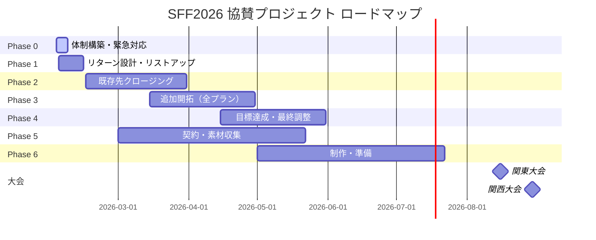
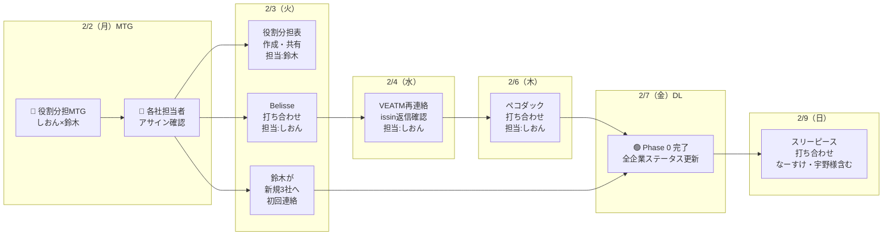
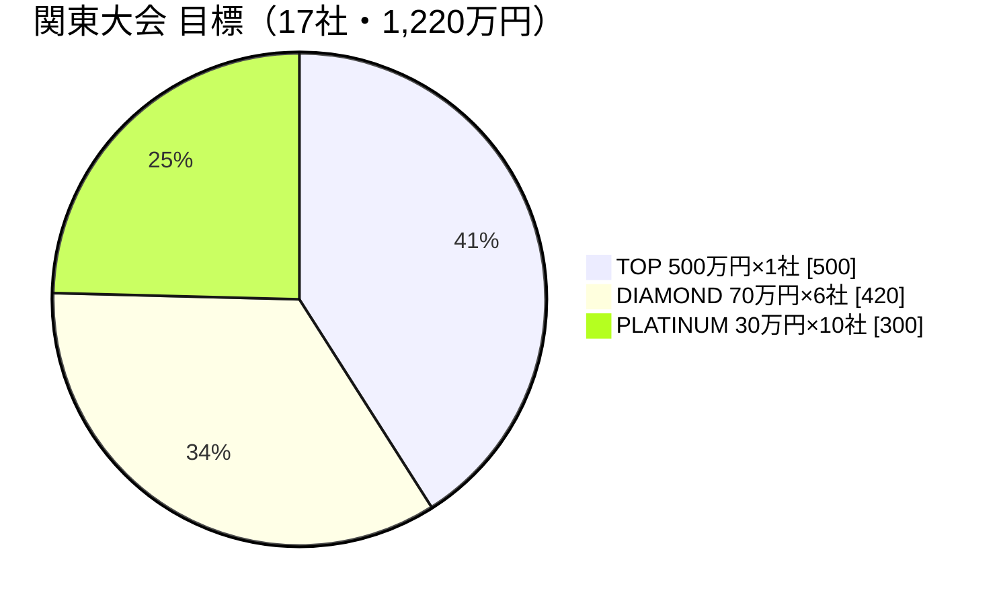

# SFF2026 協賛プロジェクト キックオフMTG アジェンダ

**日付**: 2026年2月2日（月）

---

## プロジェクト全体の流れ

---

## フェーズの流れ（詳細）

```mermaid
flowchart LR
    subgraph P0["Phase 0（2月上旬）"]
        P0A[役割分担決定]
        P0B[未連絡企業への初動]
        P0C[商談中企業の状況把握]
    end

    subgraph P1["Phase 1（2月）"]
        P1A[リターンアイデア収集]
        P1B[新パッケージ確定]
        P1C[全プラン候補リスト作成]
    end

    subgraph P2["Phase 2（2〜3月）"]
        P2A[既存先へのクロージング]
        P2B[DIAMOND 3社追加]
        P2C[PLATINUM 5社追加]
    end

    subgraph P3["Phase 3（3〜4月）"]
        P3A[不足分の追加開拓]
        P3B[目標達成へ追い込み]
    end

    subgraph P4["Phase 4（4〜5月）"]
        P4A[最終追い込み]
        P4B[目標達成 17社・1,220万円]
    end

    P0 --> P1 --> P2 --> P3 --> P4
```

---

## 今ここ！Phase 0 の詳細

**ポイント**

- 担当アサインは音声メモベースで確定済み → 今日確認
- しおんさん：商談中5社 + 関係性深い企業（計11社）
- 鈴木：決定済み企業の契約対応 + 新規問い合わせ企業（計11社）
- 具体的な打ち合わせ日程が入っている企業を優先

**凡例**: 🔴 今日やること ／ 🟢 ゴール ／ DL = デッドライン

---

## 現在の決定状況

### 決定済み企業（4社）

| 企業名 | プラン | 担当 | 状況 |
|--------|--------|------|------|
| ステディジャパン | **TOP** | しおん | 決定済み・数値すり合わせ必要 |
| 有限会社越（コシコーヒー） | **DIAMOND** | 鈴木 | 決定済み・契約書やり取り中 |
| 極洋 | **PLATINUM** | 鈴木 | 決定済み・Slackリマインド必要 |
| PowerLife | **PLATINUM** | 鈴木 | 決定済み・リターン回答済み |

### お断り企業（2社）

| 企業名 | 理由 |
|--------|------|
| SOLIA（アンビーク） | 方向性が合わず |
| TIMA Tokyo | お断り連絡あり |

---

## 目標数値

### 全体目標（関東＋関西 = 2大会合計）

| パッケージ | 1大会あたり | 2大会合計 | 金額/社 | 合計金額 |
|------------|-------------|-----------|---------|----------|
| TOP | 1社 | 2社 | 500万円 | 1,000万円 |
| DIAMOND | 6社 | 12社 | 70万円 | 840万円 |
| PLATINUM | 10社 | 20社 | 30万円 | 600万円 |
| **合計** | **17社** | **34社** | - | **2,440万円** |

---

### 関東大会（8月）

| パッケージ | 目標 | 現状 | 残り |
|------------|------|------|------|
| TOP | 1社 | **1社** ✅ | 0社 |
| DIAMOND | 6社 | **1社** | 5社 |
| PLATINUM | 10社 | **2社** | 8社 |
| **合計** | **17社** | **4社** | **13社** |

**決定済み内訳**
- TOP：ステディジャパン
- DIAMOND：有限会社越
- PLATINUM：極洋、PowerLife

---

### 関西大会（8月）

| パッケージ | 目標 | 現状 | 残り |
|------------|------|------|------|
| TOP | 1社 | 0社 | 1社 |
| DIAMOND | 6社 | 0社 | 6社 |
| PLATINUM | 10社 | 0社 | 10社 |
| **合計** | **17社** | **0社** | **17社** |

※関東・関西両方で協賛する企業があれば調整

---

## 今日のゴール

- [ ] 担当アサイン（しおん11社・鈴木11社）の確認・合意
- [ ] にのくんとの連携方法が決まっている
- [ ] 2月前半の優先タスクと担当が決まっている
- [ ] 打ち合わせ予定企業（Belisse、ペコダック、スリーピース）への準備方針確認

---

## アジェンダ

### 1. 現状の企業ステータス共有 & 担当者アサイン確認（15分）

音声メモベースで整理した担当アサインを確認。

**担当アサイン（確定案）**

| 担当 | 企業数 | 対象企業 |
|------|--------|----------|
| **しおん** | 11社 | スリーピース、ペコダック、西梅田クリニック、VEATM、VOLIX、ステディジャパン、issin、プラスプラン、Belisse、SOLIA（お断り）、TIMA Tokyo（お断り） |
| **鈴木** | 11社 | 極洋、PowerLife、有限会社越、トラストワース、ALAWAY、Dear、HOGUGU、KYO、ラフロン、EDS、Scirocco Works |

**アサインの考え方**

- **しおん**: 商談中・関係性が深い企業、交渉が必要な企業
- **鈴木**: 決定済み企業の契約対応、新規問い合わせ企業、定型対応
- **にのくん**: 自分の人脈で紹介できる企業、新規開拓（後日確認）

**確認ポイント**

- [ ] この分担でOKか？
- [ ] 引継ぎが必要な企業はあるか？

---

### 2. 商談中企業の状況確認（10分）

現在商談中の5社について、直近のアクションを確認。

| 企業名 | 温度感 | 次アクション | 日程 | 見込みプラン |
|--------|--------|--------------|------|--------------|
| スリーピース | 中 | なーすけ・宇野様含め打ち合わせ | **2/9** | DIAMOND |
| ペコダック | 中 | 打ち合わせ | **2/6** | DIAMOND |
| Belisse | 中 | 打ち合わせ | **2/3（月曜）** | DIAMOND |
| VEATM | 中 | 週明け再連絡 | 2/3〜 | DIAMOND〜TOP |
| issin | 中 | 返信確認 | 2/3〜 | PLATINUM |

**懸念点メモ**

- **スリーピース**: ①集客問題 ②競合心配（AMBiQUE→解消済み）
- **ペコダック**: 会社予算未決定のため即決難しい
- **Belisse**: 金額上昇で反応未知数
- **VEATM**: 他団体協賛との兼ね合い検討中
- **issin**: 検討に時間がかかっている

---

### 3. 3人の役割分担を決める（15分）

以下の役割案をベースに話し合う。

| 役割 | 担当 | 具体的にやること |
|------|------|------------------|
| 営業の主担当 | しおん | 商談、クロージング、企業との窓口、交渉 |
| 営業サポート | にのくん | 自分の人脈からのアプローチ、紹介、想いを伝える営業 |
| PM・管理 | 鈴木 | 進捗管理、営業ツール作成、MTG設計、契約対応、新規問い合わせ対応 |

**決めること**

- [ ] この分担でOKか？
- [ ] 各自の稼働可能な時間帯・頻度は？
- [ ] 判断に迷ったときは誰に相談する？

---

### 4. にのくんとの連携方法を決める（10分）

にのくんの状況（ボイスメモより）：

- プルデンシャル勤務、副業禁止のため無報酬で協力
- SFFボランティア経験あり、想いを伝える営業が得意
- できること：自分の人脈企業への営業 → Shape Fitへつなぐ
- すでに協賛資料は渡してある

**決めること**

- [ ] にのくんが企業を紹介したら、誰がどう引き継ぐ？
- [ ] 連絡手段は何を使う？（LINE / Slack / メール）
- [ ] 進捗共有の頻度は？（週1など）
- [ ] にのくんへのお礼の方向性は？
- [ ] 次回にのくんを交えたMTGはいつ？

---

### 5. 2月前半の優先タスク確認（10分）

Phase 0 のデッドラインは **2/7**。それまでに以下を終わらせる。

| タスク | 担当 | 期限 | 備考 |
|--------|------|------|------|
| 役割分担表の作成・共有 | 鈴木 | 2/3 | このMTG結果をまとめる |
| Belisse打ち合わせ | しおん | **2/3** | カラーリング会社、DIAMOND見込み |
| 「とても興味あり」3社への初回連絡 | 鈴木 | 2/4 | KYO、EDS、Scirocco |
| VEATM再連絡・issin返信確認 | しおん | 2/4 | 週明け対応 |
| 「興味はある」1社への連絡 | 鈴木 | 2/5 | ラフロン |
| ペコダック打ち合わせ | しおん | **2/6** | 会社予算未決定、即決難しい |
| 極洋Slackリマインド | 鈴木 | 2/3 | 見ていない可能性あり |
| 有限会社越 契約書対応 | 鈴木 | 2/7 | やり取り中 |

**2/7以降の予定**

| タスク | 担当 | 期限 | 備考 |
|--------|------|------|------|
| スリーピース打ち合わせ | しおん | **2/9** | なーすけ・宇野様含む、DIAMOND前向き |

**確認ポイント**

- [ ] この分担で問題ないか？
- [ ] 他に優先すべきことはあるか？

---

### 6. 営業ツールの優先度確認（5分）

鈴木が作成中のツール。どれが今すぐ必要か確認。

| ツール | 用途 | 優先度 |
|--------|------|--------|
| メッセージテンプレート | 初回連絡・フォローに使う | 高 / 中 / 低 |
| 交渉判断基準シート | 値引き要請などの判断に使う | 高 / 中 / 低 |
| 営業フロー図 | チームの共通認識づくり | 高 / 中 / 低 |
| FAQ集 | 商談での質問対応 | 高 / 中 / 低 |
| 素材チェックリスト | 契約後の素材収集 | 高 / 中 / 低 |

**決めること**

- [ ] 作るべきもの、つくらないでもいいもの
- [ ] 商談で困っていることはある？

---

### 7. 次回の確認（5分）

- [ ] 次回MTG日程：＿＿月＿＿日（＿）＿＿時〜
- [ ] 日常の連絡手段：
- [ ] にのくんを交えたMTG日程：

---

## MTGメモ欄

### 決まったこと

- 

### 宿題・ネクストアクション

| タスク | 担当 | 期限 |
|--------|------|------|
| | | |

### 気になったこと・次回話すこと

-