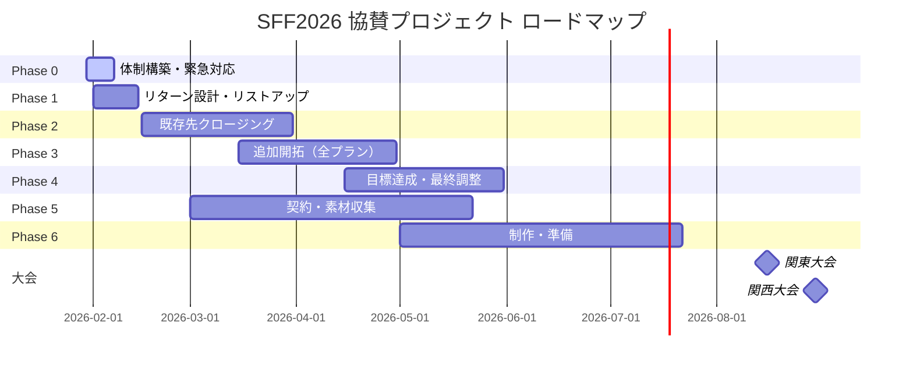
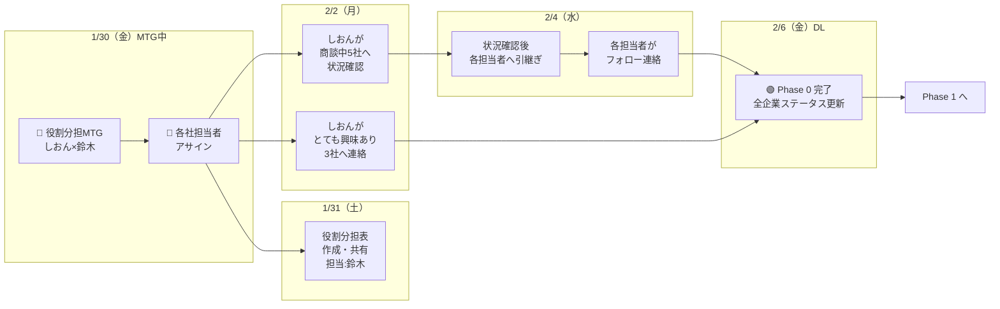
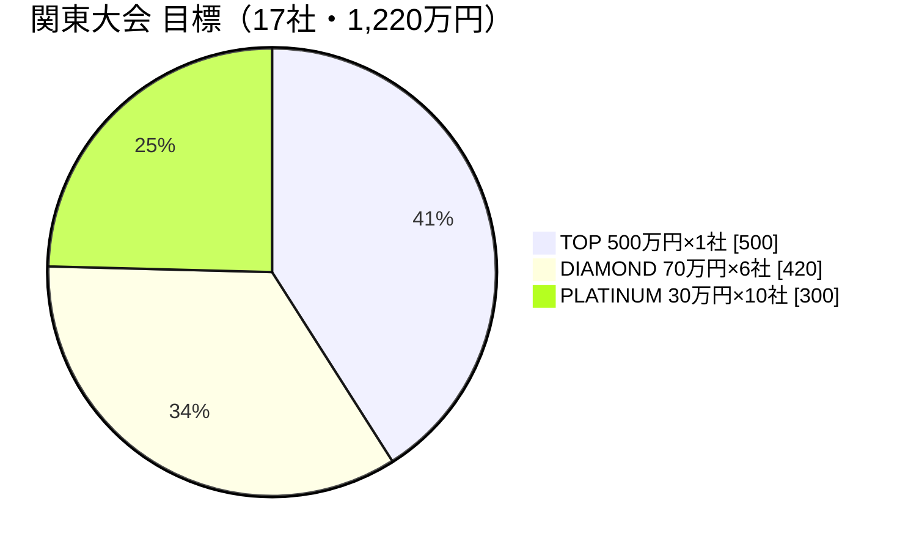
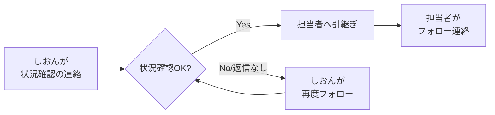

## プロジェクト全体の流れ

---

## フェーズの流れ（詳細）

```mermaid
flowchart LR
    subgraph P0["Phase 0（1月下旬〜2月上旬）"]
        P0A[役割分担決定]
        P0B[未連絡企業への初動]
        P0C[商談中企業の状況把握]
    end

    subgraph P1["Phase 1（2月）"]
        P1A[リターンアイデア収集]
        P1B[新パッケージ確定]
        P1C[全プラン候補リスト作成]
    end

    subgraph P2["Phase 2（2〜3月）"]
        P2A[既存先へのクロージング]
        P2B[DIAMOND 3社決定]
        P2C[PLATINUM 5社決定]
    end

    subgraph P3["Phase 3（3〜4月）"]
        P3A[TOP候補へアプローチ]
        P3B[不足分の追加開拓]
        P3C[TOP 1社決定]
    end

    subgraph P4["Phase 4（4〜5月）"]
        P4A[最終追い込み]
        P4B[目標達成 17社・1,194万円]
    end

    P0 --> P1 --> P2 --> P3 --> P4

```

---

## 今ここ！Phase 0 の詳細

**ポイント**

- 担当アサインは今日のMTG中に決める
- 状況確認の連絡はしおんさんが一括で行う
- 確認が取れたら各担当者に引き継いでフォロー

**凡例**: 🔴 今日やること ／ 🟢 ゴール ／ DL = デッドライン

---

## 目標数値

### 全体目標（関東＋関西 = 2大会合計）

| パッケージ | 1大会あたり | 2大会合計 | 金額/社 | 合計金額 |
| --- | --- | --- | --- | --- |
| TOP | 1社 | 2社 | 500万円 | 1,000万円 |
| DIAMOND | 6社 | 12社 | 70万円 | 840万円 |
| PLATINUM | 10社 | 20社 | 30万円 | 600万円 |
| **合計** | **17社** | **34社** | - | **2,440万円** |

---

### 関東大会（8月）

| パッケージ | 目標 | 現状 | 残り |
| --- | --- | --- | --- |
| TOP | 1社 | 0社 | 1社 |
| DIAMOND | 6社 | 0社 | 6社 |
| PLATINUM | 10社 | 2社 | 8社 |
| **合計** | **17社** | **2社** | **15社** |

---

### 関西大会（8月）

| パッケージ | 目標 | 現状 | 残り |
| --- | --- | --- | --- |
| TOP | 1社 | 0社 | 1社 |
| DIAMOND | 6社 | 0社 | 6社 |
| PLATINUM | 10社 | 0社 | 10社 |
| **合計** | **17社** | **0社** | **17社** |

※現状の数値はMTGでしおんさんに確認して更新

---

## 今日のゴール

- [ ]  3人（しおん・鈴木・にのくん）の役割分担が決まっている
- [ ]  にのくんとの連携方法が決まっている
- [ ]  2月前半の優先タスクと担当が決まっている

---

## アジェンダ

### 1. 現状の企業ステータス共有 & 担当者アサイン（15分）

しおんさんから各企業の最新状況を共有しながら、**その場で担当者を決めていく**。

https://docs.google.com/spreadsheets/d/178cZqJ1w5stMSxOYBl0WmS-vhOYD3ZPTtKCaaX2nkkc/edit?gid=954315172#gid=954315172

**アサインの考え方（案）**

- **しおん**: 商談中・とても興味ありなど、関係性が深い企業
- **にのくん**: 自分の人脈で紹介できる企業、新規開拓
- **鈴木**: 直近稼働限定的なので、サポート的な役割（必要に応じて）

---

### 2. 営業の動き方を確認する（10分）

**確認ポイント**

- [ ]  この流れでOKか？
- [ ]  引継ぎのタイミング・方法は？（Slackで共有？口頭？）
- [ ]  担当者が困ったときの相談先は？（しおんさん？）

---

### 2. 3人の役割分担を決める（15分）

以下の役割案をベースに話し合う。

| 役割 | 担当案 | 具体的にやること |
| --- | --- | --- |
| 営業の主担当 | しおん | 商談、クロージング、企業との窓口 |
| 営業サポート | にのくん | 自分の人脈からのアプローチ、紹介 |
| PM・管理 | 鈴木 | 進捗管理、営業ツール作成、MTG設計、しおんさんサポート、来年以降の仕組み作り |

**決めること**

- [ ]  この分担でOKか？
- [ ]  各自の稼働可能な時間帯・頻度は？
- [ ]  判断に迷ったときは誰に相談する？

---

### 3. にのくんとの連携方法を決める（10分）

にのくんの状況（ボイスメモより）：

- プルデンシャル勤務、副業禁止のため無報酬で協力
- SFFボランティア経験あり、想いを伝える営業が得意
- できること：自分の人脈企業への営業 → Shape Fitへつなぐ
- すでに協賛資料は渡してある

**決めること**

- [ ]  にのくんが企業を紹介したら、誰がどう引き継ぐ？
- [ ]  連絡手段は何を使う？（LINE / Slack / メール）
- [ ]  進捗共有の頻度は？（週1など）
- [ ]  にのくんへのお礼の方向性は？
- [ ]  次回にのくんを交えたMTGはいつ？

---

### 4. 2月前半の優先タスク確認（10分）

Phase 0 のデッドラインは **2/7**。それまでに以下を終わらせる。

| タスク | 担当 | 期限 | 備考 |
| --- | --- | --- | --- |
| 役割分担表の作成・共有 | 鈴木 | 2/1 | このMTG結果をまとめる |
| 商談中5社へ状況確認の連絡 | しおん | 2/3 | 一括で連絡 |
| 「とても興味あり」3社への初回連絡 | しおん | 2/3 | KYO、EDS、Scirocco |
| 状況確認後、各担当者へ引継ぎ | しおん | 2/5 | 確認取れた企業から順次 |
| 各担当者がフォロー連絡 | 各担当 | 2/7 | 引継ぎを受けたら連絡 |

**確認ポイント**

- この分担で問題ないか？
- 他に優先すべきことはあるか？

---

### 5. 営業ツールの優先度確認（5分）

鈴木が作成中のツール。どれが今すぐ必要か確認。

| ツール | 用途 | 優先度 |
| --- | --- | --- |
| [メッセージテンプレート](https://docs.google.com/spreadsheets/d/110FGomJRGgRhCi8aMMmArDmRNx2Rcsbt/edit?usp=sharing&ouid=101007590592271005687&rtpof=true&sd=true) | 初回連絡・フォローに使う | 高 / 中 / 低 |
| [交渉判断基準シート](https://docs.google.com/spreadsheets/d/1tyQbmk1s5K_AlR6UDb4YfRjIQQZ1x1ab/edit?usp=sharing&rtpof=true&sd=true) | 値引き要請などの判断に使う | 高 / 中 / 低 |
| [営業フロー図](https://docs.google.com/spreadsheets/d/1AtjKfoN3IZ9x9Bpxr25yJ-AFpJeMM6uV/edit?gid=1324434080#gid=1324434080) | チームの共通認識づくり | 高 / 中 / 低 |
| FAQ集 | 商談での質問対応 | 高 / 中 / 低 |
| [素材チェックリスト](https://docs.google.com/spreadsheets/d/1tWJXcaN1PCvjdPJ-olNx5FTYGYHfOent/edit?gid=1962921579#gid=1962921579) | 契約後の素材収集 | 高 / 中 / 低 |

**決めること**

- [ ]  作るべきもの、つくらないでもいいもの
- [ ]  商談で困っていることはある？

---

### 6. 次回の確認（5分）

- [ ]  次回MTG日程：＿＿月＿＿日（＿）＿＿時〜
- [ ]  日常の連絡手段：
- [ ]  にのくんを交えたMTG日程：

---

## MTGメモ欄

### 決まったこと

- 

### 宿題・ネクストアクション

- 

### 気になったこと・次回話すこと