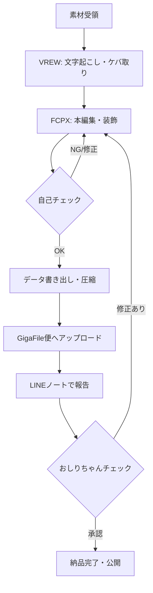

# 📂 04_納品・運用フロー

編集作業と同等に重要なのが、「スムーズな納品」と「気持ちの良いコミュニケーション」です。
チーム全体で効率よく動くために、以下のフローとルールを厳守してください。

---

## 🔄 業務フロー全体図（Workflow）



-----

## 📦 4-1. 納品形式・データ共有ルール

編集データの受け渡しには **「GigaFile（ギガファイル）便」** を使用します。
ファイル容量が大きくなるため、以下の手順で確実にデータを共有してください。

### 📤 1. 提出物のセット内容

納品時は、以下の3点をフォルダごとに圧縮（zip化）して送付してください。

1.  **文字起こし前の元データ**
      * 編集で使用した動画素材の元データ（バックアップ用）。
2.  **VREW保存データ一式**
      * VREWプロジェクトファイル、および書き出したFCPXMLファイル。
3.  **サムネイル画像フォルダ**
      * 作成したサムネイル画像（png/jpg）や、候補となるスクリーンショット。

### ⚙️ 2. VREWからの書き出し設定（FCPX連携用）

Final Cut Proへ連携するため、VREWから以下の設定でエクスポートを行ってください。

  * **形式:** **Final Cut Pro xml** (fcpxml) を選択。
  * **対象:**
      * [x] 音声ファイル (mp3, wav) 
      * [x] 画像ファイル (png, gif) 
      * [x] mov 透明背景の字幕付き動画 
  * **フレームレート:** 原本動画と同一（基本は29.97fps） 。

### ☁️ 3. GigaFile便へのアップロード設定

  * **保存期間:** 必ず **「最大（100日など）」** に変更してください。
      * ※デフォルト（7日など）のままだと、チェック時にリンク切れになる恐れがあります。
      * **アップロード完了画面で、「保持期限」が想定どおりの◯日（最大）になっているかを必ず目視で確認してください。**
  * **ファイル名:** 「日付_動画タイトル_氏名」、中身がわかる名前にしてください。

-----

## 🤝 4-2. 運用・コミュニケーションルール

オンライン完結の業務だからこそ、レスポンスの速さと正確な報告が信頼に繋がります。

### 💬 1. 納品報告（LINEノート）

納品報告は、グループLINEのトークではなく**「ノート」**機能を使用します [cite: 534]。
以下のテンプレートをコピーして使用してください。

#### 📋 納品報告テンプレート

```
【素材の共有】
下記に動画素材を共有させていただきます。

[動画タイトルをここに記入]

・文字起こし前の元データ リンク：
[GigaFile便のURL]

・Vrew保存データ リンク：
[GigaFile便のURL]

・サムネイル画像フォルダ リンク：
[GigaFile便のURL]

・編集の際の補足・申し送り事項：
（例：ここのアニメーションはHUNTER×HUNTERの〇〇をオマージュしました、など）
```
### 🗓 2. スケジュールと稼働基準

  * **納品ペース:** 週2〜3本（YouTubeロング動画 ＋ 公式LINE用動画など）。
  * **レスポンス:**
      * 業務連絡には可能な限り早く反応してください（スタンプ1つでもOK）。
      * **「土日しか稼働できません」「平日は連絡取れません」はNG**です。修正対応などで平日も連絡が取れる状態を維持してください。

### 🛡 3. 緊急時の連絡

  * 「データが破損していて開けない」「素材が足りない」などのトラブルが発生した場合は、納品期限を待たずに**直ちに**連絡してください。早めの相談があれば、スケジュールの調整が可能です。
  * **「この発言、使っていいかな？」「この表現は攻めすぎていないかな？」など、判断に迷う素材が出てきた時点で、いったん編集を止めてください。** そのうえで、LINEグループ内でおしりちゃんにメンションを付けて**必ず相談（エスカレーション）**してください。
