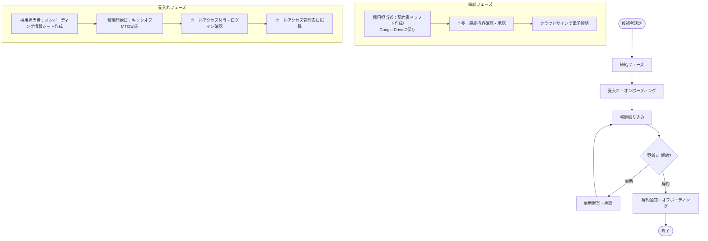

# 採用・受入れフロー マニュアル

---

## 0. このドキュメントの使い方

このページでは、Shape Fitで新たなメンバーを迎える際の**締結から更新・解約まで**の全フローを雇用形態ごとに記載しています。

採用担当者は自分の担当する雇用形態の列を確認し、各フェーズのアクションと期限を漏れなく実施してください。

**凡例**

- 🟢 全雇用形態共通
- 🔵 業務委託のみ
- 🟡 パートタイムのみ
- 🔴 正規雇用のみ

---

## 1. フロー全体図



---

## 2. フェーズ別詳細

### 📌 フェーズ① 締結

> **起点**：候補者が決定した時点
> 
> 
> **全雇用形態共通フロー**
> 

| ステップ | 担当者 | アクション | 備考 |
| --- | --- | --- | --- |
| 1 | 採用担当者 | 契約書ドラフトを作成し、[Google Drive](https://drive.google.com/drive/folders/1oZ8F2HoPhJBvejp98py3QTQGdVMPVjR0?usp=drive_link)の所定フォルダに保存 | 雇用形態別のひな形を使用 |
| 2 | 上長 | 契約書の最終内容を確認・承認
クラウドサインの電子締結リンクを作成 | 内容に問題があれば採用担当者へ差し戻し |
| 3 | 採用担当者 | クラウドサインにて電子締結リンクを候補者に送り、締結を依頼 | 締結完了後、管理台帳（業務委託者管理シート）に契約情報を登録 |

**雇用形態別の差分**

|  | 業務委託 🔵 | パートタイム 🟡 | 正規雇用 🔴 |
| --- | --- | --- | --- |
| 契約書ひな形 | 業務委託契約書 | 雇用契約書（パート） | 雇用契約書（正社員） |
| 必須確認項目 | 業務内容・単価・納期・知的財産帰属・再委託可否・秘密保持 | 時給・勤務日時・試用期間・社会保険加入有無 | 給与・勤務地・試用期間・社会保険・就業規則 |
| 請求書取得 | **向こうが作成** | Shape側が作成 | Shape側が作成 |

---

### 📌 フェーズ② 受入れ・オンボーディング

> **タイミング**：稼働開始日
> 
> 
> **全雇用形態共通フロー**
> 

| ステップ | 担当者 | アクション |
| --- | --- | --- |
| 1 | 採用担当者 | キックオフ前日までにオンボーディング情報シートを完成させる（ログイン情報・招待先を事前準備） |
| 2 | 採用担当者 | 稼働開始日にキックオフMTGを実施（アジェンダはキックオフMTG資料テンプレートを使用） |
| 3 | 採用担当者 | MTG内でSlack / Canva / Notionのアクセスを付与し、本人がログインできることを確認 |
| 4 | 採用担当者 | ツールアクセス管理表に付与日・付与担当者を記録 |

**雇用形態別の差分**

|  | 業務委託 🔵 | パートタイム 🟡 | 正規雇用 🔴 |
| --- | --- | --- | --- |
| 追加確認事項 | 秘密保持・情報管理のリマインド | 勤怠管理ツールの使い方説明 | 就業規則の説明・社内研修の案内 |
| 勤怠管理 | 原則なし（成果物管理）
→時給管理する場合には必要になる | 勤怠管理ツールに登録・説明必須 | 勤怠管理ツールに登録・説明必須 |

---

### 📌 フェーズ③ 報酬振り込み

> **サイクル**：月末締め 翌月末払い
> 

### 🟢 共通フロー概要

```
月末       →    翌月初め     →   翌月末
請求書提出期限    採用担当者チェック    アールハープさんにて振込
```

### 業務委託の報酬フロー 🔵

| ステップ | 担当者 | アクション | 期限 |
| --- | --- | --- | --- |
| 1 | 業務委託者 | 請求書を採用担当者へ提出 | 月末まで |
| 2 | 採用担当者 | 請求書の内容をチェック（下記チェック項目参照） | 翌月3営業日以内 |
| 3 | 採用担当者 | 業務委託者管理シートに請求情報を記入・請求書のGoogle DriveリンクをURL欄に貼付 | 同上 |
| 4 | アールハープさん | フォルダに入っている請求書を確認する。 | 同上 |
| 5 | アールハープさん | 振込実施後、業務委託者管理シートの「振込完了」「振込完了日」「振込担当者」を入力 | 翌月末まで |

**採用担当者の確認チェック項目**

- [ ]  請求書を受領できているか
- [ ]  請求月・請求金額が契約内容と一致しているか
- [ ]  振込先口座が登録済みのものと一致しているか
- [ ]  業務種別に応じたしおんさん確認が必要な項目がないか（下記エスカレーションルール参照）
- [ ]  業務委託者管理シートへの記入が完了しているか
- [ ]  請求書のGoogle DriveリンクをURL欄に貼付したか

### パートタイム報酬フロー 🟡🔴

| ステップ | 担当者 | アクション | 期限 |
| --- | --- | --- | --- |
| 1 | 本人 | 月末までに勤怠を確定・申請 | 月末まで |
| 2 | 採用担当者 | 勤怠内容を確認・承認 | 翌月3営業日以内 |
| 3 | 採用担当者 | アールハープさんへSlack連絡（しおんさんをCC）し、給与計算・振込依頼 | 同上 |
| 4 | 社労士さん | 勤怠締め・PDFにて、各人の稼働時間を送ってもらう→しおんさん・アールハープさん | 同上 |
| 5 | アールハープさん | 給与計算・振込実施 | 当月20日 |
| 6 | しおんさん | 勤怠状況のチェック
→　[請求書フォーマット](https://docs.google.com/spreadsheets/d/1ITJuA333Wv5T4pAvUtpAXNDSvNgDTiCiHbVUuhs0804/edit?gid=1170628518#gid=1170628518) | 当月25日まで |

---

### 📌 フェーズ④ 更新・解約

> **全雇用形態共通フロー**
> 

### 更新の場合

| ステップ | 担当者 | アクション | 期限 |
| --- | --- | --- | --- |
| 1 | 採用担当者 | 更新起案フォーマットを作成（根拠・理由の明記必須） | 契約終了37日前まで
（解約通知30日前の1週間前） |
| 2 | 上長 | 起案内容を確認・承認
クラウドサインの作成 | 契約終了37日前まで |
| 3 | 採用担当者 | 条件変更がある場合は新契約書を作成し、クラウドサインで再締結 | 契約終了日まで |
| 4 | 採用担当者 | **業務委託者管理シートの契約情報を更新** | 再締結後即日 |

> ⚠️ **根拠・理由が記載されていない起案は上長へ提出不可。** 必ず理由を明記してから提出してください。
> 

### 解約の場合

| ステップ | 担当者 | アクション | 期限 |
| --- | --- | --- | --- |
| 1 | 採用担当者 | 解約起案フォーマットを作成（根拠・引き継ぎ方針を明記） | 契約終了37日前まで |
| 2 | 上長 | 起案内容を確認・承認 | 契約終了37日前まで |
| 3 | 採用担当者 | 対象者へ解約通知をメールで送付 | 契約終了30日前まで |
| 4 | 採用担当者 | **ツールアクセス管理表を確認し、全ツールのアクセス権限を剥奪** | 契約終了日 |
| 5 | 採用担当者 | **業務委託者管理シートの契約ステータスを「契約終了」に更新** | 契約終了日 |

---

## 3. ステークホルダー別役割一覧

| 役割 | 担当 | 主な責務 |
| --- | --- | --- |
| 採用担当者（各人） | 各BU担当者 | 業務委託者との一次窓口・契約書作成・請求書受領・ツールアクセス管理・起案 |
| 上長 | 採用担当者の直属上長 | 契約書の最終確認・更新/解約起案の承認 |
| しおんさん | 経理内部 | 特定業務種別の請求内容確認（エスカレーション対応）・例外・トラブル対応 |
| アールハープさん | 外部経理 | 振込執行・給与計算 |

---

## 4. 基本ルール集

| ルール | 内容 |
| --- | --- |
| 支払いサイト | 月末締め 翌月末払い（全雇用形態統一） |
| 解約通知期限 | 契約終了の30日前・メールにて実施 |
| 更新/解約承認期限 | 解約通知期限（30日前）のさらに1週間前（＝契約終了37日前）までに上長承認を完了 |
| 契約書保管 | Google Drive所定フォルダに保存後、クラウドサインで締結 |
| アールハープさんへの連絡方法 | Slack連絡 ＋ しおんさんをCC（簡易共有で可・上記のフローを確認し必要に応じてCC入れる） |
| ツールアクセス付与タイミング | 稼働開始日（キックオフMTG内で実施） |

---

## 5. 例外・エスカレーションルール

### しおんさんへのエスカレーション条件

請求書の内容確認時に以下のいずれかに該当する場合は、採用担当者がしおんさんへ確認を取る。

| 条件 | 内容 |
| --- | --- |
| 業務種別が特殊な場合 | クリエイティブディレクター・YouTubeディレクターなど、業務によって請求項目が異なるケース |
| 初回請求の場合 | 新規の業務委託者からの初回請求時は念のため確認を推奨 |

### その他トラブル対応

請求・振込・契約に関する問題が発生した場合の一次対応はしおんさん・鈴木が担当するため、2名にメンションを入れて連絡する

## 6. フォルダ

契約書フォルダ：https://drive.google.com/drive/folders/1oZ8F2HoPhJBvejp98py3QTQGdVMPVjR0?usp=drive_link

---