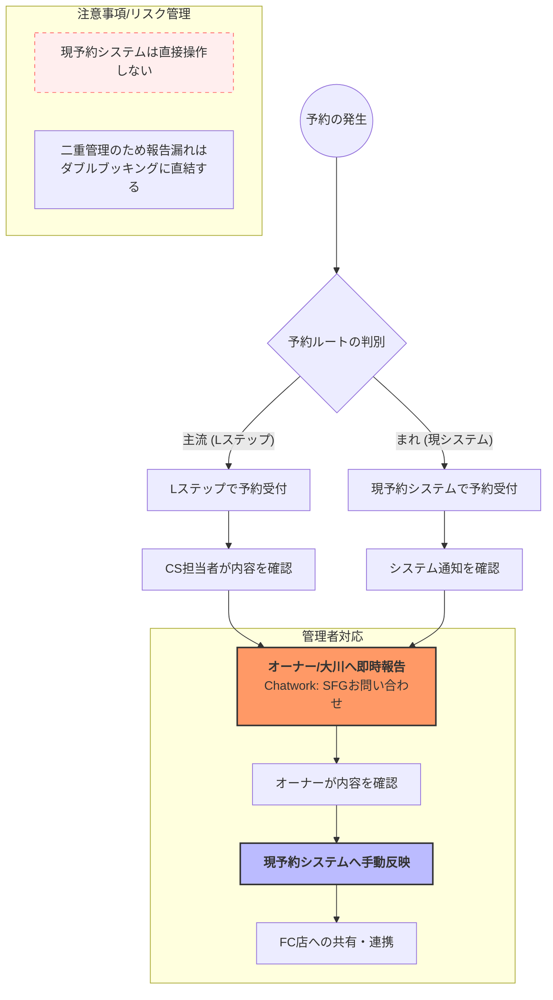

# 03. SFG（ジム事業）対応実務

## 1. 窓口と使用システム
SFG事業では、お客様の目的や店舗に合わせて以下の窓口を使い分けます。

### 使用アドレス
* **SFG事業全体**: `support@shape-fit-gym.com`
  * 全店舗共通の問い合わせ、新規の相談など。
* **SFG本店専用**: `shitte@shape-fit-gym.com`
  * 本店の顧客対応、店舗固有の連絡など。

### 使用システム
* **SFG予約システム**
  * ID: `okawa.shape@gmail.com` / Pass: `Monaca97`
  * 顧客の契約内容や予約状況を確認する際に使用します。
* **Lステップ（公式LINE）**
  * ID: `okawa_na` / Pass: `monaca97`
  * LINE公式アカウントからのチャット相談に使用します。

---

## 2. 問い合わせの分類
届いた内容は、まず以下の4つのどれに該当するかを確認します。

1. **一般のお客様からのお問い合わせ**
   * カウンセリング予約、契約、支払い、システム操作、トレーニング内容への質問など。
2. **営業・提案メール**
   * 業務提携、広告、新サービスの提案など。
3. **なーすけ宛・メディア関連**
   * PR依頼、メディア出演、ポージングレッスンの依頼など。
4. **トレーナーへのご意見・ご要望（クレーム含む）**
   * 指導内容や接客態度に関する指摘など。

---

## 3. 基本の対応フロー
すべてのお問い合わせに対し、以下のステップで対応を進めます。

1. **情報の把握**: 顧客情報を確認し、過去のメール履歴から同様のケースがないか参照します。
2. **下書き作成**: 過去の事例を参考に返信文を作成します。
3. **報告・確認**: 作成した文案を大川へ報告し、内容の確認を受けます。
4. **送信**: 承認を得た内容でお客様へ返信します。
5. **トレーナー共有**: 返信完了後、担当トレーナーへ内容を報告し、現場と情報を共有します。

---

## 4. 判断基準と注意点

### クレーム・ご意見への対応
トレーナーへの厳しい意見やクレームについては、**自分の判断で返信せず、必ず大川へ相談してください**。大川が対応方針を検討し、返信文を確定させます。

### 営業・メディア関連
* **営業メール**: 基本は大川に報告します。明らかに不要な広告等は、担当者の判断でお断りしても構いません。
* **メディア関連**: 「なーすけ」への出演・取材依頼などは、即座に大川へ共有してください。

### コミュニケーションの質
* **24時間以内の返信**: 解決に時間がかかる場合でも「確認中」の旨を一次返信します。
* **感情の汲み取り**: 単なる一問一答ではなく、お客様の不安や希望を想像し「どのような希望がありますか？」と問いかける姿勢を大切にしてください。
* **NG表現**: 「痩せさせます」など、結果を100%保証するような言葉は絶対に使用しないでください。

---

## 5. 予約管理の詳細フローと注意点
新担当者（神保さん）は「現予約システムを操作しない」という方針のもと、以下のフローで対応します。Lステップと現予約システムは連動していない「二重管理」状態であるため、報告漏れはダブルブッキングに直結します。

### 予約導線別フロー図

### ⚠️ 予約管理の注意点（NG行動）
重大なトラブル（ダブルブッキングやシステムデータの破損）を防ぐため、以下の行為は固く禁止します。

* **現予約システムの直接操作（追加・修正・削除）**
    * 予約の登録や変更、特にデータの削除は絶対に行わないでください。
    * **理由**：操作を誤ると大元の管理者へ修正依頼が必要になり、対応フローが非常に複雑化するためです。
* **Lステップ予約の「報告のみ」での自己完結**
    * Lステップで予約を受けた際、報告をせずに放置することは厳禁です。
    * **理由**：現システムとLステップは連携していないため、即座に報告・反映しなければダブルブッキングが発生し、FCオーナーに多大な迷惑をかけるリスクがあります。