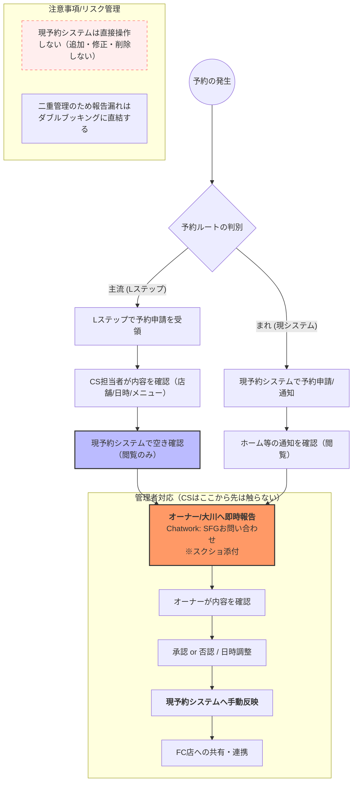

# 03. SFG（ジム事業）対応実務

## 1. 窓口と使用システム
SFG事業では、お客様の目的や店舗に合わせて以下の窓口を使い分けます。

### 使用アドレス
* **SFG事業全体**: `support@shape-fit-gym.com`
  * 全店舗共通の問い合わせ、新規の相談など。
* **SFG本店専用**: `shitte@shape-fit-gym.com`
  * 本店の顧客対応、店舗固有の連絡など。

### 使用システム
* **SFG予約システム**
  * ID: `okawa.shape@gmail.com` / Pass: `Monaca97`
  * 顧客の契約内容や予約状況を確認する際に使用します。
* **Lステップ（公式LINE）**
  * ID: `okawa_na` / Pass: `monaca97`
  * LINE公式アカウントからのチャット相談に使用します。

※ID/Passは取り扱い注意。閲覧権限は必要最小限にしてください。

---

## 2. 問い合わせの分類
届いた内容は、まず以下の4つのどれに該当するかを確認します。

1. **一般のお客様からのお問い合わせ**
   * カウンセリング予約、契約、支払い、システム操作、トレーニング内容への質問など。
2. **営業・提案メール**
   * 業務提携、広告、新サービスの提案など。
3. **なーすけ宛・メディア関連**
   * PR依頼、メディア出演、ポージングレッスンの依頼など。
4. **トレーナーへのご意見・ご要望（クレーム含む）**
   * 指導内容や接客態度に関する指摘など。

---

## 3. 基本の対応フロー
すべてのお問い合わせに対し、以下のステップで対応を進めます。

1. **情報の把握**: 顧客情報を確認し、過去のメール履歴から同様のケースがないか参照します。
2. **下書き作成**: 過去の事例を参考に返信文を作成します。
3. **報告・確認**: 作成した文案を大川へ報告し、内容の確認を受けます。
4. **送信**: 承認を得た内容でお客様へ返信します。
5. **トレーナー共有**: 返信完了後、担当トレーナーへ内容を報告し、現場と情報を共有します。

※予約が絡む場合は、【5. 予約管理の詳細フローと注意点】に沿って「空き確認（閲覧のみ）→報告」までを先に行います。

---

## 4. 判断基準と注意点

### クレーム・ご意見への対応
トレーナーへの厳しい意見やクレームについては、**自分の判断で返信せず、必ず大川へ相談してください**。大川が対応方針を検討し、返信文を確定させます。

### 営業・メディア関連
* **営業メール**: 基本は大川に報告します。明らかに不要な広告等は、担当者の判断でお断りしても構いません。
* **メディア関連**: 「なーすけ」への出演・取材依頼などは、即座に大川へ共有してください。

### コミュニケーションの質
* **24時間以内の返信**: 解決に時間がかかる場合でも「確認中」の旨を一次返信します。
* **感情の汲み取り**: 単なる一問一答ではなく、お客様の不安や希望を想像し「どのような希望がありますか？」と問いかける姿勢を大切にしてください。
* **NG表現**: 「痩せさせます」など、結果を100%保証するような言葉は絶対に使用しないでください。

---

## 5. 予約管理の詳細フローと注意点
新担当者（神保さん）は「現予約システムを操作しない」という方針のもと、以下のフローで対応します。  
Lステップと現予約システムは連動していない「二重管理」状態であるため、報告漏れはダブルブッキングに直結します。

#### まず前提（超重要）
- Lステップ側の「予約が入った」は、予約確定ではなく「申請待ち」の状態です。  
  そのため、Lステップで予約申請を見つけたら、必ず現予約システム側で「本当に空いているか」を確認してから報告します（Lステップと現予約システムは連動していません）。{{画像を挿入}}

- CS担当がやるのは「確認」と「報告」までです。  
  予約の承認／キャンセル、予約の追加・修正・削除などの“確定操作”はCS担当は行いません（事故防止）。

---

### 予約導線別フロー図


---

### CS：毎日やるチェック（見逃し防止）
#### 1) Lステップ：メッセージ確認
- 「個別トーク」で新着がないか確認する
- 念のため「トーク一覧」でも新着がないか確認する
{{画像を挿入}}

#### 2) Lステップ：予約申請の確認（全店舗）
- 「予約管理」→「カレンダー予約」
- 「全店舗」を対象に、当日〜数日先まで申請が入っていないか確認
- 申請を見つけたら「予約確定ではなく申請待ち」なので、必ず現予約システムで空き確認へ進む
{{画像を挿入}}

#### 3) 現予約システム：ホームで“異常がないか”だけ見る（閲覧のみ）
- 「ホーム」で以下が出ていないかを確認（出ていたら大川へ報告）
  - カウンセリングの申請/承認待ち
  - 既存予約の承認待ち
  - 支払いエラー
{{画像を挿入}}

---

### Lステップで予約申請を見つけた時（CSがやること）
#### 手順
1. Lステップ「予約管理」→「カレンダー予約」→対象店舗を開く
   - 申請が入っている枠を開いて、以下を控える（またはスクショ）
     - 顧客名
     - 希望日時
     - 店舗
     - メニュー/備考
   {{画像を挿入}}

2. 現予約システムで空き確認（閲覧のみ）
   - 「スケジュール」を開いて、同日時の埋まり具合を確認
   - 注意：店舗には「トレーニングルームが2つ」あります。
     - トレーニングルーム2つが埋まっている場合、セッション予約はできません
     - 待合室はカウンセリングで使用（原則「同時間に1名」想定）
   {{画像を挿入}}

3. 大川へ即時報告（Chatwork「SFG お問い合わせ」）
   - 空きがある場合：予約申請あり＋空き確認OKを報告（スクショ添付）
   - 空きがない場合：空きなし報告＋代替候補（別時間/別店舗）の提案を添えて相談
   - CS担当は「承認/否認」や「登録/修正/削除」などの確定操作は行わない

#### 報告テンプレ（コピペ用）
```
**投稿先：Chatwork「SFG お問い合わせ」グループ**
【Lステップ予約報告】
Lステップより予約申請が入りました。内容のご確認と、現システムへの反映判断をお願いいたします。
## ■顧客名：
■予約日時：YYYY年MM月DD日（ ）HH:MM〜
■対象店舗：
■メニュー：
■備考：
■現予約システム空き確認：OK / NG（※スクショ添付）
{{画像を挿入}}
```
---

### 支払いエラー・謎の表示など“いつもと違う”ものを見つけたら
- CS担当は自力で直そうとせず、操作を止めて大川へ報告します（スクショ添付）
- 「現予約システム / Lステップ / Shopify」など、どのシステムで起きているかも一緒に共有します

---

### 【参考：管理者のみ】現予約システムでの承認/キャンセル（CSは操作しない）
- 承認待ちの確認例：
  - 「ホーム」→「予約承認待ち」→「詳細」→「スケジュール」
  - 赤字の箇所を選択（承認されると青字になる）
  {{画像を挿入}}

- 承認画面で行う設定：
  - 「担当トレーナー」「スペース」を設定
  - 「承認する」or「キャンセル」
  {{画像を挿入}}

- 補足：
  - 予約承認時に入力したメッセージは、公式LINEより自動送信されます

---

### ⚠️ 予約管理の注意点（NG行動）

重大なトラブル（ダブルブッキングやシステムデータの破損）を防ぐため、以下の行為は固く禁止します。

* **現予約システムの直接操作（追加・修正・削除）**

  * 予約の登録や変更、特にデータの削除は絶対に行わないでください。
  * **理由**：操作を誤ると大元の管理者へ修正依頼が必要になり、対応フローが非常に複雑化するためです。
* **Lステップ予約の「報告のみ」での自己完結**

  * Lステップで予約を受けた際、報告をせずに放置することは厳禁です。
  * **理由**：現システムとLステップは連携していないため、即座に報告・反映しなければダブルブッキングが発生し、FCオーナーに多大な迷惑をかけるリスクがあります。
* **「空き確認」をせずにお客様へ確定ニュアンスで返信する**

  * Lステップで申請が入っても確定ではありません。
  * 必ず現予約システムで空き確認（閲覧のみ）→大川へ共有→方針確定、の順で進めます。

---

### （参考）管理者向け：操作フロー資料

* `フロー説明.pdf`

  * これは「管理者が操作する場合の全体フロー理解」の参考資料です。
  * **CSは操作しません（閲覧・理解のための参照のみ）。**
