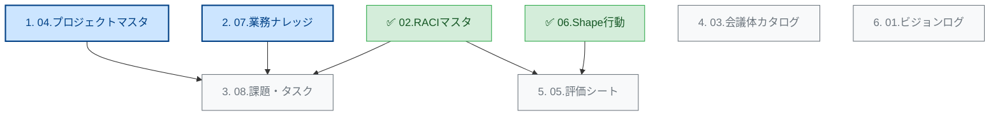

Notionのデータベース構築において、「リレーション（紐付け）の親」から先に作ると、後で設定に戻る手間が省けて効率的です。

現在、\*\*「02.RACIマスタ」**と**「06.Shapeらしさ行動」\*\*という「判断基準（ルール）」の核となるDBは作成済みですね。

ここから先は、課題管理表にある\*\*「現場の混乱」を鎮めるための受け皿\*\*を優先して作る順序をお勧めします。

### 🚀 推奨構築ステップ

以下の\*\*フェーズ1（受け皿作り）\*\*を最優先で進めるのが、今のShapeFitの課題解決に最も効果的です。

-----

### Phase 1：業務の「置き場所」を作る（最優先）

課題管理表にある「散らかった仕事」を整理するために、まずは箱を用意します。

#### **1. 04.プロジェクトマスタDB**

  * **理由:** 全てのタスクや会議は「何のプロジェクト（目的）か？」に紐づきます。これがないと、タスクDBを作っても「分類不能」なタスクが溢れてしまいます。
  * **解決する課題:** 「B2B展開」「CRM導入」「イベント改善」など、今バラバラに動いている取り組みを「プロジェクト」として定義し、\*\*「終わり（ゴール）」\*\*を可視化します。

#### **2. 07.業務ナレッジDB**

  * **理由:** 「紫音さんしかできない（Issue 001）」仕事を剥がすには、マニュアルの置き場所が必須です。
  * **解決する課題:** 作成したマニュアルをこのDBに格納し、`RACIマスタ` と紐付けることで、「このマニュアルの責任者は誰か」を明確にします。

-----

### Phase 2：日々の「動き」を作る

箱ができたら、中身（タスク）を流し込みます。

#### **3. 08.課題・タスクDB**

  * **理由:** ここが全社員が毎日見る画面になります。プロジェクト（箱）とRACI（責任者）が決まっていれば、タスク登録時に迷いがなくなります。
  * **解決する課題:** 「言った言わない」「進捗確認の手間」を、このDBのステータス管理で解決します。

#### **4. 03.会議体カタログDB**

  * **理由:** 「会議が決まらない（Issue 012）」を防ぐため、会議の定義（目的・参加者）を固めます。

-----

### Phase 3：文化と評価を定着させる

運用が回り始めたら、質を高めるフェーズに入ります。

  * **05.評価シートDB:** `Shapeらしさ行動DB` を使って、実績を評価に結びつけます。
  * **01.ビジョン更新ログDB:** 全社のベクトルを合わせます。

-----

### 次のアクション

まずは中心となる **「04.プロジェクトマスタDB」** のデータを作成するのが良いと思います。
課題管理表（CSV）の内容を見ると、すでにいくつかの明確なプロジェクトが動いているようです。

**「04.プロジェクトマスタDB」用に、課題管理表から抽出したプロジェクト一覧を作成しましょうか？**
（例：法人研修事業立ち上げ、CRM/IT基盤構築、SFFイベント運営改善、など）

- 09.称賛・GoodActionログDB
- 10.議事録・動画ログDB
- 05.評価シートDB