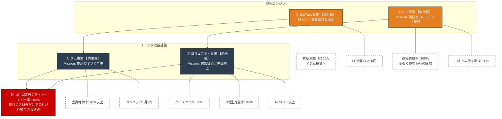

### このツリーのポイント

1.  **KGIへの貢献ルート:**
      * KGI（固定費カバー）を直接支えるのは、青色の\*\*「ジム」**と**「コミュニティ」\*\*です。ここが崩れるとKGIは未達になります。
2.  **エンジンの役割（オレンジ色）:**
      * **YouTube**は、単体で稼ぐのではなく「ジムへ資金と客を送る」ために存在します。
      * **SFF**は、イベントで終わらせず「コミュニティへ熱いファンを送る」ために存在します。
3.  **KPIの連鎖:**
      * 下段の白いボックス（KPI）を達成することで、上段の事業ミッションが達成され、最終的にKGIが満たされる構造になっています。

これをチームに共有する際は、「私たちの仕事（白いボックス）が、最終的にどう会社の安定（赤いボックス）に繋がっているか」を説明するに使うと効果的です。