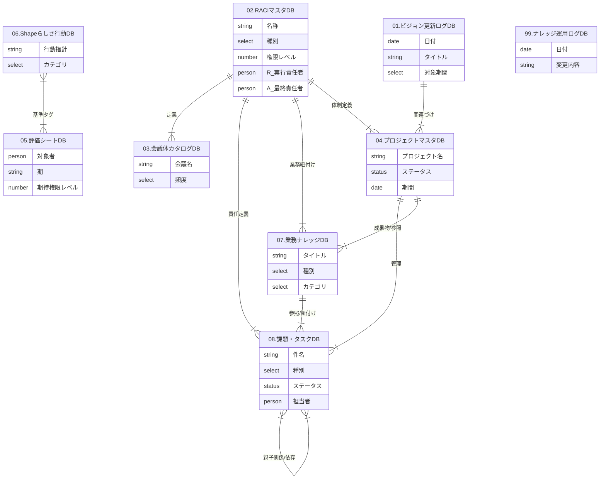

# ShapeFitナレッジシェルフ データモデリング

**Version:** 1.0  
**Last Updated:** 2025/11/29  
**Parent Document:** [ShapeFitナレッジシェルフ定義書](./ShapeFitナレッジシェルフ.md)

---

## 1. ER図 (Entity Relationship Diagram)

ShapeFitナレッジシェルフを構成するデータベース間のリレーションシップ定義です。

---

## 2. データベース詳細定義

各データベースのプロパティ設定詳細です。Notionでの実装を前提としています。

### 01. ビジョン更新ログ DB
* **ID:** `DB_VISION`
* **目的:** ビジョンや中期方針の変更履歴を一元管理する。

| プロパティ名 | 型 (Type) | 設定・選択肢例 | 説明 |
| :--- | :--- | :--- | :--- |
| **タイトル** | Title | - | 更新タイトル |
| **日付** | Date | - | 更新日 |
| **対象期間** | Select | 10年, 3年, 1年 | どの期間のビジョンに関する更新か |
| **担当者** | Person | - | 更新責任者 |
| **概要** | Text | - | 変更内容の要約 |
| **関連プロジェクト** | Relation | -> `DB_PROJECT` | このビジョンを実現するためのPJ |

### 02. RACIマスタ DB
* **ID:** `DB_RACI`
* **目的:** 業務・PJ・会議における役割と権限レベルを定義する辞書。

| プロパティ名 | 型 (Type) | 設定・選択肢例 | 説明 |
| :--- | :--- | :--- | :--- |
| **名称** | Title | - | 業務プロセス名、会議体名など |
| **種別** | Select | 業務プロセス, プロジェクト, 定例会議 | 定義の種類 |
| **R (実行)** | Person | - | 実行責任者 |
| **A (責任)** | Person | - | 最終承認者 |
| **C (相談)** | Person | - | 協業・相談先 |
| **I (報告)** | Person | - | 情報共有先 |
| **権限レベル** | Select | Lv1(指示待ち), Lv2(案作成), Lv3(条件付決定), Lv4(決定報告), Lv5(全権) | 委譲されている権限の度合い |
| **関連マニュアル** | Relation | -> `DB_KNOWLEDGE` | 業務手順書へのリンク |
| **関連プロジェクト** | Relation | -> `DB_PROJECT` | 関連するPJ |

### 03. 会議体カタログ DB
* **ID:** `DB_MEETING`
* **目的:** 定例会議の目的・参加者・アジェンダを標準化する。

| プロパティ名 | 型 (Type) | 設定・選択肢例 | 説明 |
| :--- | :--- | :--- | :--- |
| **会議名** | Title | - | - |
| **頻度** | Select | 日次, 週次, 隔週, 月次, Q次 | 開催サイクル |
| **目的** | Text | - | 会議のゴール |
| **参加者** | Person | - | 必須参加者 |
| **関連RACI** | Relation | -> `DB_RACI` | この会議で扱う業務領域 |
| **議事録URL** | URL | - | 議事録格納フォルダ/ページへのリンク |

### 04. プロジェクトマスタ DB
* **ID:** `DB_PROJECT`
* **目的:** 全社のプロジェクトポートフォリオ管理。

| プロパティ名 | 型 (Type) | 設定・選択肢例 | 説明 |
| :--- | :--- | :--- | :--- |
| **プロジェクト名** | Title | - | - |
| **ステータス** | Status | 構想中, 進行中, 完了, 保留, 中止 | - |
| **期間** | Date | - | 開始日〜終了日 |
| **オーナー (A)** | Person | - | PJオーナー |
| **PM (R)** | Person | - | プロジェクトマネージャー |
| **進捗率** | Number | % | バー表示用 |
| **関連ビジョン** | Relation | -> `DB_VISION` | 親となるビジョン |
| **関連RACI** | Relation | -> `DB_RACI` | 関連する業務定義 |
| **課題・タスク** | Relation | -> `DB_TASK` | 子タスク一覧 |
| **成果物** | Relation | -> `DB_KNOWLEDGE` | PJによる成果物 |

### 05. 評価シート DB
* **ID:** `DB_EVALUATION`
* **目的:** 権限レベルと行動指針に基づいた客観的な評価記録。

| プロパティ名 | 型 (Type) | 設定・選択肢例 | 説明 |
| :--- | :--- | :--- | :--- |
| **評価タイトル** | Title | 例: 2025上期評価_鈴木 | - |
| **対象者** | Person | - | - |
| **期** | Select | 2025上期, 2025下期... | - |
| **期待権限レベル** | Select | Lv1 〜 Lv5 | 期初に設定した期待値 |
| **実績権限レベル** | Select | Lv1 〜 Lv5 | 期末の到達度 |
| **Shape行動タグ** | Relation | -> `DB_VALUES` | 体現できた行動（タグ付け） |
| **コメント** | Text | - | フィードバック内容 |

### 06. Shapeらしさ行動 DB
* **ID:** `DB_VALUES`
* **目的:** 抽象的なバリューを具体的な行動リストとして管理し、評価やタグ付けに利用する。

| プロパティ名 | 型 (Type) | 設定・選択肢例 | 説明 |
| :--- | :--- | :--- | :--- |
| **行動指針** | Title | 例: 即レス(1時間以内), 10%共有 | 具体的な行動 |
| **カテゴリ** | Select | 未来起点, 挑戦, 誠実... | 紐づくバリュー |
| **種別** | Select | 推奨(Good), 禁止(Bad) | - |
| **関連評価** | Relation | -> `DB_EVALUATION` | この行動が評価されたシート |

### 07. 業務ナレッジ DB
* **ID:** `DB_KNOWLEDGE`
* **目的:** マニュアル・テンプレートの一元管理。

| プロパティ名 | 型 (Type) | 設定・選択肢例 | 説明 |
| :--- | :--- | :--- | :--- |
| **タイトル** | Title | - | - |
| **カテゴリ** | Select | 営業, ジム運営, CS, バックオフィス, 全社 | - |
| **種別** | Select | マニュアル, テンプレート, チェックリスト, 規定 | - |
| **オーナー** | Person | - | 更新責任者 |
| **更新頻度** | Select | 毎月, 四半期, 半年, 随時 | - |
| **最終更新日** | Date | - | - |
| **関連RACI** | Relation | -> `DB_RACI` | どの業務の手順書か |
| **関連プロジェクト** | Relation | -> `DB_PROJECT` | どのPJの成果物か |

### 08. 課題・タスク DB
* **ID:** `DB_TASK`
* **目的:** 全社のToDo、課題、アイデアの管理。

| プロパティ名 | 型 (Type) | 設定・選択肢例 | 説明 |
| :--- | :--- | :--- | :--- |
| **件名** | Title | - | - |
| **種別** | Select | タスク, 課題, アイデア | - |
| **ステータス** | Status | 未着手, 進行中, レビュー中, 完了, 保留 | - |
| **優先度** | Select | 高, 中, 低 | - |
| **期限** | Date | - | Due Date |
| **担当者 (R)** | Person | - | 実行者 |
| **関連プロジェクト** | Relation | -> `DB_PROJECT` | 親プロジェクト |
| **関連RACI** | Relation | -> `DB_RACI` | 関連業務 |
| **関連ナレッジ** | Relation | -> `DB_KNOWLEDGE` | 参照マニュアル等 |

