# README

# test

## テーブル一覧

| 名前 | カラム一覧 | コメント | タイプ |
| --- | --- | --- | --- |
| [public.Answer](https://www.notion.so/public-Answer-2be163ffb49181269a2fd02fba1ac4bf?pvs=21) | 7 | 回答 | BASE TABLE |
| [public.Category](public.Category.md) | 5 | カテゴリー（マスター） | BASE TABLE |
| [public.Competition](public.Competition.md) | 6 | 大会 | BASE TABLE |
| [public.CompetitionCategory](public.CompetitionCategory.md) | 9 | 大会カテゴリー（大会×カテゴリー×場所×日時×枠数） | BASE TABLE |
| [public.CompetitionSchedule](public.CompetitionSchedule.md) | 11 | 大会スケジュール | BASE TABLE |
| [public.Entry](public.Entry.md) | 8 | エントリー | BASE TABLE |
| [public.EntryPreference](https://www.notion.so/public-EntryPreference-2be163ffb4918179aacfec41344538e3?pvs=21) | 8 | 希望大会カテゴリー | BASE TABLE |
| [public.Event](https://www.notion.so/public-Event-2be163ffb49181fa8c38e2019954447c?pvs=21) | 7 | イベント | BASE TABLE |
| [public.EventParticipation](https://www.notion.so/public-EventParticipation-2be163ffb49181239eebef95895b5e04?pvs=21) | 6 | イベント参加意向 | BASE TABLE |
| [public.Question](public.Question.md) | 10 | 設問 | BASE TABLE |
| [public.Survey](public.Survey.md) | 6 | アンケート | BASE TABLE |
| [public.User](public.User.md) | 15 | ユーザー（Auth0認証） | BASE TABLE |

## Stored procedures and functions

| 名前 | ReturnType | Arguments | タイプ |
| --- | --- | --- | --- |
| public.gin_extract_query_trgm | internal | text, internal, smallint, internal, internal, internal, internal | FUNCTION |
| public.gin_extract_value_trgm | internal | text, internal | FUNCTION |
| public.gin_trgm_consistent | bool | internal, smallint, text, integer, internal, internal, internal, internal | FUNCTION |
| public.gin_trgm_triconsistent | char | internal, smallint, text, integer, internal, internal, internal | FUNCTION |
| public.gtrgm_compress | internal | internal | FUNCTION |
| public.gtrgm_consistent | bool | internal, text, smallint, oid, internal | FUNCTION |
| public.gtrgm_decompress | internal | internal | FUNCTION |
| public.gtrgm_distance | float8 | internal, text, smallint, oid, internal | FUNCTION |
| public.gtrgm_in | gtrgm | cstring | FUNCTION |
| public.gtrgm_options | void | internal | FUNCTION |
| public.gtrgm_out | cstring | gtrgm | FUNCTION |
| public.gtrgm_penalty | internal | internal, internal, internal | FUNCTION |
| public.gtrgm_picksplit | internal | internal, internal | FUNCTION |
| public.gtrgm_same | internal | gtrgm, gtrgm, internal | FUNCTION |
| public.gtrgm_union | gtrgm | internal, internal | FUNCTION |
| public.set_limit | float4 | real | FUNCTION |
| public.show_limit | float4 |  | FUNCTION |
| public.show_trgm | _text | text | FUNCTION |
| public.similarity | float4 | text, text | FUNCTION |
| public.similarity_dist | float4 | text, text | FUNCTION |
| public.similarity_op | bool | text, text | FUNCTION |
| public.strict_word_similarity | float4 | text, text | FUNCTION |
| public.strict_word_similarity_commutator_op | bool | text, text | FUNCTION |
| public.strict_word_similarity_dist_commutator_op | float4 | text, text | FUNCTION |
| public.strict_word_similarity_dist_op | float4 | text, text | FUNCTION |
| public.strict_word_similarity_op | bool | text, text | FUNCTION |
| public.word_similarity | float4 | text, text | FUNCTION |
| public.word_similarity_commutator_op | bool | text, text | FUNCTION |
| public.word_similarity_dist_commutator_op | float4 | text, text | FUNCTION |
| public.word_similarity_dist_op | float4 | text, text | FUNCTION |
| public.word_similarity_op | bool | text, text | FUNCTION |

## Enums

| 名前 | Values |
| --- | --- |
| public.InputType | CHECKBOX, RADIO, SELECT, TEXT, TEXTAREA |
| public.ScheduleType | ENTRY, EVENT, INFORMATION |

## ER図

```mermaid
erDiagram

"public.Answer" }o--|| "public.Entry" : "FOREIGN KEY ("entryId") REFERENCES "Entry"(id) ON UPDATE CASCADE ON DELETE CASCADE"
"public.Answer" }o--|| "public.Question" : "FOREIGN KEY ("questionId") REFERENCES "Question"(id) ON UPDATE CASCADE ON DELETE CASCADE"
"public.CompetitionCategory" }o--|| "public.Competition" : "FOREIGN KEY ("competitionId") REFERENCES "Competition"(id) ON UPDATE CASCADE ON DELETE CASCADE"
"public.CompetitionCategory" }o--|| "public.Category" : "FOREIGN KEY ("categoryId") REFERENCES "Category"(id) ON UPDATE CASCADE ON DELETE RESTRICT"
"public.CompetitionSchedule" }o--|| "public.Competition" : "FOREIGN KEY ("competitionId") REFERENCES "Competition"(id) ON UPDATE CASCADE ON DELETE CASCADE"
"public.CompetitionSchedule" }o--o| "public.Event" : "FOREIGN KEY ("eventId") REFERENCES "Event"(id) ON UPDATE CASCADE ON DELETE SET NULL"
"public.Entry" }o--|| "public.User" : "FOREIGN KEY ("userId") REFERENCES "User"(id) ON UPDATE CASCADE ON DELETE RESTRICT"
"public.Entry" }o--|| "public.Competition" : "FOREIGN KEY ("competitionId") REFERENCES "Competition"(id) ON UPDATE CASCADE ON DELETE CASCADE"
"public.EntryPreference" }o--|| "public.CompetitionCategory" : "FOREIGN KEY ("competitionCategoryId") REFERENCES "CompetitionCategory"(id) ON UPDATE CASCADE ON DELETE RESTRICT"
"public.EntryPreference" }o--|| "public.Entry" : "FOREIGN KEY ("entryId") REFERENCES "Entry"(id) ON UPDATE CASCADE ON DELETE CASCADE"
"public.EventParticipation" }o--|| "public.User" : "FOREIGN KEY ("userId") REFERENCES "User"(id) ON UPDATE CASCADE ON DELETE RESTRICT"
"public.EventParticipation" }o--|| "public.Event" : "FOREIGN KEY ("eventId") REFERENCES "Event"(id) ON UPDATE CASCADE ON DELETE CASCADE"
"public.Question" }o--o| "public.Category" : "FOREIGN KEY ("categoryId") REFERENCES "Category"(id) ON UPDATE CASCADE ON DELETE SET NULL"
"public.Question" }o--|| "public.Survey" : "FOREIGN KEY ("surveyId") REFERENCES "Survey"(id) ON UPDATE CASCADE ON DELETE CASCADE"
"public.Survey" }o--|| "public.Competition" : "FOREIGN KEY ("competitionId") REFERENCES "Competition"(id) ON UPDATE CASCADE ON DELETE CASCADE"

"public.Answer" {
  text answerText
  timestamp_3__without_time_zone createdAt
  timestamp_3__without_time_zone deletedAt
  text entryId FK
  text id
  text questionId FK
  timestamp_3__without_time_zone updatedAt
}
"public.Category" {
  timestamp_3__without_time_zone createdAt
  timestamp_3__without_time_zone deletedAt
  text id
  text name
  timestamp_3__without_time_zone updatedAt
}
"public.Competition" {
  timestamp_3__without_time_zone createdAt
  timestamp_3__without_time_zone deletedAt
  text id
  text imagePath
  text name
  timestamp_3__without_time_zone updatedAt
}
"public.CompetitionCategory" {
  integer capacity
  text categoryId FK
  text competitionId FK
  timestamp_3__without_time_zone createdAt
  timestamp_3__without_time_zone deletedAt
  text eventDate
  text id
  text location
  timestamp_3__without_time_zone updatedAt
}
"public.CompetitionSchedule" {
  text competitionId FK
  timestamp_3__without_time_zone createdAt
  timestamp_3__without_time_zone deletedAt
  timestamp_3__without_time_zone endDate
  text eventId FK
  text id
  _ScheduleType_ scheduleType
  timestamp_3__without_time_zone startDate
  text tag
  text title
  timestamp_3__without_time_zone updatedAt
}
"public.Entry" {
  text competitionId FK
  timestamp_3__without_time_zone createdAt
  timestamp_3__without_time_zone deletedAt
  text id
  text scheduleTag
  timestamp_3__without_time_zone updatedAt
  text userId FK
  text videoPath
}
"public.EntryPreference" {
  text competitionCategoryId FK
  timestamp_3__without_time_zone createdAt
  timestamp_3__without_time_zone deletedAt
  text entryId FK
  text id
  boolean isWinner
  integer preferenceOrder
  timestamp_3__without_time_zone updatedAt
}
"public.Event" {
  timestamp_3__without_time_zone createdAt
  timestamp_3__without_time_zone deletedAt
  text description
  text id
  text name
  text thumbnailPath
  timestamp_3__without_time_zone updatedAt
}
"public.EventParticipation" {
  timestamp_3__without_time_zone createdAt
  timestamp_3__without_time_zone deletedAt
  text eventId FK
  text id
  timestamp_3__without_time_zone updatedAt
  text userId FK
}
"public.Question" {
  text categoryId FK
  timestamp_3__without_time_zone createdAt
  timestamp_3__without_time_zone deletedAt
  integer displayOrder
  text id
  _InputType_ inputType
  boolean isRequired
  text questionText
  text surveyId FK
  timestamp_3__without_time_zone updatedAt
}
"public.Survey" {
  text competitionId FK
  timestamp_3__without_time_zone createdAt
  timestamp_3__without_time_zone deletedAt
  text id
  text name
  timestamp_3__without_time_zone updatedAt
}
"public.User" {
  text address
  timestamp_3__without_time_zone birthDate
  text buildingName
  timestamp_3__without_time_zone createdAt
  timestamp_3__without_time_zone deletedAt
  text email
  text firstName
  text firstNameKana
  text gender
  text id
  text lastName
  text lastNameKana
  text phoneNumber
  text postalCode
  timestamp_3__without_time_zone updatedAt
}
```

---

> Generated by tbls
>