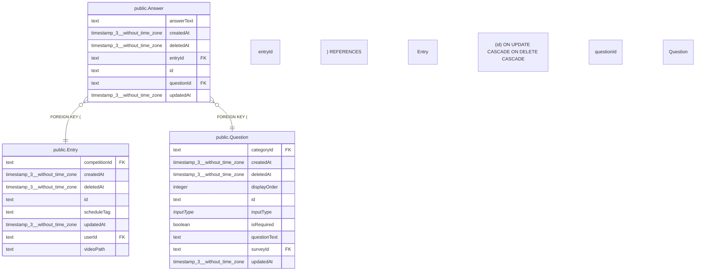

# public.Answer

## 概要

回答

## カラム一覧

| 名前 | タイプ | デフォルト値 | Nullable | 子テーブル | 親テーブル | コメント |
| --- | --- | --- | --- | --- | --- | --- |
| answerText | text |  | false |  |  | 回答内容 |
| createdAt | timestamp(3) without time zone | CURRENT_TIMESTAMP | false |  |  | 作成日時 |
| deletedAt | timestamp(3) without time zone |  | true |  |  | 削除日時 |
| entryId | text |  | false |  | [public.Entry](https://www.notion.so/public-Entry-2be163ffb49181d8aa7bdceded356db7?pvs=21) | エントリーID |
| id | text |  | false |  |  | 回答ID |
| questionId | text |  | false |  | [public.Question](https://www.notion.so/public-Question-2be163ffb4918193a54ce19e3765e6e5?pvs=21) | 設問ID |
| updatedAt | timestamp(3) without time zone |  | false |  |  | 更新日時 |

## 制約一覧

| 名前 | タイプ | 定義 |
| --- | --- | --- |
| Answer_entryId_fkey | FOREIGN KEY | FOREIGN KEY (“entryId”) REFERENCES “Entry”(id) ON UPDATE CASCADE ON DELETE CASCADE |
| Answer_pkey | PRIMARY KEY | PRIMARY KEY (id) |
| Answer_questionId_fkey | FOREIGN KEY | FOREIGN KEY (“questionId”) REFERENCES “Question”(id) ON UPDATE CASCADE ON DELETE CASCADE |

## INDEX一覧

| 名前 | 定義 |
| --- | --- |
| Answer_pkey | CREATE UNIQUE INDEX “Answer_pkey” ON public.”Answer” USING btree (id) |
| Answer_questionId_entryId_key | CREATE UNIQUE INDEX “Answer_questionId_entryId_key” ON public.”Answer” USING btree (“questionId”, “entryId”) |

## ER図

---

> Generated by tbls
>