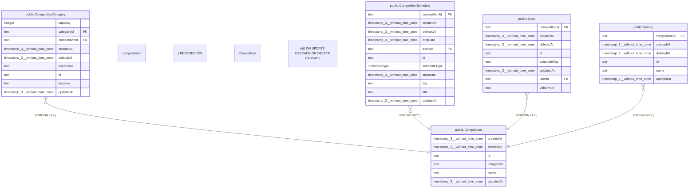

# public.Competition

## 概要

大会

## カラム一覧

| 名前 | タイプ | デフォルト値 | Nullable | 子テーブル | 親テーブル | コメント |
| --- | --- | --- | --- | --- | --- | --- |
| createdAt | timestamp(3) without time zone | CURRENT_TIMESTAMP | false |  |  | 作成日時 |
| deletedAt | timestamp(3) without time zone |  | true |  |  | 削除日時 |
| id | text |  | false | [public.CompetitionCategory](https://www.notion.so/public-CompetitionCategory-2be163ffb491817ca991ed099d3c6231?pvs=21),
[public.CompetitionSchedule](https://www.notion.so/public-CompetitionSchedule-2be163ffb4918128b79af28e0657a6eb?pvs=21),
[public.Entry](https://www.notion.so/public-Entry-2be163ffb49181d8aa7bdceded356db7?pvs=21),
[public.Survey](https://www.notion.so/public-Survey-2be163ffb4918129857cd4f3bc73edd9?pvs=21) |  | 大会ID |
| imagePath | text |  | true |  |  | 画像パス |
| name | text |  | false |  |  | 大会名 |
| updatedAt | timestamp(3) without time zone |  | false |  |  | 更新日時 |

## 制約一覧

| 名前 | タイプ | 定義 |
| --- | --- | --- |
| Competition_pkey | PRIMARY KEY | PRIMARY KEY (id) |

## INDEX一覧

| 名前 | 定義 |
| --- | --- |
| Competition_pkey | CREATE UNIQUE INDEX “Competition_pkey” ON public.”Competition” USING btree (id) |

## ER図

---

> Generated by tbls
>