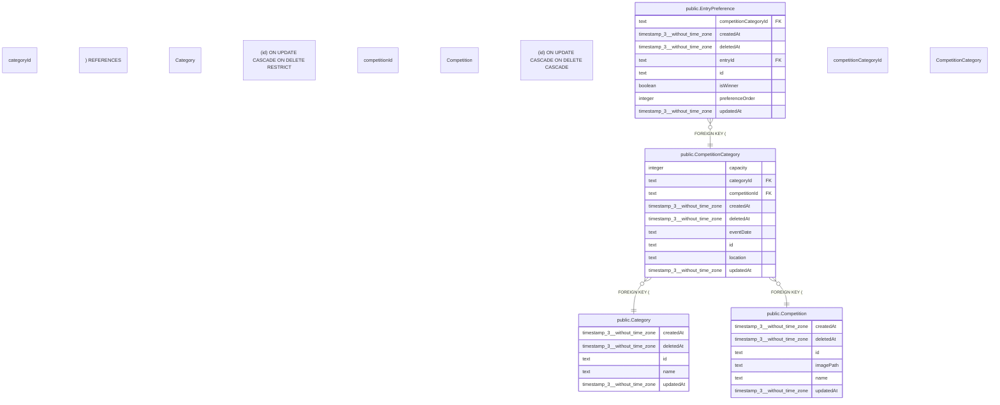

# public.CompetitionCategory

## 概要

大会カテゴリー（大会×カテゴリー×場所×日時×枠数）

## カラム一覧

| 名前 | タイプ | デフォルト値 | Nullable | 子テーブル | 親テーブル | コメント |
| --- | --- | --- | --- | --- | --- | --- |
| capacity | integer |  | false |  |  | 枠数 |
| categoryId | text |  | false |  | [public.Category](https://www.notion.so/public-Category-2be163ffb49181db9fdbf630924a5d19?pvs=21) | カテゴリーID |
| competitionId | text |  | false |  | [public.Competition](https://www.notion.so/public-Competition-2be163ffb491816aa085e0b01471c06b?pvs=21) | 大会ID |
| createdAt | timestamp(3) without time zone | CURRENT_TIMESTAMP | false |  |  | 作成日時 |
| deletedAt | timestamp(3) without time zone |  | true |  |  | 削除日時 |
| eventDate | text |  | false |  |  | 開催日時（「Day1 9/22(土)」等の自由形式） |
| id | text |  | false | [public.EntryPreference](https://www.notion.so/public-EntryPreference-2be163ffb4918179aacfec41344538e3?pvs=21) |  | 大会カテゴリーID |
| location | text |  | false |  |  | 場所（関東、関西など） |
| updatedAt | timestamp(3) without time zone |  | false |  |  | 更新日時 |

## 制約一覧

| 名前 | タイプ | 定義 |
| --- | --- | --- |
| CompetitionCategory_categoryId_fkey | FOREIGN KEY | FOREIGN KEY (“categoryId”) REFERENCES “Category”(id) ON UPDATE CASCADE ON DELETE RESTRICT |
| CompetitionCategory_competitionId_fkey | FOREIGN KEY | FOREIGN KEY (“competitionId”) REFERENCES “Competition”(id) ON UPDATE CASCADE ON DELETE CASCADE |
| CompetitionCategory_pkey | PRIMARY KEY | PRIMARY KEY (id) |

## INDEX一覧

| 名前 | 定義 |
| --- | --- |
| CompetitionCategory_competitionId_categoryId_location_event_key | CREATE UNIQUE INDEX “CompetitionCategory_competitionId_categoryId_location_event_key” ON public.”CompetitionCategory” USING btree (“competitionId”, “categoryId”, location, “eventDate”) |
| CompetitionCategory_pkey | CREATE UNIQUE INDEX “CompetitionCategory_pkey” ON public.”CompetitionCategory” USING btree (id) |

## ER図

---

> Generated by tbls
>