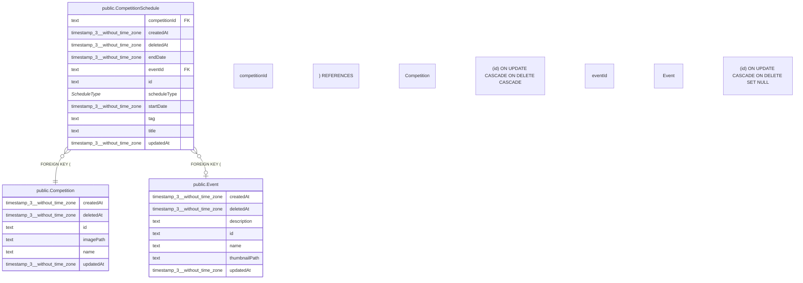

# public.CompetitionSchedule

## 概要

大会スケジュール

## カラム一覧

| 名前 | タイプ | デフォルト値 | Nullable | 子テーブル | 親テーブル | コメント |
| --- | --- | --- | --- | --- | --- | --- |
| competitionId | text |  | false |  | [public.Competition](https://www.notion.so/public-Competition-2be163ffb491816aa085e0b01471c06b?pvs=21) | 大会ID |
| createdAt | timestamp(3) without time zone | CURRENT_TIMESTAMP | false |  |  | 作成日時 |
| deletedAt | timestamp(3) without time zone |  | true |  |  | 削除日時 |
| endDate | timestamp(3) without time zone |  | true |  |  | 終了日時 |
| eventId | text |  | true |  | [public.Event](https://www.notion.so/public-Event-2be163ffb49181fa8c38e2019954447c?pvs=21) | イベントID |
| id | text |  | false |  |  | スケジュールID |
| scheduleType | “ScheduleType” |  | false |  |  | スケジュール種別 |
| startDate | timestamp(3) without time zone |  | false |  |  | 開始日時 |
| tag | text |  | true |  |  | エントリーに付けるタグ（1次エントリー、2次エントリー等） |
| title | text |  | true |  |  | タイトル（イベントの場合はEvent.nameを使用） |
| updatedAt | timestamp(3) without time zone |  | false |  |  | 更新日時 |

## 制約一覧

| 名前 | タイプ | 定義 |
| --- | --- | --- |
| CompetitionSchedule_competitionId_fkey | FOREIGN KEY | FOREIGN KEY (“competitionId”) REFERENCES “Competition”(id) ON UPDATE CASCADE ON DELETE CASCADE |
| CompetitionSchedule_eventId_fkey | FOREIGN KEY | FOREIGN KEY (“eventId”) REFERENCES “Event”(id) ON UPDATE CASCADE ON DELETE SET NULL |
| CompetitionSchedule_pkey | PRIMARY KEY | PRIMARY KEY (id) |

## INDEX一覧

| 名前 | 定義 |
| --- | --- |
| CompetitionSchedule_pkey | CREATE UNIQUE INDEX “CompetitionSchedule_pkey” ON public.”CompetitionSchedule” USING btree (id) |

## ER図

---

> Generated by tbls
>