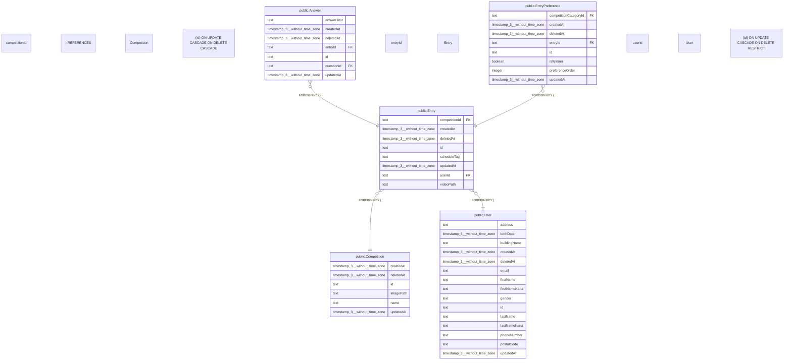

# public.Entry

## 概要

エントリー

## カラム一覧

| 名前 | タイプ | デフォルト値 | Nullable | 子テーブル | 親テーブル | コメント |
| --- | --- | --- | --- | --- | --- | --- |
| competitionId | text |  | false |  | [public.Competition](https://www.notion.so/public-Competition-2be163ffb491816aa085e0b01471c06b?pvs=21) | 大会ID |
| createdAt | timestamp(3) without time zone | CURRENT_TIMESTAMP | false |  |  | 作成日時 |
| deletedAt | timestamp(3) without time zone |  | true |  |  | 削除日時 |
| id | text |  | false | [public.Answer](https://www.notion.so/public-Answer-2be163ffb49181269a2fd02fba1ac4bf?pvs=21),
[public.EntryPreference](https://www.notion.so/public-EntryPreference-2be163ffb4918179aacfec41344538e3?pvs=21) |  | エントリーID |
| scheduleTag | text |  | true |  |  | 1次エントリー、2次エントリー等のタグ |
| updatedAt | timestamp(3) without time zone |  | false |  |  | 更新日時 |
| userId | text |  | false |  | [public.User](https://www.notion.so/public-User-2be163ffb491814ab3dad3a2b5ac948d?pvs=21) | ユーザーID |
| videoPath | text |  | true |  |  | 動画パス |

## 制約一覧

| 名前 | タイプ | 定義 |
| --- | --- | --- |
| Entry_competitionId_fkey | FOREIGN KEY | FOREIGN KEY (“competitionId”) REFERENCES “Competition”(id) ON UPDATE CASCADE ON DELETE CASCADE |
| Entry_pkey | PRIMARY KEY | PRIMARY KEY (id) |
| Entry_userId_fkey | FOREIGN KEY | FOREIGN KEY (“userId”) REFERENCES “User”(id) ON UPDATE CASCADE ON DELETE RESTRICT |

## INDEX一覧

| 名前 | 定義 |
| --- | --- |
| Entry_pkey | CREATE UNIQUE INDEX “Entry_pkey” ON public.”Entry” USING btree (id) |
| Entry_userId_competitionId_scheduleTag_key | CREATE UNIQUE INDEX “Entry_userId_competitionId_scheduleTag_key” ON public.”Entry” USING btree (“userId”, “competitionId”, “scheduleTag”) |

## ER図

---

> Generated by tbls
>