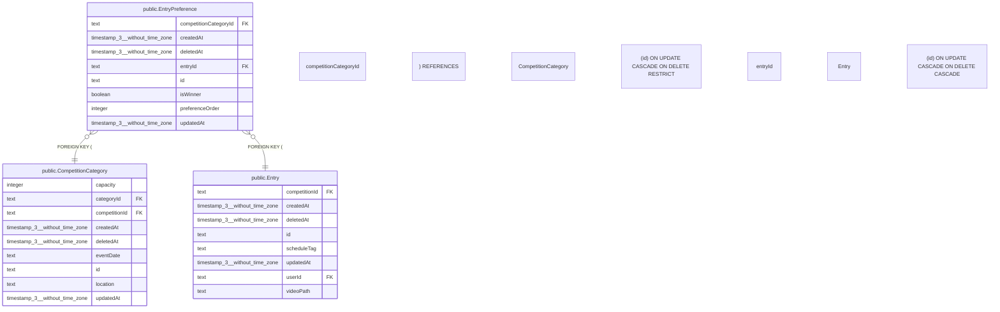

# public.EntryPreference

## 概要

希望大会カテゴリー

## カラム一覧

| 名前 | タイプ | デフォルト値 | Nullable | 子テーブル | 親テーブル | コメント |
| --- | --- | --- | --- | --- | --- | --- |
| competitionCategoryId | text |  | false |  | [public.CompetitionCategory](https://www.notion.so/public-CompetitionCategory-2be163ffb491817ca991ed099d3c6231?pvs=21) | 大会カテゴリーID |
| createdAt | timestamp(3) without time zone | CURRENT_TIMESTAMP | false |  |  | 作成日時 |
| deletedAt | timestamp(3) without time zone |  | true |  |  | 削除日時 |
| entryId | text |  | false |  | [public.Entry](https://www.notion.so/public-Entry-2be163ffb49181d8aa7bdceded356db7?pvs=21) | エントリーID |
| id | text |  | false |  |  | 希望ID |
| isWinner | boolean | false | false |  |  | 当選フラグ |
| preferenceOrder | integer |  | false |  |  | 希望順（第1希望=1, 第2希望=2, …） |
| updatedAt | timestamp(3) without time zone |  | false |  |  | 更新日時 |

## 制約一覧

| 名前 | タイプ | 定義 |
| --- | --- | --- |
| EntryPreference_competitionCategoryId_fkey | FOREIGN KEY | FOREIGN KEY (“competitionCategoryId”) REFERENCES “CompetitionCategory”(id) ON UPDATE CASCADE ON DELETE RESTRICT |
| EntryPreference_entryId_fkey | FOREIGN KEY | FOREIGN KEY (“entryId”) REFERENCES “Entry”(id) ON UPDATE CASCADE ON DELETE CASCADE |
| EntryPreference_pkey | PRIMARY KEY | PRIMARY KEY (id) |

## INDEX一覧

| 名前 | 定義 |
| --- | --- |
| EntryPreference_entryId_competitionCategoryId_key | CREATE UNIQUE INDEX “EntryPreference_entryId_competitionCategoryId_key” ON public.”EntryPreference” USING btree (“entryId”, “competitionCategoryId”) |
| EntryPreference_entryId_preferenceOrder_key | CREATE UNIQUE INDEX “EntryPreference_entryId_preferenceOrder_key” ON public.”EntryPreference” USING btree (“entryId”, “preferenceOrder”) |
| EntryPreference_pkey | CREATE UNIQUE INDEX “EntryPreference_pkey” ON public.”EntryPreference” USING btree (id) |

## ER図

---

> Generated by tbls
>