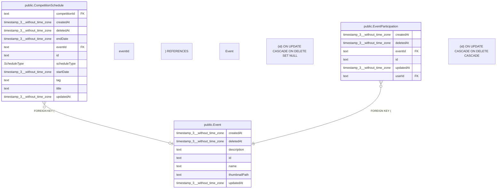

# public.Event

## 概要

イベント

## カラム一覧

| 名前 | タイプ | デフォルト値 | Nullable | 子テーブル | 親テーブル | コメント |
| --- | --- | --- | --- | --- | --- | --- |
| createdAt | timestamp(3) without time zone | CURRENT_TIMESTAMP | false |  |  | 作成日時 |
| deletedAt | timestamp(3) without time zone |  | true |  |  | 削除日時 |
| description | text |  | true |  |  | 説明 |
| id | text |  | false | [public.CompetitionSchedule](https://www.notion.so/public-CompetitionSchedule-2be163ffb4918128b79af28e0657a6eb?pvs=21),
[public.EventParticipation](https://www.notion.so/public-EventParticipation-2be163ffb49181239eebef95895b5e04?pvs=21) |  | イベントID |
| name | text |  | false |  |  | イベント名 |
| thumbnailPath | text |  | true |  |  | サムネイルパス |
| updatedAt | timestamp(3) without time zone |  | false |  |  | 更新日時 |

## 制約一覧

| 名前 | タイプ | 定義 |
| --- | --- | --- |
| Event_pkey | PRIMARY KEY | PRIMARY KEY (id) |

## INDEX一覧

| 名前 | 定義 |
| --- | --- |
| Event_pkey | CREATE UNIQUE INDEX “Event_pkey” ON public.”Event” USING btree (id) |

## ER図

---

> Generated by tbls
>