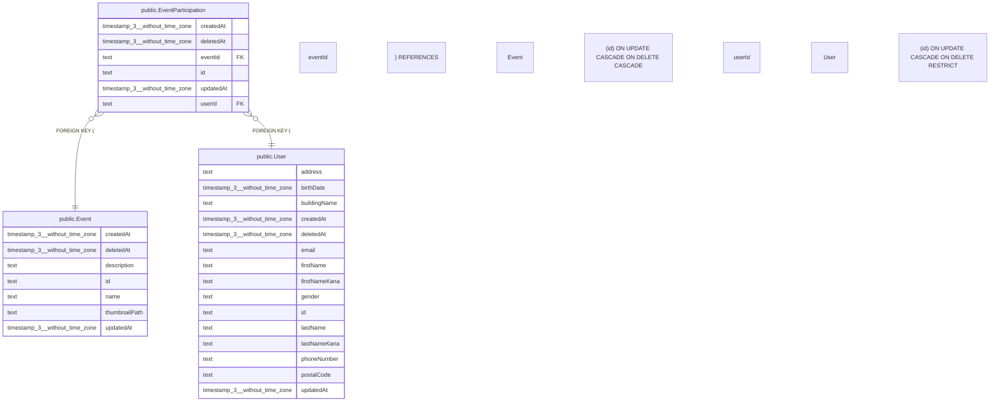

# public.EventParticipation

## 概要

イベント参加意向

## カラム一覧

| 名前 | タイプ | デフォルト値 | Nullable | 子テーブル | 親テーブル | コメント |
| --- | --- | --- | --- | --- | --- | --- |
| createdAt | timestamp(3) without time zone | CURRENT_TIMESTAMP | false |  |  | 作成日時 |
| deletedAt | timestamp(3) without time zone |  | true |  |  | 削除日時 |
| eventId | text |  | false |  | [public.Event](https://www.notion.so/public-Event-2be163ffb49181fa8c38e2019954447c?pvs=21) | イベントID |
| id | text |  | false |  |  | 参加意向ID |
| updatedAt | timestamp(3) without time zone |  | false |  |  | 更新日時 |
| userId | text |  | false |  | [public.User](https://www.notion.so/public-User-2be163ffb491814ab3dad3a2b5ac948d?pvs=21) | ユーザーID |

## 制約一覧

| 名前 | タイプ | 定義 |
| --- | --- | --- |
| EventParticipation_eventId_fkey | FOREIGN KEY | FOREIGN KEY (“eventId”) REFERENCES “Event”(id) ON UPDATE CASCADE ON DELETE CASCADE |
| EventParticipation_pkey | PRIMARY KEY | PRIMARY KEY (id) |
| EventParticipation_userId_fkey | FOREIGN KEY | FOREIGN KEY (“userId”) REFERENCES “User”(id) ON UPDATE CASCADE ON DELETE RESTRICT |

## INDEX一覧

| 名前 | 定義 |
| --- | --- |
| EventParticipation_eventId_userId_key | CREATE UNIQUE INDEX “EventParticipation_eventId_userId_key” ON public.”EventParticipation” USING btree (“eventId”, “userId”) |
| EventParticipation_pkey | CREATE UNIQUE INDEX “EventParticipation_pkey” ON public.”EventParticipation” USING btree (id) |

## ER図

---

> Generated by tbls
>