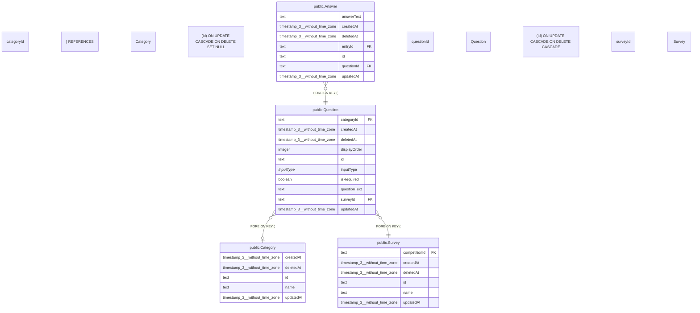

# public.Question

## 概要

設問

## カラム一覧

| 名前 | タイプ | デフォルト値 | Nullable | 子テーブル | 親テーブル | コメント |
| --- | --- | --- | --- | --- | --- | --- |
| categoryId | text |  | true |  | [public.Category](https://www.notion.so/public-Category-2be163ffb49181db9fdbf630924a5d19?pvs=21) | 対象カテゴリーID（希望カテゴリーに一致する場合のみ表示） |
| createdAt | timestamp(3) without time zone | CURRENT_TIMESTAMP | false |  |  | 作成日時 |
| deletedAt | timestamp(3) without time zone |  | true |  |  | 削除日時 |
| displayOrder | integer | 0 | false |  |  | 表示順 |
| id | text |  | false | [public.Answer](https://www.notion.so/public-Answer-2be163ffb49181269a2fd02fba1ac4bf?pvs=21) |  | 設問ID |
| inputType | “InputType” | ‘TEXT’::“InputType” | false |  |  | 入力形式 |
| isRequired | boolean | false | false |  |  | 必須フラグ |
| questionText | text |  | false |  |  | 質問文 |
| surveyId | text |  | false |  | [public.Survey](https://www.notion.so/public-Survey-2be163ffb4918129857cd4f3bc73edd9?pvs=21) | アンケートID |
| updatedAt | timestamp(3) without time zone |  | false |  |  | 更新日時 |

## 制約一覧

| 名前 | タイプ | 定義 |
| --- | --- | --- |
| Question_categoryId_fkey | FOREIGN KEY | FOREIGN KEY (“categoryId”) REFERENCES “Category”(id) ON UPDATE CASCADE ON DELETE SET NULL |
| Question_pkey | PRIMARY KEY | PRIMARY KEY (id) |
| Question_surveyId_fkey | FOREIGN KEY | FOREIGN KEY (“surveyId”) REFERENCES “Survey”(id) ON UPDATE CASCADE ON DELETE CASCADE |

## INDEX一覧

| 名前 | 定義 |
| --- | --- |
| Question_pkey | CREATE UNIQUE INDEX “Question_pkey” ON public.”Question” USING btree (id) |

## ER図

---

> Generated by tbls
>