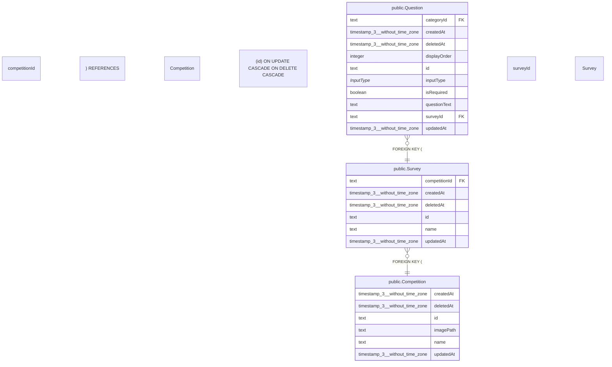

# public.Survey

## 概要

アンケート

## カラム一覧

| 名前 | タイプ | デフォルト値 | Nullable | 子テーブル | 親テーブル | コメント |
| --- | --- | --- | --- | --- | --- | --- |
| competitionId | text |  | false |  | [public.Competition](https://www.notion.so/public-Competition-2be163ffb491816aa085e0b01471c06b?pvs=21) | 大会ID |
| createdAt | timestamp(3) without time zone | CURRENT_TIMESTAMP | false |  |  | 作成日時 |
| deletedAt | timestamp(3) without time zone |  | true |  |  | 削除日時 |
| id | text |  | false | [public.Question](https://www.notion.so/public-Question-2be163ffb4918193a54ce19e3765e6e5?pvs=21) |  | アンケートID |
| name | text |  | false |  |  | アンケート名 |
| updatedAt | timestamp(3) without time zone |  | false |  |  | 更新日時 |

## 制約一覧

| 名前 | タイプ | 定義 |
| --- | --- | --- |
| Survey_competitionId_fkey | FOREIGN KEY | FOREIGN KEY (“competitionId”) REFERENCES “Competition”(id) ON UPDATE CASCADE ON DELETE CASCADE |
| Survey_pkey | PRIMARY KEY | PRIMARY KEY (id) |

## INDEX一覧

| 名前 | 定義 |
| --- | --- |
| Survey_pkey | CREATE UNIQUE INDEX “Survey_pkey” ON public.”Survey” USING btree (id) |

## ER図

---

> Generated by tbls
>