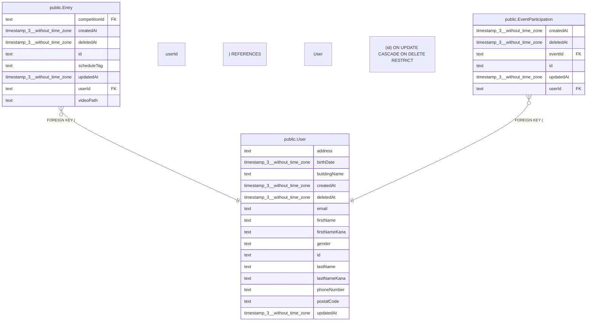

# public.User

## 概要

ユーザー（Auth0認証）

## カラム一覧

| 名前 | タイプ | デフォルト値 | Nullable | 子テーブル | 親テーブル | コメント |
| --- | --- | --- | --- | --- | --- | --- |
| address | text |  | false |  |  | 住所（番地） |
| birthDate | timestamp(3) without time zone |  | false |  |  | 生年月日 |
| buildingName | text |  | true |  |  | 建物名 |
| createdAt | timestamp(3) without time zone | CURRENT_TIMESTAMP | false |  |  | 作成日時 |
| deletedAt | timestamp(3) without time zone |  | true |  |  | 削除日時 |
| email | text |  | false |  |  | メールアドレス |
| firstName | text |  | false |  |  | 名 |
| firstNameKana | text |  | false |  |  | メイ（フリガナ） |
| gender | text |  | false |  |  | 性別 |
| id | text |  | false | [public.Entry](https://www.notion.so/public-Entry-2be163ffb49181d8aa7bdceded356db7?pvs=21)[,](public.Entry.md)
[public.EventParticipation](https://www.notion.so/public-EventParticipation-2be163ffb49181239eebef95895b5e04?pvs=21) |  | ユーザーID（Auth0のsub） |
| lastName | text |  | false |  |  | 姓 |
| lastNameKana | text |  | false |  |  | セイ（フリガナ） |
| phoneNumber | text |  | false |  |  | 電話番号 |
| postalCode | text |  | false |  |  | 郵便番号 |
| updatedAt | timestamp(3) without time zone |  | false |  |  | 更新日時 |

## 制約一覧

| 名前 | タイプ | 定義 |
| --- | --- | --- |
| User_pkey | PRIMARY KEY | PRIMARY KEY (id) |

## INDEX一覧

| 名前 | 定義 |
| --- | --- |
| User_pkey | CREATE UNIQUE INDEX “User_pkey” ON public.”User” USING btree (id) |

## ER図

---

> Generated by tbls
>