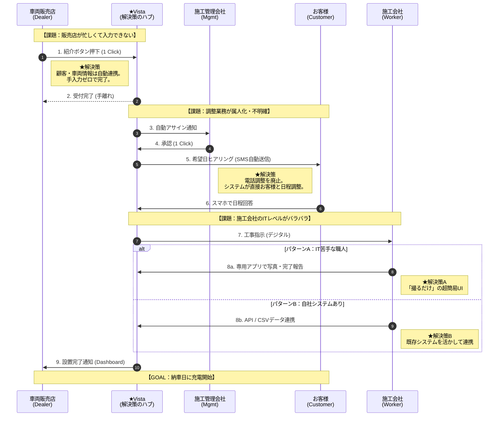

ご指摘ありがとうございます。見にくくて申し訳ありません。
最初にご提示した\*\*「スイムレーン形式（誰が・いつやるか）」**の図が一番わかりやすかったとのことですので、その形式で**「課題解決の流れ（PM視点）」\*\*を整理し直しました。

\*\*「ボトルネック（課題）」**が**「システム（Vista）」\*\*によってどう解消されていくか、ひと目で分かるようにしています。

### 課題解決実行フロー図（PM視点）

### この図のポイント（PMとしてここを管理する）

1.  **販売店の「手離れ」ポイント（手順2）**
      * ここで販売店のタスクが完全に終了していることを担保します。
2.  **調整の「自動化」ポイント（手順5-6）**
      * 施工管理会社が電話をするのではなく、システムが自動でSMSを送り、お客様が直接入力することでリードタイムを短縮します。
3.  **現場の「分岐」ポイント（手順8a/8b）**
      * [cite_start]ここが最大の工夫点です。「ITが苦手な人」と「システムを持っている人」で入り口を分けることで、データの型（フォーマット）を裏側で強制的に統一します[cite: 81, 146]。

この図であれば、各ステークホルダーの「楽になるポイント」が明確かと思います。いかがでしょうか？