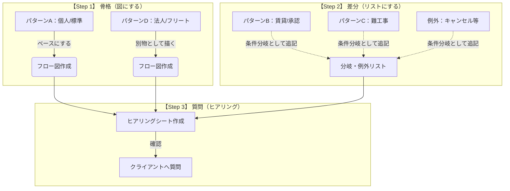

# 論点整理— As-Is業務フロー分析・ヒアリング用

## 0. まず何をしたいか（この論点整理のゴール）

このプロジェクトは、全部のパターンを図にするのではなく、
**“流れの骨格が変わる分岐”だけを代表パターンとして描き** 、
細かい差分は **チェック項目（条件リスト）** で管理します。 
そのために「何を確認すれば、フロー図・要件・ツール選定が固まるか」を論点として並べています。 

---

## 1. 全体の流れ

### 1-1. 進め方

```
[骨格：メインフローを2本描く]
  ├─ A：標準（個人×戸建×標準工事）
  └─ D：法人/フリート（商流が別物の可能性）

       ↓

[分岐：メインフロー以外は「分岐/例外リスト」に落とす]
  ├─ 承認が必要（集合/賃貸など）
  ├─ 難工事/申請（電力・許認可など）
  └─ キャンセル/欠品/トラブル/追加費用…（例外）

       ↓

[質問；「？」を質問票にする（社内用と対面用の2枚）]
  ├─ 社内確認用：網羅チェック
  └─ 対面ヒアリング用：会話の流れ＋Yes/No分岐
``` 



### 1-2. パターン整理

```
代表パターン（図で描く）
  A：標準（戸建×持家×標準工事）
  B：承認が必要（集合/賃貸/共有地）
  C：高難度工事（追加工事・申請・許認可）
  D：法人/フリート（B2B・複数台/複数拠点）

共通の例外（どのパターンでも起きるので別紙）
  見積/金額のズレ、日程調整の泥沼、手戻り/欠品/不在、保証切り分け…等
```

パターンA〜Dと例外の定義はこの整理に沿っています。 

---

## 2. 論点

### 論点1：まず「案件タイプ」が本当にあるか

> 目的：図を増やしすぎないために、「よくある」「ほぼ無い」を先に仕分ける。分岐が本当に存在するかを確認する

* **案件タイプの実在確認**（新車／中古車／既納客の後付け、個人／法人、同時購入／後追い、補助金ありなし）
  → 実務で“よくある順”と“ほぼ無い”を仕分けたい 
* **現地調査（現調）の実施主体**は誰か（施工会社／施工管理会社／販売店同席）
  → 誰が現場情報を握っているかで、システム入力者が変わる 
* **法的・近隣要件**（道路占用、工事時間制約など）が「どの程度の頻度で」起きるか 

（背景：分岐の洗い出し観点は「販売/契約」「設置条件」「金流」「物流」「アフター」「統制/連携」で整理済みです） 

---

### 論点2：法人（B2B/フリート）は“別の図”にした方がいいか

> 目的：B2Bは「窓口・契約・請求」が変わると、フローが別物になりやすい

* **窓口が販売店なのか／メーカー（法人営業）なのか**（直販に近い商流があるか） 
* **契約が都度の注文書なのか／包括契約＋発注リストなのか** 
* **請求が個別なのか／月締め一括（翌月末払い等）なのか** 
* **本社で契約・支払、現場が日程調整・立会い**という“意思決定と現場の分離”が本当に起きているか 

（「商流が大きく異なるなら、無理に一枚にまとめず別紙で切り出す」ほうがいい） 

---

### 論点3：「見積→請求→入金」を新しい仕組みでどこまで扱うか

> 目的：ここを曖昧にすると、要件の重さが一気に増えてプロジェクトが破綻しやすい

* 現状、**見積書発行／請求書発行／入金消込**は誰のシステムでやっているか（新システムでやるのか、既存会計でやって連携だけか） 
* **販売店マージン**の乗せ方と、後から費用が増えた時に「誰が追加分を請求・回収するのか」運用が決まっているか 

（上司FB：今回は“現状は聞くが、実装するかは慎重に判断”） 


---

### 論点4：承認が必要なとき「誰が何を作って、どこで止まるか」

> 目的：承認待ちは“止まる工程”なので、ステータス設計と責任が重要

* 集合住宅/賃貸で、**管理組合・オーナー承諾**が必要なとき
  * 図面・仕様書は誰が用意する？（顧客は書けない前提で施工側が支援？） 
  * 承認待ちの間、案件はどう管理している？（保留・塩漬けの扱い） 

* **電力申請（アンペア変更等）**が必要なとき
  * 申請作業の担当は誰か、工事日は「仮予約」になるのか 

（パターンB/Cでも同じ論点を指しています） 

---

### 論点5：日程調整が「伝言ゲーム」になる原因はどこか

> 目的：ここが現場負荷の主要因になりやすい・誰がハブかを固定したい

* 日程調整の主体は誰か（顧客⇔施工管理が直か、販売店が必ず挟まるか） 
* 4者（顧客・販売店・施工管理・施工店）で**伝言ゲーム化**する具体パターン

  * 候補日提示→枠が埋まる、雨天延期、顧客都合キャンセル時の再調整は新規予約と違うのか 

（例外2としても「日程調整の泥沼化」が主要ターゲット） 

---

### 論点6：物流・部材（モノ）は「どこに」「いつ」あるべきか

> 目的：「モノ」と「工事」がズレると、欠品・持ち戻り・再訪問が増える

* 納品形態（販売店入庫／顧客直送／施工会社持ち込み）と、**受け取り責任者**は誰か 
* **部材欠品**が起きた時の運用（誰が気づき、誰が手配し、在庫はどこで管理？） 
* そもそも「モノ」と「工事」が別ルートでズレる問題が現場でどれくらい起きているか 

---

### 論点7：例外（キャンセル／追加費用／クレーム）で「お金」と「戻し先」はどうなるか

> 目的：例外は漏れると炎上しやすい。特に“費用負担”と“工程をどこに戻すか”を固定する

* **現調後キャンセル**時：調査費は誰負担？顧客に請求するなら誰がどのルートで？ 
* **工事当日キャンセル**時：キャンセル料の判断基準、再調整はどこに戻す？部材はどうする？ 
* **当日発覚の追加費用**：工事後に追加見積・請求を切れるのか／支払い手段が合わない時どうするか 
* **見積・金流の不整合**（車両はローン、工事は現金等）：差額の追加請求書を誰が出す？回収確認は誰？ 

---

### 論点8：完了判定・品質・報告 — 何をもって「終わり」か

> 目的：完了条件が曖昧だと、写真不備・差戻しが減らない

* 完了サイン（誰がサイン？現場担当？顧客？）と、完了報告の提出先 
* **写真不備で見積が作れない／再訪問**など、手戻りが起きる頻度と“戻し先” 
* 写真・チェック項目の**標準ルール**があるか（誰が決め、誰が監査？） 

---

### 論点9：アフター・保証 — 窓口と責任の切り分け

> 目的：「機器の問題か、施工の問題か」を最初に切り分けないと、たらい回しになる

* 故障・不具合の**受付窓口**はどこか（販売店/施工店/コールセンター等） 
* 「機器の問題」か「施工の問題」かの一次切り分け手順、無償/有償の判断 

（例外4としても責任分界が重要論点） 

---

### 論点10：データ・連携 — ID/マスタ/権限/保管の“正”を決める

> 目的：ここが決まらないと、二重入力とデータ散在が解消されない

* **案件ID（管理No）**は何をキーにしている？誰が採番？関係者全員が同じ番号を使っている？ 
* **マスタ整合**（販売店/施工管理/施工会社/顧客/機器）と「どれが正（SoT）」か 
* 個人情報（住所・電話・図面・写真）の所在、保持期間、アクセス権限、監査者 
* 将来的に社内基盤 **vista** に集約する前提が“確定”か、“可能性”止まりか 

---

### 論点11：現場の運用制約（ツール・IT耐性）と、証跡回収

> 目的：現場が回らないツールを選ぶと定着しない。口頭だけだと実態がズレる

* 施工会社（特に協力会社）の端末・運用（スマホ可／PC中心／FAX電話中心） 
* 口頭だけでなく、実物として回収すべき帳票・証跡（見積テンプレ、契約書、チェックリスト、FAX送付状など） 

（As-Is計画でも「証跡収集」が明記） 

