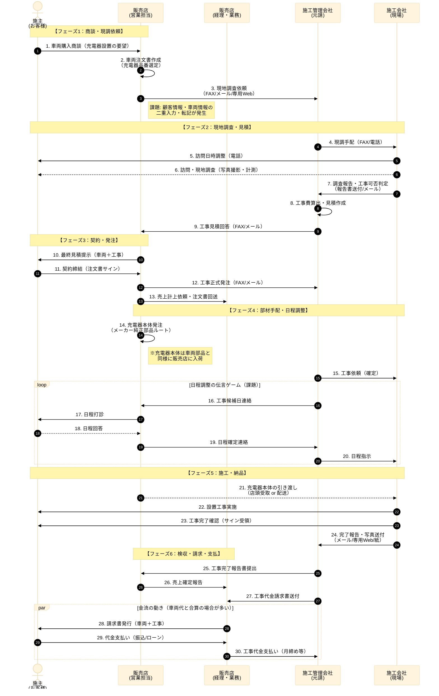

# As-Is業務フロー：パターンA（標準モデル）

## 【パターンA】標準モデル（戸建て・持家 × 標準工事）
**最もボリュームが大きく、自動化・効率化のベースとなる「（基本形）」。**

* **定義**:
    * **意思決定**: 本人のみで完結（戸建て・持家）。
    * **工事**: 標準範囲内（追加工事なし、電力申請なし）。
    * **リードタイム**: 最短。

## フロー図

-----
