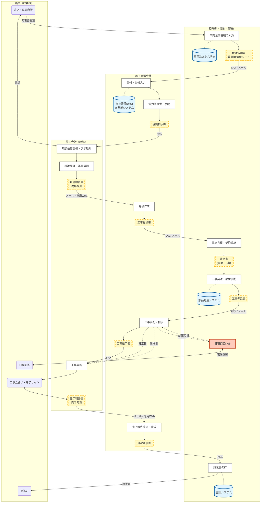

# As-Is業務フロー：パターンA（標準モデル）

## 【パターンA】標準モデル：戸建て・持家への標準工事

このパターンは、個人の顧客が自分の所有する戸建て住宅に設置するケースです。最も件数が多く、システム化や自動化を検討する際の基礎となるモデルです。

* **基本定義**
    * **顧客属性**: 個人客であり、設置場所は自己所有の戸建て住宅です。
    * **意思決定**: 顧客本人の意思だけで設置を決定できます。他者の許可は不要です。
    * **工事内容**: 基本的な標準工事の範囲内で完了します。追加の特殊な工事は発生しません。
    * **所要期間**: 検討から設置完了までの期間が最も短く済みます。

* **業務フローの特徴と課題**
    * **情報の分断**: 車両の契約は販売店で行い、工事の契約は施工会社と行うため、顧客情報や車両情報が二重管理になりがちです。
    * **現地調査**: 施工担当者が顧客宅を訪問して調査を行いますが、事前に顧客自身が写真を送付して済ませるオンライン調査の形式も存在します。
    * **日程調整の伝言ゲーム**: 販売店、施工管理会社、施工会社、顧客の4者の間で連絡を取り合うため、工事日の決定に時間がかかります。

## 1. 業務フロー図（スイムレーン形式）

**凡例と見方：**
* **円柱**: 利用システム（ここが情報のサイロになっています）
* **書類**: 帳票・データ（ここがアナログな受け渡しポイント＝IPOです）
* **矢印上のテキスト**: 伝達手段（FAX、電話、メールなど）

