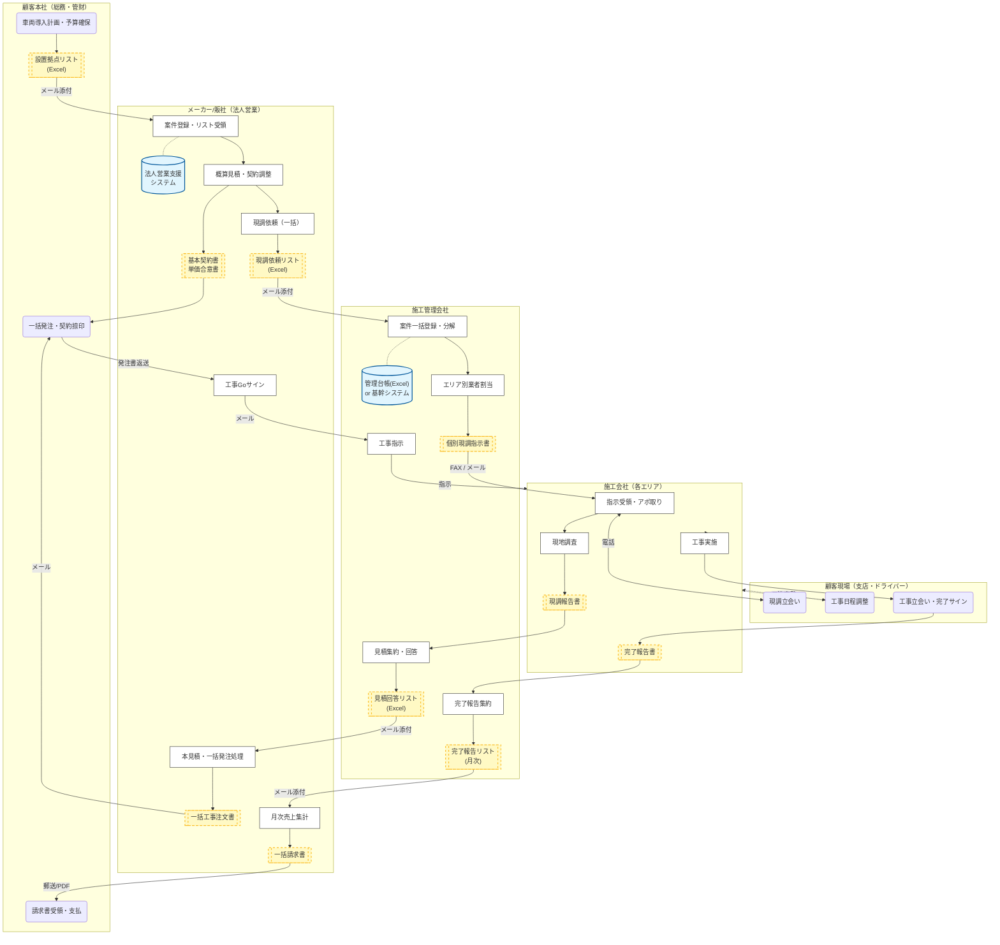

# As-Is業務フロー：パターンD（法人・フリートモデル）

## 【パターンD】法人・フリートモデル：B2B・複数台・複数拠点

このパターンは、企業が営業車や配送車として車両を導入するケースです。
個人の買い物とは異なり、**「契約（本社）」と「現場（支店）」が分離している点**、および**「リスト形式での一括管理」**が最大の特徴です。

* **基本定義**
    * **顧客属性**: 法人企業（社用車、配送車、店舗用車両）。
    * **特徴**: 1台ごとの契約ではなく、複数台・複数拠点の工事をまとめて発注・管理します。
    * **意思決定**: 「総務部（契約・支払）」と「ドライバー/支店（現場立ち会い）」が別人です。

* **業務フローの特徴と課題**
    * **Excelバケツリレー**: 顧客データが「申込書」ではなく「拠点リスト（Excel）」で流通するため、更新管理が煩雑化します。
    * **意思決定と現場の乖離**: 本社がGoサインを出しても、現場（支店）の事情で工事日が決まらない、というタイムラグが発生します。
    * **月締め請求**: 案件ごとの入金消込ではなく、月末に「完了した工事分」をまとめて請求書化する処理が必要です。

## 1. 業務フロー図（スイムレーン形式）

**凡例と見方：**
* **円柱**: 利用システム（一括取込機能がない場合、手入力の温床となります）
* **書類**: 帳票・データ（パターンDでは「リスト/台帳」が主役となります）
* **矢印上のテキスト**: 伝達手段（メール添付が主、現場へは電話）

