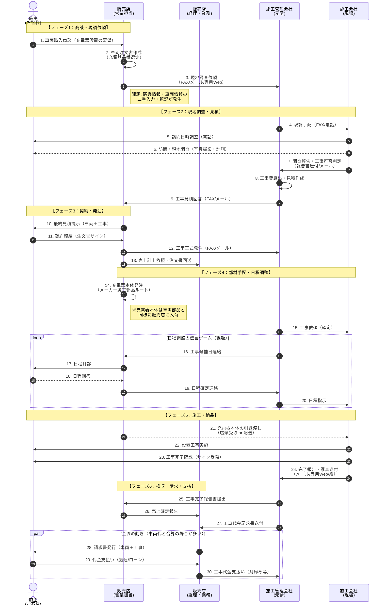

ご提示いただいたプロジェクト文書および上司からのフィードバックに基づき、\*\*「パターンA：標準モデル（戸建て・持家×標準工事）」\*\*のAs-Is業務フロー（現状）を作成しました。

自動車業界の商流における「モノ（充電器）」と「コト（工事）」の複雑な絡み合い、および上司指摘事項である「金流（経理）」の分離を反映しています。

### 作成のポイント（上司フィードバックの反映）

1.  **スイムレーンの細分化**: 販売店を「営業担当」と「経理担当」に分離し、契約と請求の主体を明確化しました。
2.  **アナログ・多重入力の可視化**: システム（破線）とアナログ連絡（電話・メール・FAX）を区別し、どこで情報の分断が起きているかを明示しました。
3.  **日程調整の「伝言ゲーム」**: 現状の課題である「販売店仲介による非効率な調整」をフローに落とし込みました。

-----

### As-Is業務フロー：パターンA（標準モデル）

-----

### フロー図の補足解説（現状のボトルネック）

この「パターンA」は最も標準的な流れですが、以下のポイントがシステム化における主要な論点（ペインポイント）となります。

#### 1\. 情報の「結節点」が多すぎる（No.3, 9, 16-20）

  * **現状**: 顧客と施工管理会社の間に「販売店営業」が挟まっています。営業担当は車両販売で多忙なため、工事日程の調整（No.16-20）が後回しになり、リードタイムが延びる最大の要因です。
  * **システム化の狙い**: 営業を介さず「顧客⇔施工管理（またはシステム）」で日程が完結する仕組みが必要です。

#### 2\. 「モノ」と「コト」の不一致（No.14, 21）

  * **現状**: 充電器（モノ）はトヨタ純正部品ルートで販売店に届きますが、工事（コト）は外部業者が行います。
  * **リスク**: 施工会社が販売店までモノを取りに行く手間や、配送ミスによる当日の「部材なし・工事不可」リスクが潜んでいます。

#### 3\. 見積・請求の不透明さ（No.8, 10, 27）

  * **現状**: 施工管理会社が出す見積（原価）に、販売店がマージンを乗せて顧客へ提示します。
  * **課題**: 上司の指摘通り、ここが「ドンブリ勘定」になりやすく、後から追加工事費が発生した際に、誰が追加分を請求・回収するのか（販売店が被るのか、客に再請求するのか）が曖昧になりがちです。

#### 4\. アナログな報告業務（No.7, 24）

  * **現状**: 多くの施工会社（特に下請け）は、現場で写真を撮り、帰社してからPCで報告書を作成・メール送信しています。
  * **システム化の狙い**: スマホ完結による報告業務のリアルタイム化が求められます。

### 次のステップへの提案

この「パターンA」をベースライン（背骨）とし、以下のステップで\*\*Step 2「差分と例外のリスト化」\*\*に進むことを推奨します。

1.  **B2Bモデル（パターンD）の差分**: この図の「Customer」が「法人担当者」に、「Sales」が「メーカー法人営業部」に置き換わった際、どこが崩れるかを確認する。
2.  **例外処理の洗い出し**: 現調の結果「工事不可」となった場合、No.7からどこへ分岐するか（キャンセル料請求フロー）を定義する。