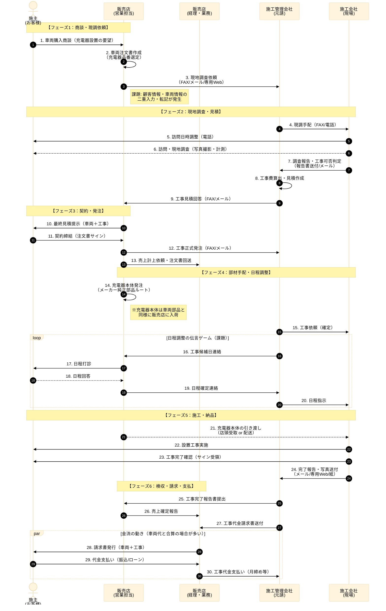

# As-Is業務フロー：パターンA（標準モデル）

-----

### フロー図の補足解説（現状のボトルネック）

#### 1\. 情報の「結節点」が多すぎる（No.3, 9, 16-20）

  * **現状**: 顧客と施工管理会社の間に「販売店営業」が挟まっています。営業担当は車両販売で多忙なため、工事日程の調整（No.16-20）が後回しになり、リードタイムが延びる最大の要因です。
  * **システム化の狙い**: 営業を介さず「顧客⇔施工管理（またはシステム）」で日程が完結する仕組みが必要です。

#### 2\. 「モノ」と「コト」の不一致（No.14, 21）

  * **現状**: 充電器（モノ）はトヨタ純正部品ルートで販売店に届きますが、工事（コト）は外部業者が行います。
  * **リスク**: 施工会社が販売店までモノを取りに行く手間や、配送ミスによる当日の「部材なし・工事不可」リスクが潜んでいます。

#### 3\. 見積・請求の不透明さ（No.8, 10, 27）

  * **現状**: 施工管理会社が出す見積（原価）に、販売店がマージンを乗せて顧客へ提示します。
  * **課題**: 上司の指摘通り、ここが「ドンブリ勘定」になりやすく、後から追加工事費が発生した際に、誰が追加分を請求・回収するのか（販売店が被るのか、客に再請求するのか）が曖昧になりがちです。

#### 4\. アナログな報告業務（No.7, 24）

  * **現状**: 多くの施工会社（特に下請け）は、現場で写真を撮り、帰社してからPCで報告書を作成・メール送信しています。
  * **システム化の狙い**: スマホ完結による報告業務のリアルタイム化が求められます。

### 差分と例外の構造化リスト（パターンAからの分岐）

#### ① プロセス分岐（パターンB・Cへの派生）

| 分岐ID | 分岐条件（トリガー） | 発生タイミング | 追加・変更されるプロセス（サブルーチン） | 影響度 |
| :--- | :--- | :--- | :--- | :--- |
| **Branch-1** | **管理組合・オーナーの承諾必須** （集合住宅・賃貸） | No.1 商談時 No.7 現調報告時 | **【承諾取得ループ】** 1. 施工店が図面・仕様書を作成 2. 施主が管理組合へ提出 3. 理事会承認待ち（数週間） 4. 承諾書受領 → フロー復帰 | **大** リードタイムが数ヶ月単位で伸びる。 システム上で「保留（塩漬け）」ステータスの管理が必要。 |
| **Branch-2** | **電力申請が必要** （アンペア変更・幹線張替え） | No.7 現調報告時 | **【東電申請ループ】** 1. 施工店が電力会社へ申請図面作成 2. 東京電力へ申請 3. 竣工検査・受電 ※工事日が「申請許可」に依存するため確定できない。 | **中** 工事日程が「仮予約」運用になる。 電力会社側の都合で工期が遅れるリスク。 |
| **Branch-3** | **標準外工事（高額見積）** （隠蔽配線不可、土木工事等） | No.9 見積回答時 | **【再商談ループ】** 1. 高額見積を提示し、顧客と折衝 2. 仕様変更（スペックダウン）またはキャンセル 3. 再見積作成 → No.10へ戻る | **中** 営業担当の手間が増大。 見積バージョンの管理が必要。 |

#### ② 例外処理（Exception）とシステム要件

| 例外ID | 事象（インシデント） | 発生タイミング | 業務上の処置（システム要件） |
| :--- | :--- | :--- | :--- |
| **Ex-1** | **現調後キャンセル** （見積高すぎ、工事不可） | No.10 見積提示後 | **【精算処理】** ・現地調査費（数千円〜）を誰が負担するか？ ・顧客請求する場合の請求フロー起動。 ・販社負担する場合の赤字処理。 |
| **Ex-2** | **工事当日キャンセル** （不在、車両干渉、部材欠品） | No.22 工事当日 | **【再調整＆ペナルティ】** ・キャンセル料の請求可否判断。 ・再工事日程の調整（No.16へ戻る）。 ・部材の持ち帰り・在庫管理。 |
| **Ex-3** | **追加費用の発生** （当日発覚した地中埋設物等） | No.22 工事当日 | **【事後請求処理】** ・当初契約（No.11）と金額がズレる。 ・追加分の見積・請求書を「工事後」に発行する例外フロー。 ・顧客の支払い手段（現金不可時の対応）。 |
| **Ex-4** | **施工不備・クレーム** （充電できない、壁の傷） | No.24 完了後 | **【トラブルチケット起票】** ・責任分界（機器vs施工）の切り分け。 ・補修工事の手配（無償/有償）。 ・完了報告の取り消し・差し戻し。 |

-----