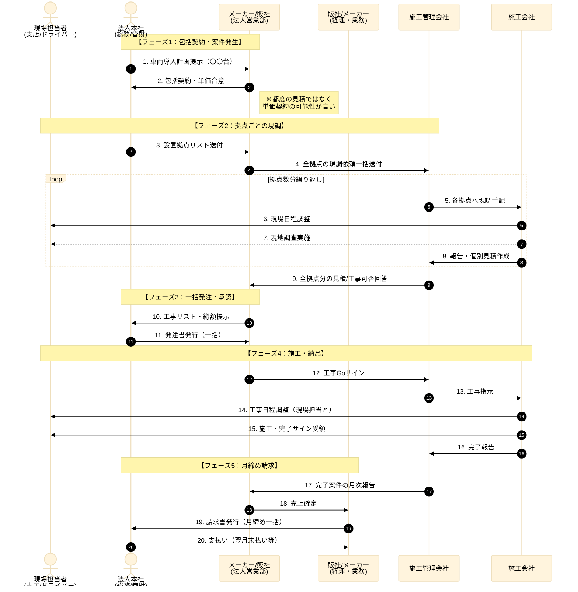

### 1\. パターンD（法人・フリート）の業務フロー仮説

**▼ パターンDの仮説フロー（B2Bモデル）**

**【パターンAとの決定的な違い（ヒアリングでの確認ポイント）】**

1.  **契約形態**: 都度の注文書ではなく「基本契約＋発注リスト」ではないか？
2.  **窓口**: 店舗（ディーラー）ではなく「法人営業部」等の別組織が担当していないか？
3.  **日程調整**: 契約は本社だが、日程調整は現場（支店）と直接行う必要がある（連絡ルートの複線化）。

-----