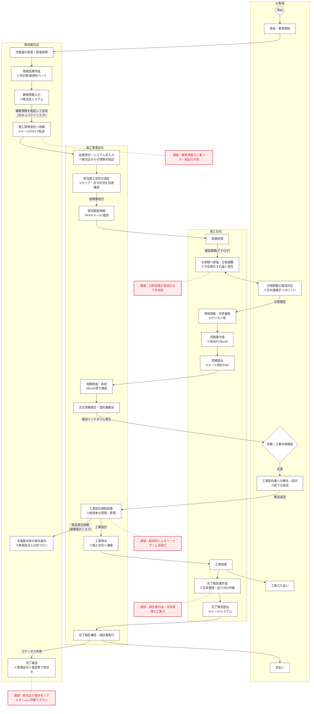

```mermaid
flowchart TD
    %% 全体のスタイル定義
    classDef default fill:#fff,stroke:#333,stroke-width:1px;
    classDef manual fill:#f5f5f5,stroke:#666,stroke-dasharray: 5 5;
    classDef pain fill:#ffebee,stroke:#d32f2f,color:#d32f2f,stroke-width:2px;

    %% --- スイムレーン（担当者ごとの領域） ---
    
    subgraph Client [お客様]
        direction TB
        C1((開始))
        C2[来店・車両商談]
        C3[日程調整の電話対応<br>※日中連絡がつきにくい]
        C4{見積・工事内容確認}
        C5[工事契約書への署名・捺印<br>※紙での返送]
        C6[工事立ち合い]
        C7[支払い]
    end

    subgraph Dealer [車両販売店]
        direction TB
        D1[充電器の提案・簡易説明]
        D2[簡易見積作成<br>※手計算/紙資料ベース]
        D3[顧客情報入力<br>※販売店システム]
        D4[施工管理会社へ依頼<br>※メール/FAXで転送]
        D5[充電器本体の発注操作<br>※車両発注とは別フロー]
        D6[完了確認<br>※管理会社へ電話等で問合せ]
    end

    subgraph Manager [施工管理会社<br>トヨタホーム等]
        direction TB
        M1[依頼受付・システム手入力<br>※販売店からの情報を転記]
        M2[担当施工会社の選定<br>※エリア・空き状況を目視確認]
        M3[現地調査依頼<br>※FAX/メール/電話]
        M4[見積精査・承認<br>※Excel等で確認]
        M5[正式見積提示・契約書郵送]
        M6[工事契約締結処理<br>※紙原本の受領・管理]
        M7[工事発注<br>※施工会社へ連絡]
        M8[完了報告確認・請求書発行]
    end

    subgraph Worker [施工会社<br>認定施工店]
        direction TB
        W1[依頼受領]
        W2[お客様へ架電・日程調整<br>※不在時のすれ違い発生]
        W3[現地調査・写真撮影<br>※デジカメ等]
        W4[見積書作成<br>※自社PC/Excel]
        W5[見積提出<br>※メール添付/FAX]
        W6[工事実施]
        W7[完了報告書作成<br>※写真整理・貼り付け作業]
        W8[完了報告提出<br>※メール/システム]
    end

    %% --- フロー接続（プロセスの流れ） ---

    %% 1.商談〜依頼
    C1 --> C2
    C2 --> D1
    D1 --> D2
    D2 --> D3
    D3 -- "顧客情報を転記して送信\n(セキュリティリスク)" --> D4
    D4 --> M1

    %% 2.調査調整〜見積
    M1 --> M2
    M2 -- "依頼書送付" --> M3
    M3 --> W1
    W1 -- "電話連絡(アナログ)" --> W2
    W2 <--> C3
    C3 -- 日程確定 --> W3
    W3 --> W4
    W4 --> W5
    W5 --> M4

    %% 3.契約〜発注
    M4 --> M5
    M5 -- "郵送リードタイム発生" --> C4
    C4 -- 合意 --> C5
    C5 -- "郵送返送" --> M6
    M6 -- "工事指示" --> M7
    M6 -- "部品発注依頼\n(連携漏れリスク)" --> D5
    M7 --> W6

    %% 4.工事〜完了
    W6 --> C6
    W6 --> W7
    W7 --> W8
    W8 --> M8
    M8 --> C7
    M8 -- ステータス共有 --> D6

    %% --- 課題の注釈（赤枠） ---
    D4 -.- P1[課題：顧客情報の二重入力・転記の手間]:::pain
    W2 -.- P2[課題：日程調整が電話のみで非効率]:::pain
    W7 -.- P3[課題：報告書作成・写真管理の工数大]:::pain
    M6 -.- P4[課題：紙契約によるリードタイム長期化]:::pain
    D6 -.- P5[課題：販売店が進捗をリアルタイムに把握できない]:::pain
```
